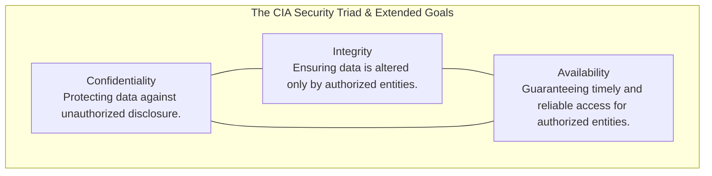
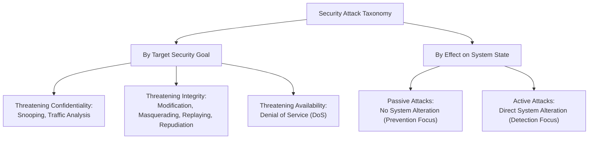
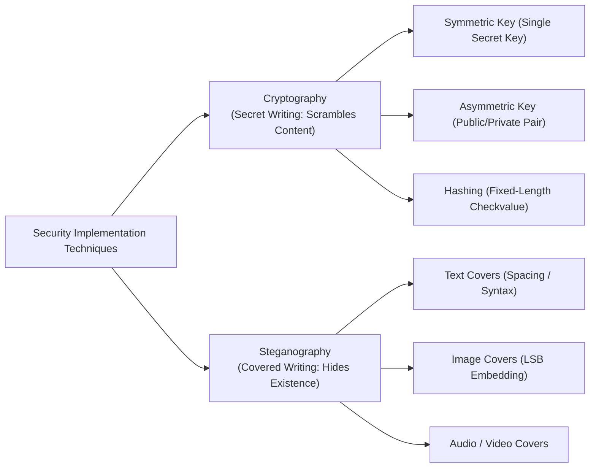
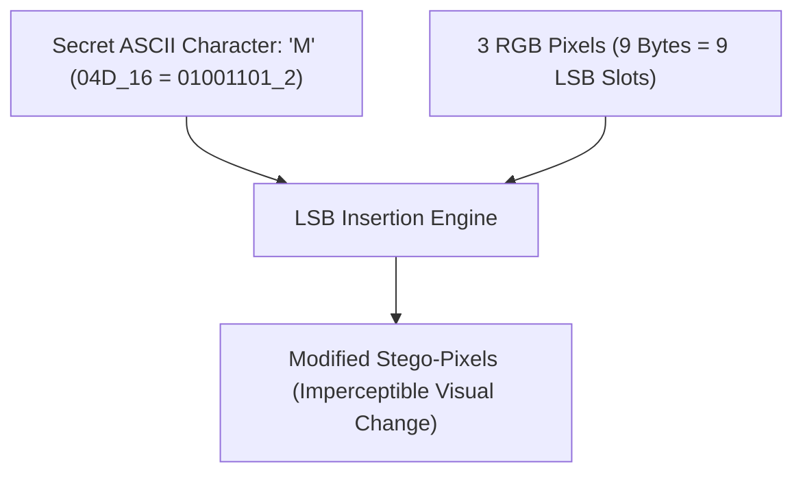

# Chapter 1: Introduction to Information Security

[← Back to Course README](../README.md)

- [1. Fundamental Concepts & Course References](#1-fundamental-concepts--course-references)
- [2. Three Core Security Goals (The CIA Triad)](#2-three-core-security-goals-the-cia-triad)
  - [Confidentiality](#confidentiality)
  - [Integrity](#integrity)
  - [Availability](#availability)
- [3. Security Attack Taxonomy](#3-security-attack-taxonomy)
  - [Attacks Threatening Confidentiality](#attacks-threatening-confidentiality)
  - [Attacks Threatening Integrity](#attacks-threatening-integrity)
  - [Attacks Threatening Availability](#attacks-threatening-availability)
  - [Passive vs. Active Attacks Matrix](#passive-vs-active-attacks-matrix)
- [4. ITU-T X.800 Security Services & Mechanisms](#4-itu-t-x800-security-services--mechanisms)
  - [Security Services](#security-services)
  - [Security Mechanisms](#security-mechanisms)
  - [ITU-T X.800 Services vs. Mechanisms Mapping Matrix](#itu-t-x800-services-vs-mechanisms-mapping-matrix)
- [5. Implementation Techniques: Cryptography vs. Steganography](#5-implementation-techniques-cryptography-vs-steganography)
  - [Cryptography Techniques](#cryptography-techniques)
  - [Steganography (Historical & Modern Covers)](#steganography-historical--modern-covers)
  - [Text Cover Encoding Mechanics](#text-cover-encoding-mechanics)
  - [Image Cover LSB Encoding Mechanics](#image-cover-lsb-encoding-mechanics)
- [6. Solved Practice & Exam Questions](#6-solved-practice--exam-questions)

---

## 1. Fundamental Concepts & Course References

Information is an organizational asset possessing critical value. Just like physical assets, information must be protected from malicious attacks, unauthorized disclosure, manipulation, and service interruption.

Historically, organizational information was stored on paper files within locked physical archives. With the advent of computer networks and electronic data processing, information storage and transmission transitioned to digital formats across public and private networks, requiring formal security architectures.

### Recommended Course Literature & Standards:
1. **William Stallings**, *Cryptography and Network Security: Principles and Practice* (7th Ed.), Pearson, 2016.
2. **Behrouz A. Forouzan & Debdeep Mukhopadhyay**, *Cryptography and Network Security* (2nd Ed. Revised), McGraw-Hill, 2010.
3. **Charles P. Pfleeger, Shari Lawrence Pfleeger, & Jonathan Margulies**, *Security in Computing* (5th Ed.), Prentice Hall, 2015.
4. **Michael E. Whitman & Herbert J. Mattord**, *Principles of Information Security* (5th Ed.), Cengage Learning, 2015.
5. **Mark Stamp**, *Information Security: Principles and Practice* (2nd Ed.), John Wiley & Sons, 2011.

---

## 2. Three Core Security Goals (The CIA Triad)

Every information security program is built upon three primary security objectives, collectively known as the **CIA Triad**:



### Confidentiality
- **Definition**: Ensuring that confidential information is hidden from unauthorized access, eavesdropping, and disclosure—both in physical/electronic storage and during network transmission.
- **Domain Applications**:
  - *Military*: Concealment of tactical orders, intelligence reports, and strategic assets.
  - *Industry*: Safeguarding proprietary intellectual property, trade secrets, and financial forecasts from corporate competitors.
  - *Banking*: Preserving customer account numbers, transaction histories, and identity records.

### Integrity
- **Definition**: Ensuring that information and programs are changed **only by authorized entities** through **authorized mechanisms**.
- **Causes of Integrity Violations**:
  - *Malicious Acts*: Unauthorized data modification, tampering, or malicious insertion by adversaries.
  - *Non-Malicious System Interruptions*: Power surges, hardware disk corruption, transmission noise, or software crashes altering stored bits.

### Availability
- **Definition**: Guaranteeing that systems, networks, and data created or stored by an organization remain accessible to authorized entities whenever needed.
- **Impact of Failure**: If a banking system experiences an availability outage, customers cannot conduct financial transactions, paralyzing business operations.

---

## 3. Security Attack Taxonomy

Security attacks are intentional actions that threaten one or more security goals. They are classified by the specific security goal targeted and by their effect on the underlying system.



---

### Attacks Threatening Confidentiality

1. **Snooping**:
   - Unauthorized access to or interception of data transmitted across a network (e.g., reading unencrypted emails or files in transit).
   - *Countermeasure*: Encipherment (Encryption).
2. **Traffic Analysis**:
   - Even when data is enciphered, an opponent can monitor online traffic patterns, observe electronic IP addresses, track request/response pairs, and determine message volume/frequency to infer business operations or transaction nature.
   - *Countermeasure*: Traffic Padding and Routing Control.

---

### Attacks Threatening Integrity

1. **Modification**:
   - The attacker intercepts legitimate data streams and alters the payload content to benefit themselves (e.g., altering a bank wire transfer amount from $100 to $10,000).
2. **Masquerading (Spoofing)**:
   - The attacker impersonates another entity. For example, an attacker steals a victim's PIN/card to pretend to be the customer, or sets up a rogue website impersonating a legitimate bank to harvest user credentials.
3. **Replaying**:
   - The attacker captures a copy of a legitimate transmission (e.g., a valid payment authorization request) and retransmits it later to execute a duplicate unauthorized transaction.
4. **Repudiation**:
   - Performed by one of the communicating parties:
     - *Sender Repudiation*: The sender denies having sent a message (e.g., a customer orders a stock trade, suffers a financial loss, and denies making the request).
     - *Receiver Repudiation*: The receiver denies having received a message (e.g., a merchant receives payment but claims non-receipt).

---

### Attacks Threatening Availability

1. **Denial of Service (DoS)**:
   - Flooding a server or network with bogus traffic to overwhelm processing capacity, or intercepting and dropping server responses to clients, effectively crippling availability.

---

### Passive vs. Active Attacks Matrix

| Dimension | Passive Attacks | Active Attacks |
| :--- | :--- | :--- |
| **Target Security Goals** | Confidentiality | Integrity and Availability |
| **System State Effect** | Does not alter data or system resources. | Modifies data, alters system state, or degrades services. |
| **Specific Attack Examples** | Snooping, Traffic Analysis | Modification, Masquerading, Replaying, Repudiation, DoS |
| **Detection Difficulty** | **Extremely Difficult**: System operates normally without audit anomalies. | **Easier to Detect**: System logs, MAC failures, or service crashes reveal the attack. |
| **Primary Security Focus** | **Prevention** (via Encryption). | **Detection and Recovery** (via MACs, Digital Signatures, Firewalls, IDS). |

---

## 4. ITU-T X.800 Security Services & Mechanisms

The **International Telecommunication Union - Telecommunication Standardization Sector (ITU-T X.800)** defines a standardized framework for security services and security mechanisms.

### Security Services
1. **Data Confidentiality**: Protects data against unauthorized disclosure (snooping and traffic analysis).
2. **Data Integrity**: Protects data from modification, insertion, deletion, and replaying.
3. **Authentication**: Provides verification of communicating peer identities during connection establishment.
4. **Nonrepudiation**: Provides proof of origin (proving sender identity) or proof of delivery (proving receipt).
5. **Access Control**: Enforces permissions for reading, writing, executing, or accessing system resources.

---

### Security Mechanisms
- **Encipherment**: Using cryptographic ciphers or steganography to hide data.
- **Data Integrity**: Appending a cryptographic checkvalue (MAC/Hash) derived from the data itself.
- **Digital Signature**: Electronic signature using asymmetric key pairs to verify origin and integrity.
- **Authentication Exchange**: Two-entity handshake proving identity via shared secrets or nonces.
- **Traffic Padding**: Inserting dummy bits into data streams to thwart traffic analysis.
- **Routing Control**: Dynamically selecting physically secure network routes to avoid eavesdropping.
- **Notarization**: Engaging a trusted third-party notary to log and guarantee communication properties.
- **Access Control**: Enforcing access rights via authentication credentials (passwords, PINs, ACLs).

---

### ITU-T X.800 Services vs. Mechanisms Mapping Matrix

The table below illustrates how security mechanisms map to security services in the ITU-T X.800 framework:

| Security Service \ Security Mechanism | Encipherment | Digital Signature | Access Control | Data Integrity | Authentication Exchange | Traffic Padding | Routing Control | Notarization |
| :--- | :---: | :---: | :---: | :---: | :---: | :---: | :---: | :---: |
| **Peer Entity Authentication** | ✓ | ✓ | | | ✓ | | | |
| **Data Origin Authentication** | ✓ | ✓ | | | | | | |
| **Access Control Service** | | | ✓ | | | | | |
| **Data Confidentiality** | ✓ | | | | | | ✓ | |
| **Traffic Flow Confidentiality** | ✓ | | | | | ✓ | ✓ | |
| **Data Integrity** | ✓ | ✓ | | ✓ | | | | |
| **Nonrepudiation (Origin & Delivery)**| | ✓ | | ✓ | | | | ✓ |

---

## 5. Implementation Techniques: Cryptography vs. Steganography

Security mechanisms are theoretical recipes implemented via two main disciplines: **Cryptography** ("secret writing") and **Steganography** ("covered writing").



---

### Cryptography Techniques
1. **Symmetric-Key Encipherment**: Uses a single shared secret key for both encryption and decryption (Alice and Bob model).
2. **Asymmetric-Key Encipherment**: Uses a key pair—a **Public Key** for encryption and a matching **Private Key** for decryption.
3. **Cryptographic Hashing**: Converts a variable-length input message into a fixed-length message digest checkvalue for integrity verification.

---

### Steganography (Historical & Modern Covers)

Unlike cryptography, which scrambles content into visible ciphertext, **steganography** conceals the very existence of the communication medium.

#### Historical Steganographic Methods:
- **Ancient Greece**: Shaving a messenger's head, tattooing the secret message on the scalp, and letting hair regrow before travel.
- **Greece and Rome**: Writing messages on wooden tablets, then coating the wood in wax to disguise it as a blank tablet.
- **Invisible Inks**: Writing with organic liquids (lemon juice, milk) that remain invisible until exposed to heat.
- **Pencil Lead Angling**: Overwriting specific letters in lead that become visible only under light at a precise angle.

---

### Text Cover Encoding Mechanics

1. **Inter-Word Spacing Method**:
   - Single space between words represents binary `0`.
   - Double space between words represents binary `1`.
2. **Grammatical Dictionary Method**:
   - Uses a structured dictionary categorized by grammatical usage (e.g., 2 Articles, 8 Verbs, 32 Nouns).
   - Encodes a 16-bit binary chunk into an innocuous sentence following an `Article - Noun - Verb - Article - Noun` pattern.

```
Binary Chunk (16 bits): [Article 1 (1b) | Noun 1 (5b) | Verb (4b) | Article 2 (1b) | Noun 2 (5b)]
Example ASCII ("Hi" = 01001000 01001001) -> Formatted English Sentence
```

---

### Image Cover LSB Encoding Mechanics

Digital images consist of pixels. In a standard 24-bit RGB image, each pixel contains 3 bytes (8 bits for Red, 8 bits for Green, 8 bits for Blue).

#### Least Significant Bit (LSB) Substitution Algorithm:
- Modifying the least significant bit (LSB) of a color byte changes the intensity by at most 1 unit out of 256, which is imperceptible to the human eye.
- **Encoding Rule**: To hide a secret bit $b \in \{0, 1\}$, clear the LSB of the color byte and set it to $b$.
- **Storage Capacity**: Since 1 pixel contains 3 bytes (3 LSBs), hiding 1 ASCII character (8 bits) requires **3 pixels** (9 available LSB slots).



```
Pixel 1: Red [R_7..R_1 | b0]  Green [G_7..G_1 | b1]  Blue [B_7..B_1 | b2]
Pixel 2: Red [R_7..R_1 | b3]  Green [G_7..G_1 | b4]  Blue [B_7..B_1 | b5]
Pixel 3: Red [R_7..R_1 | b6]  Green [G_7..G_1 | b7]  Blue [Unused/Pad]
```

---

## 6. Solved Practice & Exam Questions

### Question 1: Security Goals & Threats Mapping
**Problem**: Map the following attacks to the specific security goal they threaten: Snooping, Replaying, Denial of Service, Modification, Traffic Analysis, Repudiation.

**Solution**:
- **Confidentiality**: Snooping, Traffic Analysis
- **Integrity**: Modification, Replaying, Repudiation
- **Availability**: Denial of Service (DoS)

---

### Question 2: Passive vs. Active Attacks Detection
**Problem**: Explain why passive attacks are easy to prevent but hard to detect, whereas active attacks are hard to prevent but easy to detect.

**Solution**:
Passive attacks (snooping/traffic analysis) do not alter system data or leave audit logs, making detection nearly impossible until leaked data surfaces; however, strong encryption completely prevents eavesdropping. Active attacks can be launched in infinite novel ways (making prevention difficult), but they alter data streams or crash services, leaving empirical trace evidence in MAC checks, audit logs, or network monitors.

---

### Question 3: ITU-T X.800 Notarization Mechanism
**Problem**: How does the X.800 Notarization security mechanism prevent sender repudiation in electronic transactions?

**Solution**:
Notarization engages a Trusted Third Party (TTP) to control and log communications. When a sender transmits a request, the notary logs the timestamp, digital signature, and request details. If the sender later denies making the request, the recipient presents the notary's cryptographically verifiable log as proof of origin.

---

### Question 4: LSB Steganography Pixel Calculation
**Problem**: Calculate how many 24-bit RGB pixels are required to hide the text message `"SECURITY"` (8 ASCII characters) using LSB steganography.

**Solution**:
1. `"SECURITY"` = 8 characters = $8 \times 8 = 64$ bits.
2. Each 24-bit RGB pixel provides 3 color bytes = 3 LSB slots.
3. $\lceil 64 / 3 \rceil = \mathbf{22}$ pixels (with 2 bits remaining for padding).

---

### Question 5: Non-Malicious Integrity Violations
**Problem**: Explain how an integrity violation can occur without any malicious human intervention.

**Solution**:
Integrity violations occur whenever stored or transmitted data is altered without authorization. Non-malicious causes include hardware disk sector corruption, electromagnetic transmission noise, software memory leaks, or electrical power surges that flip bits in system RAM or storage.
