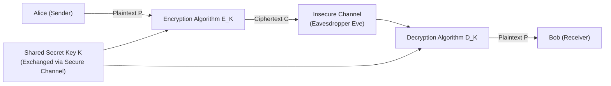
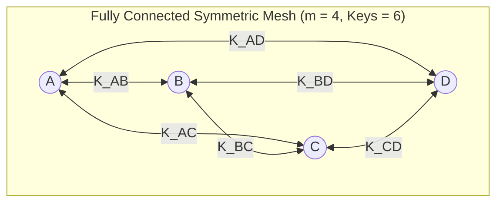
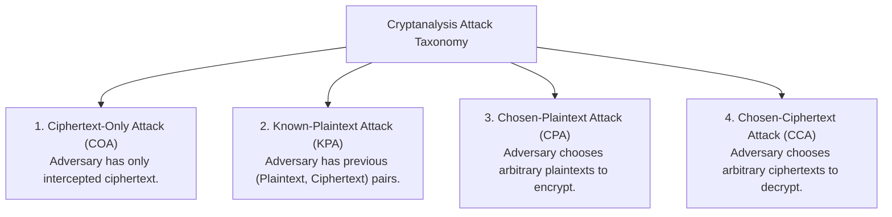

# Chapter 2: Traditional Symmetric-Key Ciphers & Cryptanalysis

[← Back to Course README](../README.md)

- [1. Introduction & Rationale for Traditional Ciphers](#1-introduction--rationale-for-traditional-ciphers)
- [2. Symmetric-Key Cryptosystem Model](#2-symmetric-key-cryptosystem-model)
  - [Mathematical Model & Kerckhoffs's Principle](#mathematical-model--kerckhoffss-principle)
  - [Key Distribution & Key Count Formula](#key-distribution--key-count-formula)
- [3. Cryptanalysis Attack Taxonomy (4 Attack Models)](#3-cryptanalysis-attack-taxonomy-4-attack-models)
  - [Ciphertext-Only Attack (COA)](#ciphertext-only-attack-coa)
  - [Known-Plaintext Attack (KPA)](#known-plaintext-attack-kpa)
  - [Chosen-Plaintext Attack (CPA)](#chosen-plaintext-attack-cpa)
  - [Chosen-Ciphertext Attack (CCA)](#chosen-ciphertext-attack-cca)
- [4. Traditional Substitution Ciphers](#4-traditional-substitution-ciphers)
  - [Additive Cipher (Shift / Caesar Cipher)](#additive-cipher-shift--caesar-cipher)
  - [Multiplicative Cipher](#multiplicative-cipher)
  - [Affine Cipher](#affine-cipher)
  - [General Monoalphabetic Substitution Cipher](#general-monoalphabetic-substitution-cipher)
- [5. Polyalphabetic Substitution Ciphers](#5-polyalphabetic-substitution-ciphers)
  - [Autokey Cipher](#autokey-cipher)
  - [Playfair Cipher (Polygraphic Cipher)](#playfair-cipher-polygraphic-cipher)
  - [Vigenère Cipher & Vigenère Tableau](#vigen%C3%A8re-cipher--vigen%C3%A8re-tableau)
  - [Hill Cipher (Linear Algebra Block Cipher)](#hill-cipher-linear-algebra-block-cipher)
- [6. Transposition Ciphers](#6-transposition-ciphers)
  - [Rail Fence Cipher](#rail-fence-cipher)
  - [Row-Column Transposition Cipher](#row-column-transposition-cipher)
- [7. Product Ciphers & Statistical Cryptanalysis](#7-product-ciphers--statistical-cryptanalysis)
- [8. 8 Solved Practice & Exam Problems](#8-8-solved-practice--exam-problems)

---

## 1. Introduction & Rationale for Traditional Ciphers

Modern symmetric-key ciphers (such as DES and AES) are built upon the foundational principles of traditional symmetric-key ciphers. Although traditional ciphers are no longer secure in the era of high-speed modern computing, studying them remains essential for several key reasons:

1. **Pedagogical Clarity**: Traditional ciphers are simpler than modern block/stream ciphers, providing an intuitive introduction to core cryptographic concepts.
2. **Foundational Cryptographic Building Blocks**: Concepts like substitution (confusion) and transposition (diffusion) form the underlying structure of modern Product Ciphers and Feistel Networks.
3. **Rationale for Modern Ciphers**: Demonstrates why simple historical algorithms fail against computerized brute-force and statistical cryptanalysis, justifying the requirement for complex key schedules and Galois Field arithmetic in modern standards.

---

## 2. Symmetric-Key Cryptosystem Model

### Mathematical Model & Kerckhoffs's Principle

In a symmetric-key cipher, communicating entities (Alice and Bob) share a single secret key ($K$) over a secure out-of-band channel before transmitting messages over an insecure public channel.



#### Mathematical Formulations:
$$\text{Encryption: } C = E_K(P)$$
$$\text{Decryption: } P = D_K(C) = D_K(E_K(P))$$

The encryption algorithm $E_K$ and decryption algorithm $D_K$ are mathematical inverses of each other.

#### Kerckhoffs's Principle:
Auguste Kerckhoffs established that a cryptosystem should be secure even if everything about the system—except the key—is public knowledge. Resistance to cryptanalysis must rely **solely on the secrecy of the key**, not on hiding the encryption algorithm (avoiding "security through obscurity").

---

### Key Distribution & Key Count Formula

If a network consists of $m$ communicating entities who require secure, pairwise symmetric communication with one another, every pair of users must share a unique secret key.



#### Pairwise Key Formula:
$$N_{\text{keys}} = \frac{m(m - 1)}{2}$$

*Example*: A network of 100 users requires $\frac{100 \times 99}{2} = \mathbf{4,950}$ distinct secret keys, highlighting the severe key management scalability limitation of symmetric cryptography.

---

## 3. Cryptanalysis Attack Taxonomy (4 Attack Models)

Cryptanalysis is the science and art of breaking secret codes. Cryptanalysts evaluate ciphers under four standard attack models based on the information available to the adversary (Eve):



### 1. Ciphertext-Only Attack (COA)
- **Assumption**: Eve intercepts ciphertext $C$ and knows the encryption algorithm $E$, but has no access to plaintext samples.
- **Attack Methods**:
  - *Brute-Force Attack (Exhaustive Key Search)*: Systematically trying every possible key in the key domain until intelligible plaintext is produced.
  - *Statistical Attack*: Exploiting natural language letter frequency distributions (e.g., `'e'`, `'t'`, `'a'` in English).
  - *Pattern Attack*: Identifying recurring structural patterns in ciphertext symbols.

### 2. Known-Plaintext Attack (KPA)
- **Assumption**: Eve has intercepted ciphertext $C$ and also possesses one or more previously matched $(P_i, C_i)$ pairs encrypted under the same secret key $K$.
- **Objective**: Use the $(P_i, C_i)$ pairs to deduce key $K$ or compromise future messages.

### 3. Chosen-Plaintext Attack (CPA)
- **Assumption**: Eve has temporary access to Alice's encryption device, allowing Eve to select arbitrary plaintext strings $P_{\text{chosen}}$ and obtain their corresponding ciphertexts $C_{\text{chosen}} = E_K(P_{\text{chosen}})$.
- **Objective**: Uncover the secret key $K$ by analyzing specific mathematical structural responses to custom plaintexts.

### 4. Chosen-Ciphertext Attack (CCA)
- **Assumption**: Eve has temporary access to Bob's decryption device, allowing Eve to select arbitrary ciphertext strings $C_{\text{chosen}}$ and obtain their corresponding decrypted plaintexts $P_{\text{chosen}} = D_K(C_{\text{chosen}})$.
- **Objective**: Deduce the secret key $K$ or recover plaintext for other targeted ciphertexts.

---

## 4. Traditional Substitution Ciphers

Substitution ciphers replace plaintext symbols with other symbols. They are categorized as **monoalphabetic** (static 1-to-1 mapping) or **polyalphabetic** (dynamic 1-to-many mapping).

Assigning numerical values in $\mathbb{Z}_{26}$: $a=0, b=1, \dots, z=25$.

---

### Additive Cipher (Shift / Caesar Cipher)

In an additive cipher, the key $k$ is an integer in $\mathbb{Z}_{26}$.

$$\text{Encryption: } C_i = (P_i + k) \pmod{26}$$
$$\text{Decryption: } P_i = (C_i - k + 26) \pmod{26}$$

- **Caesar Cipher**: A specific additive cipher used by Julius Caesar with fixed key $k = 3$.
- **Key Domain**: $|Z_{26}| = 26$ possible keys. Since $k=0$ is trivial (no encryption), only **25 non-trivial keys** exist.

#### Worked Example (Encryption & Decryption):
- Plaintext: `"hello"` ($[7, 4, 11, 11, 14]$), Key $k = 15$.
- Encryption:
  - $h (7) + 15 = 22 \rightarrow \mathbf{W}$
  - $e (4) + 15 = 19 \rightarrow \mathbf{T}$
  - $l (11) + 15 = 26 \equiv 0 \rightarrow \mathbf{A}$
  - $l (11) + 15 = 26 \equiv 0 \rightarrow \mathbf{A}$
  - $o (14) + 15 = 29 \equiv 3 \rightarrow \mathbf{D}$
  - **Ciphertext**: `WTAAD`
- Decryption of `WTAAD`:
  - $W (22) - 15 = 7 \rightarrow \mathbf{h}$
  - $T (19) - 15 = 4 \rightarrow \mathbf{e}$
  - $A (0) - 15 = -15 \equiv 11 \rightarrow \mathbf{l}$
  - $A (0) - 15 = -15 \equiv 11 \rightarrow \mathbf{l}$
  - $D (3) - 15 = -12 \equiv 14 \rightarrow \mathbf{o}$
  - **Plaintext**: `hello` ✓

#### Brute-Force Cryptanalysis Example:
Intercepted Ciphertext: `"UVACLYFZLJBYL"` (Length 13). Eve tests keys $k=1, 2, \dots$:
- $k=1 \rightarrow$ `TUZBKXEYKIAXK`
- $k=2 \rightarrow$ `STYAJWDXJHZWJ`
- $\dots$
- $k=7 \rightarrow$ **`NOT VERY SECURE`** (Intelligible plaintext found!)

#### Statistical Cryptanalysis Example:
Eve intercepts a long ciphertext where the character `'I'` occurs 14 times (highest frequency). Assuming `'I'` (8) corresponds to English most frequent letter `'e'` (4):
$$k = (8 - 4) \pmod{26} = \mathbf{4}$$
Eve decrypts the remaining text using shift key $k=4$.

---

### Multiplicative Cipher

In a multiplicative cipher, plaintext values are multiplied by key $k$.

$$\text{Encryption: } C_i = (P_i \times k) \pmod{26}$$
$$\text{Decryption: } P_i = (C_i \times k^{-1}) \pmod{26}$$

#### Key Domain Condition:
For decryption to exist, key $k$ must have a modular multiplicative inverse $k^{-1} \pmod{26}$. This requires $\gcd(k, 26) = 1$.
- **Key Space $\mathbb{Z}_{26}^*$**: Contains only **12 valid keys**:
  $$\mathbb{Z}_{26}^* = \{1, 3, 5, 7, 9, 11, 15, 17, 19, 21, 23, 25\}$$

#### Worked Example:
- Plaintext: `"hello"` ($[7, 4, 11, 11, 14]$), Key $k = 7$.
  - $h (7) \times 7 = 49 \equiv 23 \rightarrow \mathbf{X}$
  - $e (4) \times 7 = 28 \equiv 2 \rightarrow \mathbf{C}$
  - $l (11) \times 7 = 77 \equiv 25 \rightarrow \mathbf{Z}$
  - $l (11) \times 7 = 77 \equiv 25 \rightarrow \mathbf{Z}$
  - $o (14) \times 7 = 98 \equiv 20 \rightarrow \mathbf{U}$
  - **Ciphertext**: `XCZZU`

---

### Affine Cipher

The **Affine Cipher** combines multiplicative and additive ciphers using a key pair $(k_1, k_2)$ where $k_1 \in \mathbb{Z}_{26}^*$ and $k_2 \in \mathbb{Z}_{26}$.

$$\text{Encryption: } C_i = (P_i \times k_1 + k_2) \pmod{26}$$
$$\text{Decryption: } P_i = \left( (C_i - k_2) \times k_1^{-1} \right) \pmod{26}$$

- **Key Space Size**: $|\mathbb{Z}_{26}^*| \times |\mathbb{Z}_{26}| = 12 \times 26 = \mathbf{312}$ possible key pairs.
- **Special Cases**:
  - Additive Cipher when $k_1 = 1$.
  - Multiplicative Cipher when $k_2 = 0$.

#### Worked Example:
- Plaintext: `"hello"` ($[7, 4, 11, 11, 14]$), Key Pair $(k_1 = 7, k_2 = 2)$.
  - $h (7) \rightarrow (7 \times 7 + 2) = 51 \equiv 25 \rightarrow \mathbf{Z}$
  - $e (4) \rightarrow (4 \times 7 + 2) = 30 \equiv 4 \rightarrow \mathbf{E}$
  - $l (11) \rightarrow (11 \times 7 + 2) = 79 \equiv 1 \rightarrow \mathbf{B}$
  - $l (11) \rightarrow (11 \times 7 + 2) = 79 \equiv 1 \rightarrow \mathbf{B}$
  - $o (14) \rightarrow (14 \times 7 + 2) = 100 \equiv 22 \rightarrow \mathbf{W}$
  - **Ciphertext**: `ZEBBW`

#### CPA Cryptanalysis Example (Solving Linear Congruences):
Eve uses Chosen-Plaintext Attack on plaintext `"et"` ($P_1 = 4, P_2 = 19$).
Suppose she obtains ciphertexts $C_1 = 22, C_2 = 5$.
She constructs linear congruence equations:
$$\begin{cases} (4 \cdot k_1 + k_2) \equiv 22 \pmod{26} \\ (19 \cdot k_1 + k_2) \equiv 5 \pmod{26} \end{cases}$$

Subtracting Equation 1 from Equation 2:
$$15 \cdot k_1 \equiv -17 \equiv 9 \pmod{26}$$
Multiplying by $15^{-1} \equiv 7 \pmod{26}$:
$$k_1 = (9 \times 7) \pmod{26} = 63 \equiv \mathbf{11}$$
Substituting $k_1 = 11$ back:
$$(44 + k_2) \equiv 22 \implies k_2 = 22 - 44 = -22 \equiv \mathbf{4}$$
**Recovered Key Pair**: $(k_1 = 11, k_2 = 4)$ ✓

---

### General Monoalphabetic Substitution Cipher

Creates an arbitrary 1-to-1 mapping table permuting the 26 letters.
- **Key Domain**: $26! \approx \mathbf{4.03 \times 10^{26}}$ possible keys.
- **Security Assessment**: Immune to brute-force key search, but **completely vulnerable to statistical frequency attacks** because single-letter, digram, and trigram letter frequencies are preserved unchanged in ciphertext.

---

## 5. Polyalphabetic Substitution Ciphers

Polyalphabetic ciphers use dynamic key streams $K = (k_1, k_2, k_3, \dots)$ where each occurrence of a character can map to different ciphertext characters (one-to-many mapping), obscuring natural language letter frequency statistics.

---

### Autokey Cipher

In an **Autokey Cipher**, the key stream is generated automatically from an initial agreed secret key $k_1$ followed by the numerical values of the plaintext characters themselves:

$$K = (k_1, P_1, P_2, P_3, \dots, P_{n-1})$$
$$C_i = (P_i + K_i) \pmod{26}$$

#### Worked Example:
- Plaintext: `"Attack is today"` $\rightarrow$ `A T T A C K I S T O D A Y` ($[0, 19, 19, 0, 2, 10, 8, 18, 19, 14, 3, 0, 24]$)
- Initial Key $k_1 = 12$.
- Key Stream: `12  0 19 19  0  2 10  8 18 19 14  3  0`

| Plaintext $P$ | Key Stream $K$ | $(P + K) \bmod 26$ | Ciphertext $C$ |
| :--- | :--- | :--- | :--- |
| **A** (0) | 12 | $0 + 12 = 12$ | **M** |
| **T** (19) | 0 | $19 + 0 = 19$ | **T** |
| **T** (19) | 19 | $19 + 19 = 38 \equiv 12$ | **M** |
| **A** (0) | 19 | $0 + 19 = 19$ | **T** |
| **C** (2) | 0 | $2 + 0 = 2$ | **C** |
| **K** (10) | 2 | $10 + 2 = 12$ | **M** |
| **I** (8) | 10 | $8 + 10 = 18$ | **S** |
| **S** (18) | 8 | $18 + 8 = 26 \equiv 0$ | **A** |
| **T** (19) | 18 | $19 + 18 = 37 \equiv 11$ | **L** |
| **O** (14) | 19 | $14 + 19 = 33 \equiv 7$ | **H** |
| **D** (3) | 14 | $3 + 14 = 17$ | **R** |
| **A** (0) | 3 | $0 + 3 = 3$ | **D** |
| **Y** (24) | 0 | $24 + 0 = 24$ | **Y** |

**Ciphertext**: `MTMTC MSALH RDY`

- *Cryptanalysis*: Although single-letter frequency is obscured, the key space for $k_1$ is only 25 possibilities, making it vulnerable to brute-force search on $k_1$.

---

### Playfair Cipher (Polygraphic Cipher)

Invented by Charles Wheatstone and promoted by Lord Playfair, the cipher encrypts pairs of letters (digrams) using a $5 \times 5$ matrix constructed from a secret keyword ($I$ and $J$ share a single cell).

#### Playfair Key Matrix Construction (Keyword `"MONARCHY"`):
```
M O N A R
C H Y B D
E F G I K
L P Q S T
U V W X Z
```

#### Formatting & Encryption Rules:
1. **Pairing**: Split plaintext into 2-letter digrams.
2. **Duplicate Letters**: Insert filler `'X'` between identical letters in a pair (e.g. `hello` $\rightarrow$ `he ll o` $\rightarrow$ `he lx lo`).
3. **Odd Length**: Append `'X'` at the end if length is odd.
4. **Row Rule**: If letters are in the same row, shift right (wrapping around).
5. **Column Rule**: If letters are in the same column, shift down (wrapping around).
6. **Rectangle Rule**: If letters form a rectangle, replace each with the letter in its own row and the other letter's column.

#### Worked Example (`hello` $\rightarrow$ `he lx lo`):
- `he` (Rectangle) $\rightarrow$ **CF**
- `lx` (Rectangle) $\rightarrow$ **SV**
- `lo` (Rectangle) $\rightarrow$ **PM**
- **Ciphertext**: `CF SV PM`

- **Key Domain Size**: $25! \approx 1.55 \times 10^{25}$, making brute-force attack impossible.

---

### Vigenère Cipher & Vigenère Tableau

The **Vigenère Cipher** repeats a secret keyword of length $m$ over the plaintext:

$$C_i = (P_i + K_{i \bmod m}) \pmod{26}$$

#### Worked Example:
- Plaintext: `"She is listening"` $\rightarrow$ `S H E I S L I S T E N I N G`
- Keyword: `"PASCAL"` (Numerical values: $[15, 0, 18, 2, 0, 11]$)

```
Plaintext:  S  H  E  I  S  L  I  S  T  E  N  I  N  G
Key Stream: P  A  S  C  A  L  P  A  S  C  A  L  P  A
Values P:   18  7  4  8 18 11  8 18 19  4 13  8 13  6
Values K:   15  0 18  2  0 11 15  0 18  2  0 11 15  0
Sum mod 26:  7  7 22 10 18 22 23 18 11  6 13 19  2  6
Ciphertext: H  H  W  K  S  W  X  S  L  G  N  T  C  G
```

**Ciphertext**: `HHWKS WXSLG NTCG`

#### Vigenère Tableau Lookup:
A $26 \times 26$ matrix where rows represent key characters and columns represent plaintext characters; their intersection gives the ciphertext letter.

---

### Hill Cipher (Linear Algebra Block Cipher)

The **Hill Cipher** divides plaintext into blocks of size $m$ and encrypts each block using an $m \times m$ key matrix $\mathbf{K}$ over $\mathbb{Z}_{26}$:

$$\mathbf{C} = \mathbf{P} \cdot \mathbf{K} \pmod{26}$$
$$\mathbf{P} = \mathbf{C} \cdot \mathbf{K}^{-1} \pmod{26}$$

#### Matrix Invertibility Condition:
Key matrix $\mathbf{K}$ is invertible modulo 26 if and only if:
$$\gcd(\det(\mathbf{K}), 26) = 1$$
The inverse matrix is given by:
$$\mathbf{K}^{-1} = \det(\mathbf{K})^{-1} \cdot \text{adj}(\mathbf{K}) \pmod{26}$$

#### Worked Example ($m=2$ Block Encryption):
Let key matrix $\mathbf{K} = \begin{pmatrix} 9 & 4 \\ 5 & 7 \end{pmatrix}$.
1. Compute $\det(\mathbf{K}) = (9 \times 7 - 4 \times 5) = 63 - 20 = 43 \equiv 17 \pmod{26}$.
2. Verify $\gcd(17, 26) = 1$ (Invertible!).
3. Inverse determinant $\det(\mathbf{K})^{-1} = 17^{-1} \pmod{26} = 23$ (since $17 \times 23 = 391 \equiv 1 \pmod{26}$).
4. Compute $\text{adj}(\mathbf{K}) = \begin{pmatrix} 7 & -4 \\ -5 & 9 \end{pmatrix} \equiv \begin{pmatrix} 7 & 22 \\ 21 & 9 \end{pmatrix} \pmod{26}$.
5. Inverse Key Matrix:
   $$\mathbf{K}^{-1} = 23 \cdot \begin{pmatrix} 7 & 22 \\ 21 & 9 \end{pmatrix} = \begin{pmatrix} 161 & 506 \\ 483 & 207 \end{pmatrix} \equiv \begin{pmatrix} 5 & 12 \\ 15 & 25 \end{pmatrix} \pmod{26}$$

- Encrypting plaintext block `"HI"` ($P = [7, 8]$):
  $$\mathbf{C} = [7, 8] \begin{pmatrix} 9 & 4 \\ 5 & 7 \end{pmatrix} = [7 \times 9 + 8 \times 5, \quad 7 \times 4 + 8 \times 7] = [103, 84] \equiv [25, 6] \rightarrow \mathbf{ZG}$$

---

## 6. Transposition Ciphers

Transposition ciphers reorder character positions without altering letter identities.

### Rail Fence Cipher
Arranges plaintext in a zig-zag pattern of depth $N$ rails and reads off row by row.

### Row-Column Transposition Cipher
Writes plaintext row-by-row into a matrix of width $K$ and reads out columns in numerical key order.

---

## 7. Product Ciphers & Statistical Cryptanalysis

Combining substitution and transposition ciphers creates a **Product Cipher**, achieving Shannon's core principles of **Confusion** (obscuring key-ciphertext relationships) and **Diffusion** (spreading plaintext statistics across ciphertext). Modern ciphers (DES/AES) are iterated product ciphers.

---

## 8. 8 Solved Practice & Exam Problems

### Question 1: Key Management Scalability
**Problem**: Calculate the number of secret keys required for a secure corporate network connecting 250 employees using symmetric cryptography.

**Solution**:
$$N_{\text{keys}} = \frac{m(m-1)}{2} = \frac{250 \times 249}{2} = \mathbf{31,125} \text{ secret keys}$$

---

### Question 2: Multiplicative Cipher Key Space
**Problem**: Prove why key $k=4$ cannot be used in a multiplicative cipher modulo 26.

**Solution**:
A key $k$ is valid in a multiplicative cipher if and only if $\gcd(k, 26) = 1$. For $k=4$:
$$\gcd(4, 26) = 2 \neq 1$$
Since $\gcd(4, 26) \neq 1$, $k=4$ has no modular multiplicative inverse in $\mathbb{Z}_{26}$, making decryption impossible.

---

### Question 3: Affine Cipher Encryption & Decryption
**Problem**: Encrypt plaintext `"cat"` using an Affine Cipher with key pair $(k_1 = 5, k_2 = 8) \pmod{26}$. Show decryption trace.

**Solution**:
1. Plaintext `"cat"` = $[2, 0, 19]$.
2. Encryption $C = (5P + 8) \pmod{26}$:
   - $c (2) \rightarrow (5 \times 2 + 8) = 18 \rightarrow \mathbf{S}$
   - $a (0) \rightarrow (5 \times 0 + 8) = 8 \rightarrow \mathbf{I}$
   - $t (19) \rightarrow (5 \times 19 + 8) = 103 \equiv 25 \rightarrow \mathbf{Z}$
   **Ciphertext**: `SIZ`
3. Decryption $P = (C - 8) \times 5^{-1} \pmod{26}$. Since $5^{-1} \pmod{26} = 21$:
   - $S (18) \rightarrow (18 - 8) \times 21 = 210 \equiv 2 \rightarrow \mathbf{c}$
   - $I (8) \rightarrow (8 - 8) \times 21 = 0 \rightarrow \mathbf{a}$
   - $Z (25) \rightarrow (25 - 8) \times 21 = 357 \equiv 19 \rightarrow \mathbf{t}$
   **Recovered Plaintext**: `cat` ✓

---

### Question 4: Cryptanalysis Attack Model Classification
**Problem**: Classify the following scenarios into one of the 4 cryptanalysis attack models (COA, KPA, CPA, CCA):
1. An attacker intercepts an encrypted file and uses letter frequency statistics.
2. An attacker obtains temporary access to a smartcard encryption reader and feeds custom data blocks to observe ciphertexts.

**Solution**:
1. **Ciphertext-Only Attack (COA)**.
2. **Chosen-Plaintext Attack (CPA)**.

---

### Question 5: Autokey Cipher Trace
**Problem**: Encrypt plaintext `"SECRET"` using an Autokey Cipher with initial key $k_1 = 7$.

**Solution**:
- Plaintext `"SECRET"` = $[18, 4, 2, 17, 4, 19]$.
- Key Stream $K = (7, 18, 4, 2, 17, 4)$.
- Computations $(P + K) \pmod{26}$:
  - $S (18) + 7 = 25 \rightarrow \mathbf{Z}$
  - $E (4) + 18 = 22 \rightarrow \mathbf{W}$
  - $C (2) + 4 = 6 \rightarrow \mathbf{G}$
  - $R (17) + 4 = 21 \rightarrow \mathbf{V}$
  - $E (4) + 17 = 21 \rightarrow \mathbf{V}$
  - $T (19) + 4 = 23 \rightarrow \mathbf{X}$
**Ciphertext**: `ZWGVVX`

---

### Question 6: Playfair Cipher Formatting
**Problem**: Format the plaintext `"COMMITTEE"` for Playfair cipher encryption.

**Solution**:
1. Group into pairs: `CO MM IT TE E`
2. Insert filler `'X'` between identical letters in a pair: `CO MX MI TT EE` $\rightarrow$ `CO MX MI TX TE EX`
3. Resulting formatted digrams: **`CO MX MI TX TE EX`**

---

### Question 7: Hill Cipher Determinant Condition
**Problem**: Is key matrix $\mathbf{K} = \begin{pmatrix} 3 & 4 \\ 2 & 6 \end{pmatrix}$ valid for a Hill cipher modulo 26?

**Solution**:
Compute $\det(\mathbf{K}) = (3 \times 6 - 4 \times 2) = 18 - 8 = 10 \pmod{26}$.
Calculate $\gcd(\det(\mathbf{K}), 26) = \gcd(10, 26) = 2 \neq 1$.
Since $\gcd(10, 26) \neq 1$, matrix $\mathbf{K}$ is **not invertible** modulo 26 and is **invalid** as a Hill cipher key.

---

### Question 8: Vigenère Cipher Encryption
**Problem**: Encrypt plaintext `"DATA"` using Vigenère cipher with keyword `"KEY"`.

**Solution**:
- Plaintext `"DATA"` = $[3, 0, 19, 0]$.
- Keyword `"KEYK"` = $[10, 4, 24, 10]$.
- Sum modulo 26:
  - $D (3) + K (10) = 13 \rightarrow \mathbf{N}$
  - $A (0) + E (4) = 4 \rightarrow \mathbf{E}$
  - $T (19) + Y (24) = 43 \equiv 17 \rightarrow \mathbf{R}$
  - $A (0) + K (10) = 10 \rightarrow \mathbf{K}$
**Ciphertext**: `NERK`
