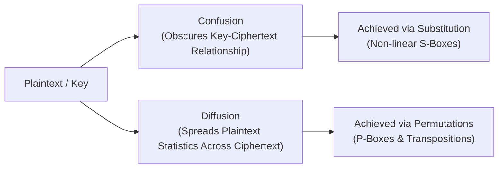
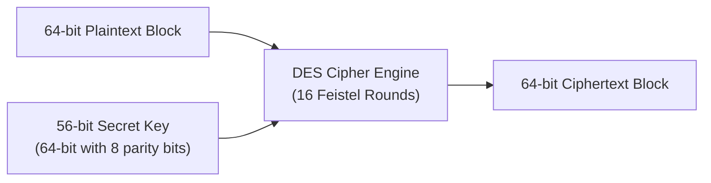
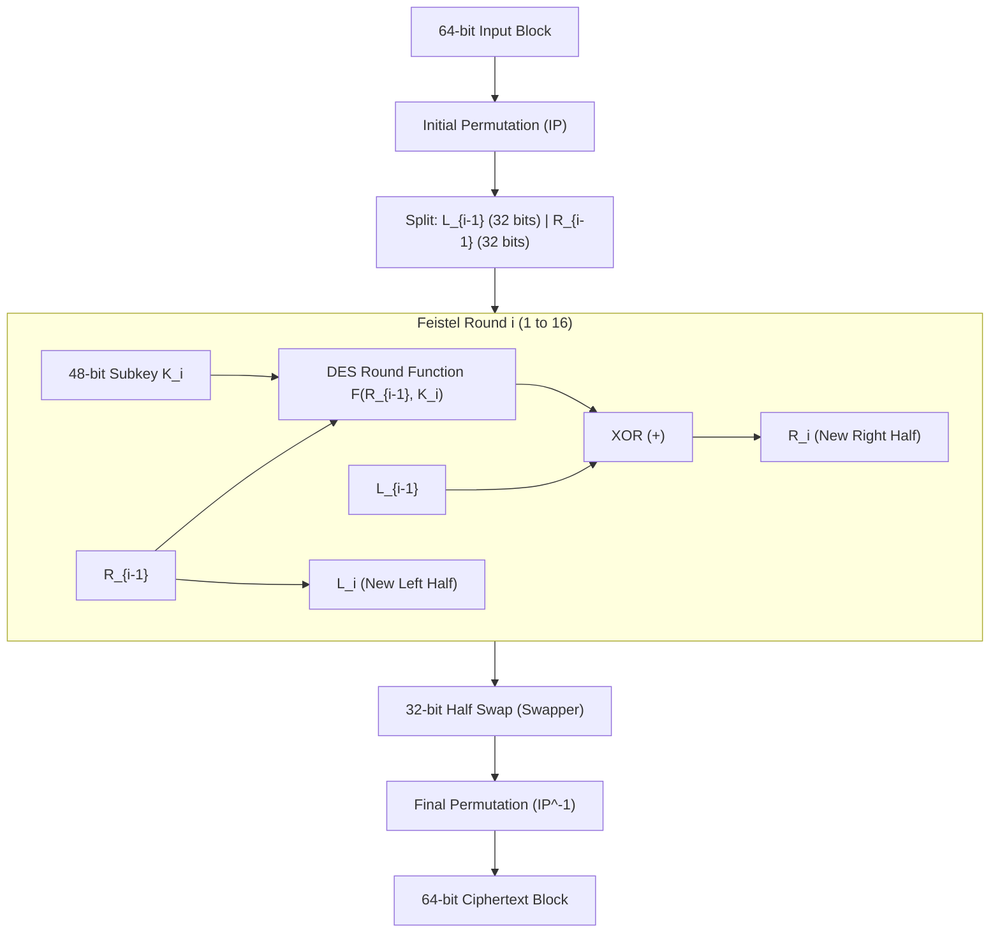
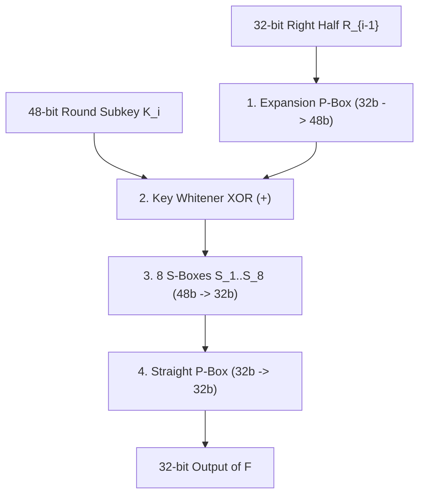
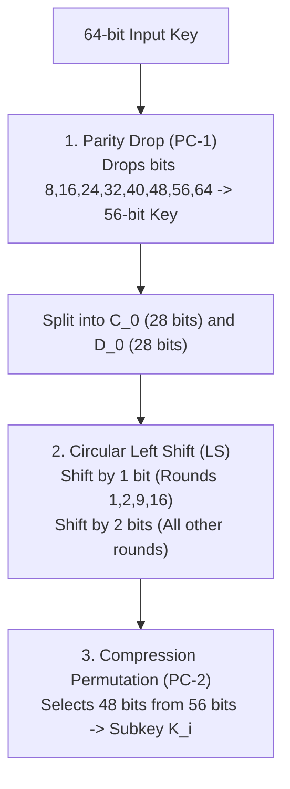
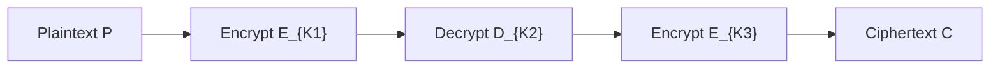

# Chapter 3: Block Ciphers & Data Encryption Standard (DES)

[← Back to Course README](../README.md)

- [1. Confusion vs. Diffusion Principles](#1-confusion-vs-diffusion-principles)
- [2. History & Overview of DES](#2-history--overview-of-des)
- [3. Feistel Cipher Architecture & Reversibility](#3-feistel-cipher-architecture--reversibility)
  - [Feistel Round Mathematics & Structure](#feistel-round-mathematics--structure)
  - [Symmetric Decryption Alignment](#symmetric-decryption-alignment)
- [4. DES Internal Structure & Permutation Boxes](#4-des-internal-structure--permutation-boxes)
  - [Initial (IP) and Final Permutations (IP^-1)](#initial-ip-and-final-permutations-ip-1)
  - [Numerical Permutation Traces (Examples 6.1 & 6.2)](#numerical-permutation-traces-examples-61--62)
- [5. The DES Function F(R_{i-1}, K_i)](#5-the-des-function-fri-1-ki)
  - [1. Expansion P-Box (32b -> 48b)](#1-expansion-p-box-32b---48b)
  - [2. Key Whitening (XOR)](#2-key-whitening-xor)
  - [3. S-Box Substitution Mechanics (48b -> 32b)](#3-s-box-substitution-mechanics-48b---32b)
  - [S-Box Worked Examples (Examples 6.3 & 6.4)](#s-box-worked-examples-examples-63--64)
  - [4. Straight Permutation P-Box (32b -> 32b)](#4-straight-permutation-p-box-32b---32b)
- [6. DES Key Schedule & Subkey Generation](#6-des-key-schedule--subkey-generation)
  - [Parity Drop (PC-1)](#parity-drop-pc-1)
  - [Cyclic Left Shift Schedule](#cyclic-left-shift-schedule)
  - [Compression Permutation (PC-2)](#compression-permutation-pc-2)
- [7. DES Property Analysis: Avalanche & Completeness](#7-des-property-analysis-avalanche--completeness)
  - [Avalanche Effect](#avalanche-effect)
  - [Completeness Effect](#completeness-effect)
- [8. Multiple DES (2DES & 3DES) and Meet-in-the-Middle Attack](#8-multiple-des-2des--3des-and-meet-in-the-middle-attack)
  - [Double DES (2DES) & MitM Vulnerability](#double-des-2des--mitm-vulnerability)
  - [Triple DES (3DES) Configurations](#triple-des-3des-configurations)
- [9. 8 Solved Practice & Exam Problems](#9-8-solved-practice--exam-problems)

---

## 1. Confusion vs. Diffusion Principles

Claude Shannon introduced two fundamental principles for designing secure cryptographic ciphers to frustrate statistical analysis:



- **Confusion**: An encryption operation that obscures the relationship between the secret key $K$ and the ciphertext $C$. In DES, confusion is provided primarily by the 8 non-linear **S-Boxes**.
- **Diffusion**: An encryption operation where the statistical influence of a single plaintext symbol is spread across many ciphertext symbols. In DES, diffusion is provided by the **Expansion P-Box**, **Straight P-Box**, and **Permuted Choice Boxes**.

---

## 2. History & Overview of DES

- **History**: In 1973, the National Institute of Standards and Technology (NIST) published a solicitation for a national symmetric key standard. IBM submitted a modified version of its *Lucifer* cipher, which was adopted as the **Data Encryption Standard (DES)** and published in March 1975 as FIPS PUB 46.
- **Block Size**: Encrypts 64-bit plaintext blocks into 64-bit ciphertext blocks.
- **Key Size**: Takes a 64-bit input key, from which 8 parity bits are dropped, leaving a **56-bit secret cipher key**.



---

## 3. Feistel Cipher Architecture & Reversibility

### Feistel Round Mathematics & Structure

DES employs a 16-round **Feistel Network**. The 64-bit block is split into two 32-bit halves: $L_{i-1}$ (Left) and $R_{i-1}$ (Right).



#### Feistel Round Equations:
$$L_i = R_{i-1}$$
$$R_i = L_{i-1} \oplus F(R_{i-1}, K_i)$$

---

### Symmetric Decryption Alignment

Decryption uses the identical Feistel structure and round logic as encryption, with the subkeys applied in **reverse order** ($K_{16}, K_{15}, \dots, K_1$):

```
Encryption Site:    Round 1 uses K1   ...  Round 16 uses K16
Decryption Site:    Round 1 uses K16  ...  Round 16 uses K1
```

Because the Mixer uses XOR ($\oplus$) and $A \oplus B \oplus B = A$, the round function $F$ does not need to be mathematically invertible for decryption to work perfectly.

---

## 4. DES Internal Structure & Permutation Boxes

### Initial (IP) and Final Permutations ($IP^{-1}$)

DES wraps its 16 Feistel rounds between two keyless, fixed 64-bit straight permutation boxes: **Initial Permutation (IP)** and **Final Permutation ($IP^{-1}$)**. These two permutations are exact mathematical inverses of each other.

```
Input Bit Index (1..64) ---> [ IP ] ---> IP Output Index
IP Output Index (1..64) ---> [ IP^-1 ] ---> Original Input Bit Index
```

*Note*: IP and $IP^{-1}$ carry zero cryptographic strength; they were included in 1975 for hardware byte-alignment reasons.

---

### Numerical Permutation Traces (Examples 6.1 & 6.2)

#### Example 6.1: Initial Permutation (IP) Trace
- **Input (Hex)**: `0002000000000001` (Only Bit 15 and Bit 64 are set to `1`).
- **IP Permutation Mapping Rule**:
  - Bit 15 of input maps to **Bit 63** of output.
  - Bit 64 of input maps to **Bit 25** of output.
- **Output Bits**: Output has 1s only at Bit 25 and Bit 63.
- **Output (Hex)**: `0000008000000002`

#### Example 6.2: Final Permutation ($IP^{-1}$) Inverse Proof
- **Input to $IP^{-1}$ (Hex)**: `0000008000000002` (1s at Bit 25 and Bit 63).
- **$IP^{-1}$ Mapping Rule**:
  - Bit 25 of input maps back to **Bit 64** of output.
  - Bit 63 of input maps back to **Bit 15** of output.
- **Output (Hex)**: `0002000000000001` (Original input recovered!) ✓

---

## 5. The DES Function $F(R_{i-1}, K_i)$

The heart of DES is the round function $F$, which takes the 32-bit right half $R_{i-1}$ and a 48-bit round subkey $K_i$ to produce a 32-bit output.



---

### 1. Expansion P-Box (32b $\rightarrow$ 48b)
Divides the 32-bit $R_{i-1}$ into eight 4-bit sections. Each 4-bit section is expanded to 6 bits by copying the boundary bits from adjacent sections:
- Bits 1, 2, 3, 4 of a section copy to output positions 2, 3, 4, 5.
- Output position 1 receives bit 4 of the previous section.
- Output position 6 receives bit 1 of the next section.

---

### 2. Key Whitening (XOR)
The 48-bit expanded output is XORed bitwise with the 48-bit round subkey $K_i$:
$$E(R_{i-1}) \oplus K_i$$

---

### 3. S-Box Substitution Mechanics (48b $\rightarrow$ 32b)
The 48-bit XORed output is split into eight 6-bit chunks and fed into 8 distinct S-Boxes ($S_1 \dots S_8$). Each S-Box maps a 6-bit input to a 4-bit output:

```
6-bit Input Chunk: (b1  b2  b3  b4  b5  b6)
  - Row Index (0..3):   Derived from Outer Bits (b1 b6) in binary.
  - Column Index (0..15): Derived from Inner Bits (b2 b3 b4 b5) in binary.
```

---

### S-Box Worked Examples (Examples 6.3 & 6.4)

#### Example 6.3: $S_1$ Box Lookup
- **Input to $S_1$**: `100011`
- **Outer Bits $(b_1 b_6)$**: `11` $\rightarrow$ Row $3_{10}$.
- **Inner Bits $(b_2 b_3 b_4 b_5)$**: `0001` $\rightarrow$ Column $1_{10}$.
- **$S_1$ Matrix Lookup** ($S_1[\text{Row } 3][\text{Col } 1]$): $12_{10} = \mathbf{1100_2}$.
- **Output**: `1100` (4 bits).

#### Example 6.4: $S_8$ Box Lookup
- **Input to $S_8$**: `000000`
- **Outer Bits $(b_1 b_6)$**: `00` $\rightarrow$ Row $0_{10}$.
- **Inner Bits $(b_2 b_3 b_4 b_5)$**: `0000` $\rightarrow$ Column $0_{10}$.
- **$S_8$ Matrix Lookup** ($S_8[\text{Row } 0][\text{Col } 0]$): $13_{10} = \mathbf{1101_2}$.
- **Output**: `1101` (4 bits).

---

### 4. Straight Permutation P-Box (32b $\rightarrow$ 32b)
Combines the eight 4-bit outputs from the S-Boxes into a 32-bit block and applies a straight permutation to diffuse bits across the next round (e.g., Bit 7 of input becomes Bit 2 of output).

---

## 6. DES Key Schedule & Subkey Generation

The subkey generator creates sixteen 48-bit subkeys ($K_1 \dots K_{16}$) from the 64-bit input key:



### Parity Drop (PC-1)
Drops the 8 parity check bits (bits 8, 16, 24, 32, 40, 48, 56, 64) and permutes the remaining 56 bits into two 28-bit halves ($C_0, D_0$).

### Cyclic Left Shift Schedule
For each round $i = 1 \dots 16$, $C_{i-1}$ and $D_{i-1}$ are left-shifted by 1 or 2 bits:
- **1-Bit Shift**: Rounds 1, 2, 9, and 16.
- **2-Bit Shift**: Rounds 3, 4, 5, 6, 7, 8, 10, 11, 12, 13, 14, and 15.

### Compression Permutation (PC-2)
Compresses the combined 56-bit shifted state $(C_i, D_i)$ into a 48-bit round subkey $K_i$.

---

## 7. DES Property Analysis: Avalanche & Completeness

### Avalanche Effect
A desirable property where a tiny change in either the plaintext or the key (e.g., flipping a single bit) produces a significant change in the ciphertext (altering $\approx 50\%$ of ciphertext bits).
- **Empirical DES Metric**: Encrypting two plaintexts differing by only **1 bit** results in ciphertext blocks differing by **29 bits** ($\approx 45\%$ of ciphertext changed).
- Significant bit changes propagate as early as **Round 3**.

### Completeness Effect
Ensures that each ciphertext bit depends upon many plaintext bits. The combined diffusion of Expansion P-Boxes, Straight P-Boxes, and S-Boxes produces strong completeness in DES.

---

## 8. Multiple DES (2DES & 3DES) and Meet-in-the-Middle Attack

Because single DES's 56-bit key space ($2^{56} \approx 7.2 \times 10^{16}$) can be brute-forced in hours by modern hardware, multi-key DES cascades were introduced.

---

### Double DES (2DES) & MitM Vulnerability

Double DES encrypts plaintext using two sequential DES stages with two independent keys ($K_1, K_2$):

$$C = E_{K2}(E_{K1}(P))$$
$$P = D_{K1}(D_{K2}(C))$$

- **Key Size**: $56 + 56 = 112$ bits.
- **Meet-in-the-Middle (MitM) Attack**:
  Rearranging the encryption equation yields:
  $$E_{K1}(P) = X = D_{K2}(C)$$
  1. Attacker computes and stores $E_{K1}(P)$ for all $2^{56}$ possible $K_1$ values in a table.
  2. Attacker computes $D_{K2}(C)$ for all $2^{56}$ possible $K_2$ values and checks for matches in the table.
  3. **Security Reduction**: Reduces 2DES security from $2^{112}$ down to $2^{56} + 2^{56} = \mathbf{2^{57}}$ operations! Thus, Double DES is **insecure**.

---

### Triple DES (3DES) Configurations

To resist Meet-in-the-Middle attacks, Triple DES (3DES) uses three DES stages in Encrypt-Decrypt-Encrypt (EDE) order:



$$\text{Encryption: } C = E_{K3}(D_{K2}(E_{K1}(P)))$$
$$\text{Decryption: } P = D_{K1}(E_{K2}(D_{K3}(C)))$$

#### 3DES Key Modes:
1. **3-Key 3DES (168-bit Key)**: Uses 3 independent keys ($K_1, K_2, K_3$). Resists MitM attacks with an effective security level of **$2^{112}$ operations**.
2. **2-Key 3DES (112-bit Key)**: Sets $K_3 = K_1$, so $C = E_{K1}(D_{K2}(E_{K1}(P)))$.
3. **Backward Compatibility**: Setting $K_1 = K_2 = K_3$ reduces 3DES directly to standard single DES!

---

## 9. 8 Solved Practice & Exam Problems

### Question 1: S-Box 1 Numerical Lookup
**Problem**: Calculate the 4-bit output of DES $S_1$ for input `110001`.

**Solution**:
1. Outer bits $(b_1 b_6) = 11_2 = 3_{10}$ (Row 3).
2. Inner bits $(b_2 b_3 b_4 b_5) = 1000_2 = 8_{10}$ (Col 8).
3. Lookup $S_1[\text{Row } 3][\text{Col } 8] = 5_{10} = \mathbf{0101_2}$.

---

### Question 2: Expansion P-Box Output Calculation
**Problem**: Why does the DES Expansion P-Box convert 32 bits into 48 bits, and how does this contribute to diffusion?

**Solution**:
The 32-bit right half is split into eight 4-bit blocks. Each block is expanded to 6 bits by copying border bits from adjacent blocks. This 48-bit output matches the 48-bit subkey size for XOR whitening and ensures that adjacent S-boxes share input bits, spreading changes rapidly across rounds (diffusion).

---

### Question 3: Parity Drop Key Calculation
**Problem**: Given a 64-bit key `0x0123456789ABCDEF`, how many bits are used for key generation and which bit positions are dropped?

**Solution**:
Exactly 8 parity bits located at positions 8, 16, 24, 32, 40, 48, 56, and 64 are dropped by PC-1. The remaining 56 bits form the active cipher key.

---

### Question 4: Meet-in-the-Middle Attack on Double DES
**Problem**: Explain why Double DES (2DES) does not provide 112 bits of security against a Known-Plaintext Attack.

**Solution**:
Due to the Meet-in-the-Middle attack, an attacker computes $E_{K1}(P) = X = D_{K2}(C)$. By sorting $2^{56}$ intermediate states $X$, the attacker finds matching key pairs in $2^{57}$ steps instead of searching all $2^{112}$ key combinations.

---

### Question 5: Key Shift Schedule Determination
**Problem**: Which rounds in DES perform a 1-bit circular left shift during subkey generation?

**Solution**:
Rounds **1, 2, 9, and 16** perform a 1-bit shift. All other 12 rounds perform a 2-bit shift.

---

### Question 6: S-Box Row and Column Mapping Rule
**Problem**: For input `011111` to an S-box, determine the decimal row and column indices used for matrix lookup.

**Solution**:
- Outer bits $(b_1 b_6) = 01_2 = \mathbf{1_{10}}$ (Row 1).
- Inner bits $(b_2 b_3 b_4 b_5) = 1111_2 = \mathbf{15_{10}}$ (Column 15).

---

### Question 7: Feistel Decryption Invertibility Requirement
**Problem**: Must the internal round function $F$ be mathematically invertible for Feistel decryption to succeed? Explain.

**Solution**:
No. Because the Feistel structure uses XOR ($\oplus$) to combine the output of $F$ with the left half ($R_i = L_{i-1} \oplus F(R_{i-1}, K_i)$), decryption simply recomputes $F(L_i, K_i)$ and XORs it with $R_i$ to recover $L_{i-1}$. Function $F$ never needs to be inverted.

---

### Question 8: 3DES EDE Mode Backward Compatibility
**Problem**: How can a 3DES hardware implementation be configured to operate as single DES?

**Solution**:
By setting all three subkeys equal ($K_1 = K_2 = K_3$). The first stage encrypts $E_{K1}(P)$, the second stage decrypts $D_{K1}(E_{K1}(P)) = P$, and the third stage encrypts $E_{K1}(P)$, resulting in standard single DES encryption.
