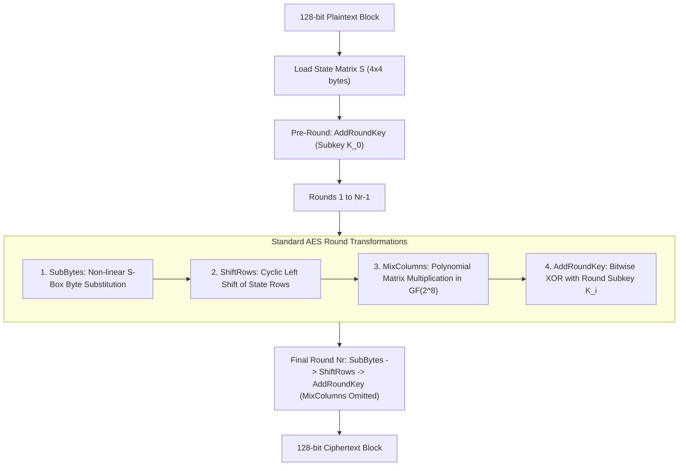
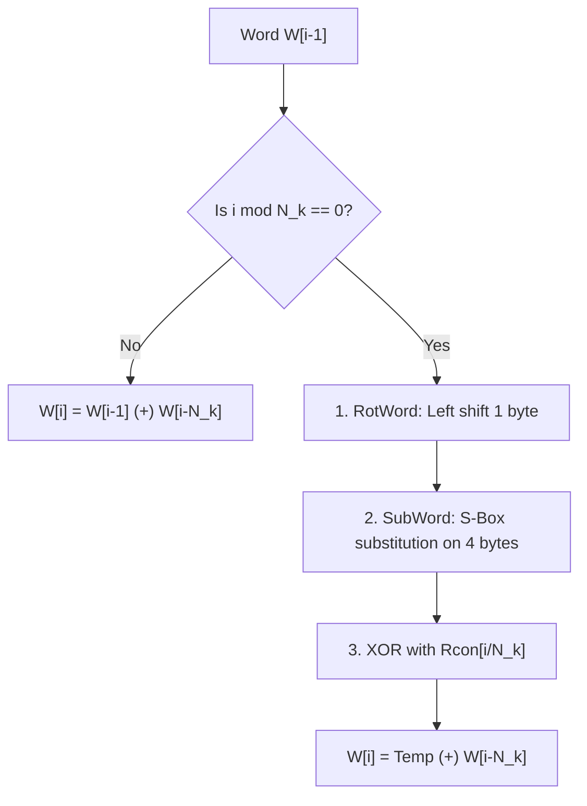

# Chapter 4: Advanced Encryption Standard (AES)

[← Back to Course README](../README.md)

- [1. AES History & Standardization Specifications](#1-aes-history--standardization-specifications)
- [2. AES Data Units & State Array Architecture](#2-aes-data-units--state-array-architecture)
  - [Data Units (Bit, Byte, Word, Block, State)](#data-units-bit-byte-word-block-state)
  - [State Array Column-Major Formatting](#state-array-column-major-formatting)
- [3. Galois Field $GF(2^8)$ Arithmetic](#3-galois-field-gf28-arithmetic)
  - [Field Addition & Subtraction (XOR)](#field-addition--subtraction-xor)
  - [Field Multiplication by $x$ (xtime)](#field-multiplication-by-x-xtime)
  - [Polynomial Multiplication Example in $GF(2^8)$](#polynomial-multiplication-example-in-gf28)
- [4. Structure of Each AES Round](#4-structure-of-each-aes-round)
- [5. The Four AES Round Transformations](#5-the-four-aes-round-transformations)
  - [1. SubBytes & InvSubBytes (Substitution)](#1-subbytes--invsubbytes-substitution)
  - [SubBytes Algebraic Derivation (Example 7.3)](#subbytes-algebraic-derivation-example-73)
  - [2. ShiftRows & InvShiftRows (Permutation)](#2-shiftrows--invshiftrows-permutation)
  - [3. MixColumns & InvMixColumns (Mixing)](#3-mixcolumns--invmixcolumns-mixing)
  - [MixColumns Inter-Byte Diffusion Example (Example 7.5)](#mixcolumns-inter-byte-diffusion-example-example-75)
  - [4. AddRoundKey (Key Addition)](#4-addroundkey-key-addition)
- [6. AES Key Expansion Schedule](#6-aes-key-expansion-schedule)
  - [Key Expansion Algorithm (AES-128, 192, 256)](#key-expansion-algorithm-aes-128-192-256)
  - [SubWord, RotWord, and Round Constants (Rcon)](#subword-rotword-and-round-constants-rcon)
- [7. 8 Solved Practice & Exam Problems](#7-8-solved-practice--exam-problems)

---

## 1. AES History & Standardization Specifications

In 1997, the National Institute of Standards and Technology (NIST) initiated an international competition to replace the aging Data Encryption Standard (DES). NIST specified that the new **Advanced Encryption Standard (AES)** must satisfy the following criteria:
- **Architecture**: Non-Feistel symmetric block cipher (Substitution-Permutation Network - SPN).
- **Block Size**: Fixed 128-bit block size ($16$ bytes).
- **Key Sizes**: 128 bits, 192 bits, and 256 bits.
- **Open Standard**: Worldwide public availability without royalty restrictions.

In December 2001, NIST officially published AES as **FIPS PUB 197**, selecting the *Rijndael* cipher designed by Belgian cryptographers Joan Daemen and Vincent Rijmen.

### Three Official AES Versions:

| AES Version | Key Length ($K$) | Block Size ($N_b$) | Key Words ($N_k$) | Rounds ($N_r$) | Subkey Words Generated |
| :--- | :---: | :---: | :---: | :---: | :---: |
| **AES-128** | 128 bits (16 bytes) | 128 bits (4 words) | 4 words | **10 Rounds** | 44 words (176 bytes) |
| **AES-192** | 192 bits (24 bytes) | 128 bits (4 words) | 6 words | **12 Rounds** | 52 words (208 bytes) |
| **AES-256** | 256 bits (32 bytes) | 128 bits (4 words) | 8 words | **14 Rounds** | 60 words (240 bytes) |

- **Round Key Size**: Every round key is **always 128 bits** (4 words of 32 bits each).
- **Total Subkey Words**: $4 \times (N_r + 1)$ words ($K_0, K_1, \dots, K_{N_r}$).

---

## 2. AES Data Units & State Array Architecture

### Data Units (Bit, Byte, Word, Block, State)
AES defines data using 5 hierarchy units:
1. **Bit**: Smallest binary unit ($0$ or $1$).
2. **Byte**: Group of 8 bits ($1 \times 8$ row or $8 \times 1$ column matrix).
3. **Word**: Group of 32 bits (4 bytes), treated as a row or column vector of bytes.
4. **Block**: Group of 128 bits (16 bytes).
5. **State ($S$)**: Intermediate 128-bit data block represented as a $4 \times 4$ matrix of 16 bytes ($s_{r,c}$ where row $r \in \{0,1,2,3\}$ and column $c \in \{0,1,2,3\}$).

---

### State Array Column-Major Formatting

When a 16-byte input block $b_0, b_1, b_2, \dots, b_{15}$ enters AES, it is loaded into the $4 \times 4$ **State Array** in **column-major order**:

$$S = \begin{bmatrix} s_{0,0} & s_{0,1} & s_{0,2} & s_{0,3} \\ s_{1,0} & s_{1,1} & s_{1,2} & s_{1,3} \\ s_{2,0} & s_{2,1} & s_{2,2} & s_{2,3} \\ s_{3,0} & s_{3,1} & s_{3,2} & s_{3,3} \end{bmatrix} = \begin{bmatrix} b_0 & b_4 & b_8 & b_{12} \\ b_1 & b_5 & b_9 & b_{13} \\ b_2 & b_6 & b_{10} & b_{14} \\ b_3 & b_7 & b_{11} & b_{15} \end{bmatrix}$$

#### Example 7.1: Text Block Matrix Loading
- Plaintext string: `"AESUSESAMATRIXZZ"` (16 ASCII characters).
- Loading into $4 \times 4$ State matrix in column-major order:
  - Column 0: `'A'` ($b_0$), `'E'` ($b_1$), `'S'` ($b_2$), `'U'` ($b_3$)
  - Column 1: `'S'` ($b_4$), `'E'` ($b_5$), `'S'` ($b_6$), `'A'` ($b_7$)
  - Column 2: `'M'` ($b_8$), `'A'` ($b_9$), `'T'` ($b_{10}$), `'R'` ($b_{11}$)
  - Column 3: `'I'` ($b_{12}$), `'X'` ($b_{13}$), `'Z'` ($b_{14}$), `'Z'` ($b_{15}$)

---

## 3. Galois Field $GF(2^8)$ Arithmetic

AES operations are defined over the finite field $GF(2^8)$ modulo the irreducible polynomial:

$$m(x) = x^8 + x^4 + x^3 + x + 1 \quad (\text{Hexadecimal: } \text{0x11B})$$

Each 8-bit byte $b_7 b_6 b_5 b_4 b_3 b_2 b_1 b_0$ represents a polynomial $b_7 x^7 + b_6 x^6 + \dots + b_1 x + b_0$.

---

### Field Addition & Subtraction (XOR)

In $GF(2^8)$, addition and subtraction are identical and implemented as bitwise XOR ($\oplus$):

$$A(x) \oplus B(x) = \sum_{i=0}^7 (a_i \oplus b_i) x^i$$

---

### Field Multiplication by $x$ (`xtime`)

Multiplying polynomial $a(x)$ by $x$ (`0x02`):
$$\text{xtime}(a) = \begin{cases} (a \ll 1) & \text{if } a_7 = 0 \\ (a \ll 1) \oplus \text{0x1B} & \text{if } a_7 = 1 \end{cases}$$

---

### Polynomial Multiplication Example in $GF(2^8)$

Multiply `0x53` ($01010011_2$) by `0x83` ($10000011_2$) modulo $m(x)$:
- $a(x) = x^6 + x^4 + x + 1$ (`0x53`)
- $b(x) = x^7 + x + 1$ (`0x83`)
- Product before reduction:
  $$a(x) \cdot b(x) = x^{13} + x^{11} + x^8 + x^6 + x^5 + x^4 + x^2 + 1$$
- Polynomial long division modulo $m(x) = x^8 + x^4 + x^3 + x + 1$ yields:
  $$r(x) = x^7 + x^6 + x^3 + x^2 + 1 = 11001101_2 = \mathbf{\text{0xCD}}$$

---

## 4. Structure of Each AES Round

Unlike Feistel ciphers, AES processes all 128 bits of the State matrix simultaneously in every round:



#### Key Round Architectural Properties:
- **Pre-Round**: Contains only `AddRoundKey` ($K_0$).
- **Rounds $1 \dots N_r-1$**: Contain all 4 transformations (`SubBytes`, `ShiftRows`, `MixColumns`, `AddRoundKey`).
- **Final Round $N_r$**: Contains 3 transformations (`SubBytes`, `ShiftRows`, `AddRoundKey`)—**`MixColumns` is omitted**!
- **Decryption**: Applies inverse transformations (`InvSubBytes`, `InvShiftRows`, `InvMixColumns`, `AddRoundKey`). `AddRoundKey` is its own self-inverse.

---

## 5. The Four AES Round Transformations

### 1. SubBytes & InvSubBytes (Substitution)

**SubBytes** is an intrabyte non-linear substitution stage where each byte in the State matrix is independently updated using a $16 \times 16$ S-Box lookup table.

```
Byte b (Hex: R C) ---> Row R, Column C in S-Box ---> Substituted Byte b'
```

- **Confusion**: Provides non-linearity. E.g., two bytes `0x5A` ($01011010_2$) and `0x5B` ($01011011_2$) differing by 1 bit map to `0xBE` and `0x39` differing by 4 bits.

---

### SubBytes Algebraic Derivation (Example 7.3)

Each S-Box byte substitution $b \rightarrow b'$ is derived algebraically in $GF(2^8)$:
1. Find multiplicative inverse $b^{-1}$ in $GF(2^8)$ modulo $m(x)$ (with $00^{-1} = 00$).
2. Apply an affine transformation over $GF(2)$:
   $$c_i = b^{-1}_i \oplus b^{-1}_{(i+4)\bmod 8} \oplus b^{-1}_{(i+5)\bmod 8} \oplus b^{-1}_{(i+6)\bmod 8} \oplus b^{-1}_{(i+7)\bmod 8} \oplus c_i$$
   Vector matrix equation: $\mathbf{c} = \mathbf{X} \cdot \mathbf{b^{-1}} \oplus \mathbf{y}$ where $\mathbf{y} = \text{0x63}$.

#### Worked Example 7.3 (`0x0C` Transformation):
1. **Multiplicative Inverse**: In $GF(2^8)$, $\text{0x0C}^{-1} = \mathbf{\text{0xB0}} = (10110000_2)$.
2. **Affine Matrix Multiplication**: $\mathbf{X} \cdot (10110000_2)^T = (10011101_2)$.
3. **Add Constant $\mathbf{y} = \text{0x63}$ ($01100011_2$)**:
   $$(10011101_2) \oplus (01100011_2) = 11111110_2 = \mathbf{\text{0xFE}}$$
   SubBytes mapping: **`0x0C` $\rightarrow$ `0xFE`**.

---

### 2. ShiftRows & InvShiftRows (Permutation)

**ShiftRows** cyclically shifts bytes in the rows of the State matrix to the left:
- **Row 0**: Shift 0 bytes (unmodified).
- **Row 1**: Left shift 1 byte.
- **Row 2**: Left shift 2 bytes.
- **Row 3**: Left shift 3 bytes.

$$\begin{bmatrix} s_{0,0} & s_{0,1} & s_{0,2} & s_{0,3} \\ s_{1,0} & s_{1,1} & s_{1,2} & s_{1,3} \\ s_{2,0} & s_{2,1} & s_{2,2} & s_{2,3} \\ s_{3,0} & s_{3,1} & s_{3,2} & s_{3,3} \end{bmatrix} \xrightarrow{\text{ShiftRows}} \begin{bmatrix} s_{0,0} & s_{0,1} & s_{0,2} & s_{0,3} \\ s_{1,1} & s_{1,2} & s_{1,3} & s_{1,0} \\ s_{2,2} & s_{2,3} & s_{2,0} & s_{2,1} \\ s_{3,3} & s_{3,0} & s_{3,1} & s_{3,2} \end{bmatrix}$$

- **InvShiftRows (Decryption)**: Cyclically shifts rows to the right by the same offsets (0, 1, 2, 3 bytes).

---

### 3. MixColumns & InvMixColumns (Mixing)

**MixColumns** is an inter-byte transformation operating on State columns. Each 4-byte column is multiplied by a fixed constant matrix over $GF(2^8)$:

$$\begin{bmatrix} s'_{0,c} \\ s'_{1,c} \\ s'_{2,c} \\ s'_{3,c} \end{bmatrix} = \begin{bmatrix} \text{02} & \text{03} & \text{01} & \text{01} \\ \text{01} & \text{02} & \text{03} & \text{01} \\ \text{01} & \text{01} & \text{02} & \text{03} \\ \text{03} & \text{01} & \text{01} & \text{02} \end{bmatrix} \begin{bmatrix} s_{0,c} \\ s_{1,c} \\ s_{2,c} \\ s_{3,c} \end{bmatrix}$$

#### InvMixColumns Matrix (Decryption):
$$\begin{bmatrix} \text{0E} & \text{0B} & \text{0D} & \text{09} \\ \text{09} & \text{0E} & \text{0B} & \text{0D} \\ \text{0D} & \text{09} & \text{0E} & \text{0B} \\ \text{0B} & \text{0D} & \text{09} & \text{0E} \end{bmatrix}$$

- **Diffusion**: Mixing combines all 4 bytes of a column so that each output byte depends on every input byte in that column.

---

### MixColumns Inter-Byte Diffusion Example (Example 7.5)

Suppose a State row contains identical bytes `0xF2` at $s_{1,0}$ and $s_{1,2}$. After passing through `MixColumns`, $s'_{1,0}$ becomes **`0xCF`** and $s'_{1,2}$ becomes **`0x0D`**. Equal bytes in different position contexts are transformed into distinct values, destroying structural patterns.

---

### 4. AddRoundKey (Key Addition)

**AddRoundKey** performs a bitwise XOR ($\oplus$) between each column of the State matrix and the corresponding 32-bit (4-byte) word of the expanded round key:

$$s'_{r,c} = s_{r,c} \oplus W_{4r + c}$$

- **Self-Inverse**: Because $A \oplus B \oplus B = A$, `AddRoundKey` is its own mathematical inverse!

---

## 6. AES Key Expansion Schedule

Key expansion converts the original cipher key into $4 \times (N_r + 1)$ subkey words ($W_0 \dots W_{4N_r + 3}$).



---

### Key Expansion Algorithm (AES-128, 192, 256)

1. **Initial Words**: $W_0, W_1, \dots, W_{N_k-1}$ copy the $N_k$ words ($4N_k$ bytes) of the input cipher key.
2. **Subsequent Words ($i = N_k \dots 4N_r + 3$)**:
   - **If $i \not\equiv 0 \pmod{N_k}$**:
     $$W_i = W_{i-1} \oplus W_{i-N_k}$$
   - **If $i \equiv 0 \pmod{N_k}$**:
     $$W_i = \text{Temp} \oplus W_{i-N_k}$$
     $$\text{where } \text{Temp} = \text{SubWord}(\text{RotWord}(W_{i-1})) \oplus \text{Rcon}[i / N_k]$$

---

### SubWord, RotWord, and Round Constants (Rcon)

- **RotWord**: Cyclically shifts a 4-byte word $[b_0, b_1, b_2, b_3]$ left by 1 byte $\rightarrow [b_1, b_2, b_3, b_0]$.
- **SubWord**: Applies the SubBytes S-Box lookup to each of the 4 bytes in a word.
- **Round Constants ($\text{Rcon}[j]$)**: 4-byte word $[\text{RC}[j], \text{00}, \text{00}, \text{00}]$ where $\text{RC}[j] = 2^{j-1} \pmod{x^8 + x^4 + x^3 + x + 1}$ in $GF(2^8)$:

$$\text{RC}[1..10] = [\text{0x01}, \text{0x02}, \text{0x04}, \text{0x08}, \text{0x10}, \text{0x20}, \text{0x40}, \text{0x80}, \text{0x1B}, \text{0x36}]$$

---

## 7. 8 Solved Practice & Exam Problems

### Question 1: Number of Round Subkey Words
**Problem**: Calculate the total number of 32-bit subkey words generated for AES-192 and AES-256.

**Solution**:
- AES-192 ($N_r = 12$): $4 \times (12 + 1) = \mathbf{52} \text{ words}$.
- AES-256 ($N_r = 14$): $4 \times (14 + 1) = \mathbf{60} \text{ words}$.

---

### Question 2: Absence of MixColumns in Final Round
**Problem**: Why is the `MixColumns` transformation omitted in the final round $N_r$ of AES?

**Solution**:
Omitting `MixColumns` in the final round makes the encryption and decryption round structures mathematically symmetric. It allows decryption to execute inverse operations in reverse order without requiring an extra `InvMixColumns` before the initial round key addition.

---

### Question 3: ShiftRows Transformation Trace
**Problem**: Given Row 2 of an AES state matrix $[A, B, C, D]$, state the resulting row after `ShiftRows`.

**Solution**:
Row 2 is cyclically left-shifted by 2 bytes:
$$[A, B, C, D] \xrightarrow{\text{ShiftRows}} \mathbf{[C, D, A, B]}$$

---

### Question 4: SubBytes Self-Inverse Property
**Problem**: Is `SubBytes` its own inverse? Explain.

**Solution**:
No. `SubBytes` uses the forward S-Box matrix based on $b^{-1}$ and constant $\text{0x63}$. `InvSubBytes` uses a separate inverse S-Box table based on inverse affine transformations.

---

### Question 5: AddRoundKey Self-Inverse Proof
**Problem**: Prove mathematically why `AddRoundKey` is its own inverse.

**Solution**:
`AddRoundKey` adds a round key word $K$ to State $S$ using bitwise XOR ($\oplus$):
$$S' = S \oplus K$$
Applying `AddRoundKey` a second time with the same key $K$:
$$S'' = S' \oplus K = (S \oplus K) \oplus K = S \oplus (K \oplus K) = S \oplus 0 = \mathbf{S}$$
Thus, `AddRoundKey` is its own mathematical inverse.

---

### Question 6: Column-Major Loading of State Array
**Problem**: If a 16-byte block is `00 11 22 33 44 55 66 77 88 99 AA BB CC DD EE FF`, show Column 1 of the state matrix.

**Solution**:
Loading in column-major order:
- Col 0: Bytes 0..3 (`00, 11, 22, 33`)
- Col 1: Bytes 4..7 (`44, 55, 66, 77`)
Column 1 vector is **`[44, 55, 66, 77]^T`**.

---

### Question 7: xtime Operation Calculation
**Problem**: Calculate $\text{xtime}(\text{0xAF})$ in $GF(2^8)$.

**Solution**:
1. $\text{0xAF} = 10101111_2$. MSB $a_7 = 1$.
2. Left shift by 1 bit: $(10101111_2 \ll 1) = 01011110_2 = \text{0x5E}$.
3. XOR with $\text{0x1B}$ ($00011011_2$):
   $$\text{0x5E} \oplus \text{0x1B} = 01011110_2 \oplus 00011011_2 = 01000101_2 = \mathbf{\text{0x45}}$$

---

### Question 8: RotWord Operation
**Problem**: Find the output of `RotWord([0xCF, 0x4F, 0x3C, 0x09])`.

**Solution**:
`RotWord` cyclically left-shifts the 4 bytes by 1 position:
$$[\text{0xCF}, \text{0x4F}, \text{0x3C}, \text{0x09}] \rightarrow \mathbf{[\text{0x4F}, \text{0x3C}, \text{0x09}, \text{0xCF}]}$$
