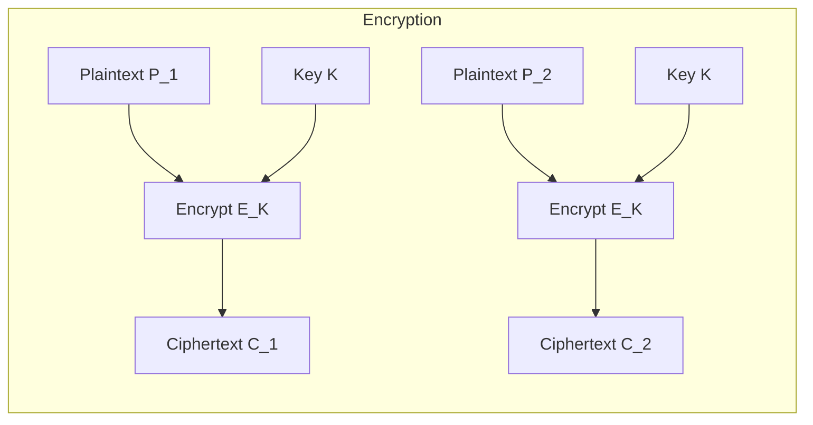
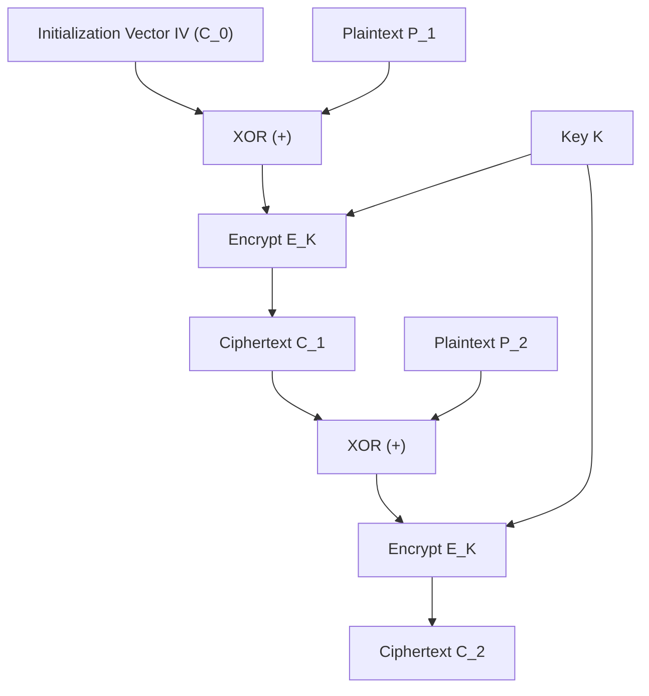
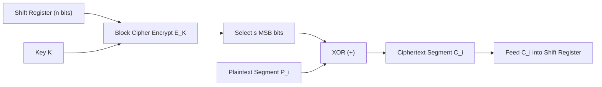
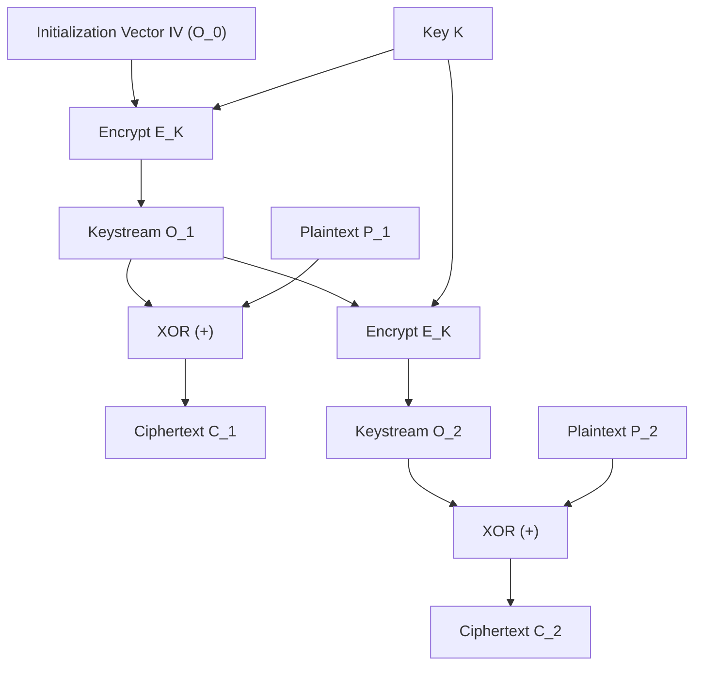
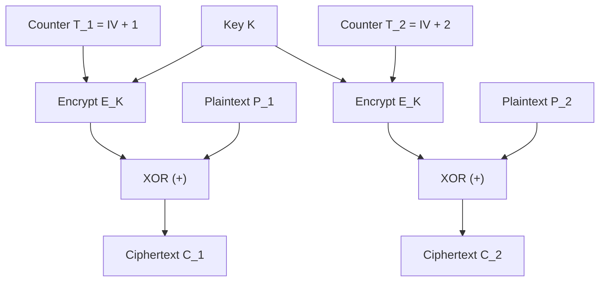
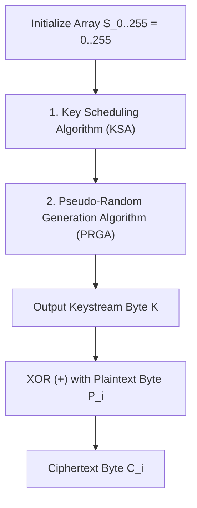

# Chapter 5: Block Cipher Modes of Operation & Stream Ciphers

[← Back to Course README](../README.md)

- [1. Rationale for Block Cipher Modes of Operation](#1-rationale-for-block-cipher-modes-of-operation)
- [2. Electronic Codebook (ECB) Mode](#2-electronic-codebook-ecb-mode)
- [3. Cipher Block Chaining (CBC) Mode](#3-cipher-block-chaining-cbc-mode)
- [4. Cipher Feedback (CFB) Mode](#4-cipher-feedback-cfb-mode)
- [5. Output Feedback (OFB) Mode](#5-output-feedback-ofb-mode)
- [6. Counter (CTR) Mode](#6-counter-ctr-mode)
- [7. AES-XTS Mode (Disk & Storage Encryption)](#7-aes-xts-mode-disk--storage-encryption)
- [8. Master Modes Comparison Matrix](#8-master-modes-comparison-matrix)
- [9. The RC4 Stream Cipher](#9-the-rc4-stream-cipher)
  - [Key Scheduling Algorithm (KSA)](#key-scheduling-algorithm-ksa)
  - [Pseudo-Random Generation Algorithm (PRGA)](#pseudo-random-generation-algorithm-prga)
- [10. 8 Solved Practice & Exam Problems](#10-8-solved-practice--exam-problems)

---

## 1. Rationale for Block Cipher Modes of Operation

Block ciphers (such as DES and AES) are designed to encrypt a fixed-size block of text ($64\text{ bits}$ for DES, $128\text{ bits}$ for AES). In real-world applications, plaintexts vary greatly in size and are typically much larger than a single block.

To securely process messages of arbitrary length using a underlying block cipher primitive, cryptographers use **Modes of Operation**. NIST defines 5 primary confidentiality modes: **ECB, CBC, CFB, OFB, and CTR**.

---

## 2. Electronic Codebook (ECB) Mode

**ECB** is the simplest mode of operation. The plaintext is divided into $N$ blocks of $n$ bits ($n=128$ for AES). Each block is encrypted independently using the same key $K$.



#### Mathematical Formulations:
$$\text{Encryption: } C_i = E_K(P_i)$$
$$\text{Decryption: } P_i = D_K(C_i)$$

#### Security & Operational Properties:
- **Vulnerability**: Identical plaintext blocks produce identical ciphertext blocks under the same key $K$. Exposes structural patterns in data (e.g., bitmap image headers).
- **Parallelism**: Fully parallelizable for both encryption and decryption.
- **Error Propagation**: A bit error in ciphertext block $C_i$ corrupts only the corresponding decrypted plaintext block $P_i$.

---

## 3. Cipher Block Chaining (CBC) Mode

In **CBC mode**, each plaintext block $P_i$ is XORed ($\oplus$) with the previous ciphertext block $C_{i-1}$ before being encrypted. An **Initialization Vector (IV)** is used as $C_0$ for the first block.



#### Mathematical Formulations:
$$\text{Encryption: } C_i = E_K(P_i \oplus C_{i-1}) \quad (\text{where } C_0 = IV)$$
$$\text{Decryption: } P_i = D_K(C_i) \oplus C_{i-1}$$

#### Security & Operational Properties:
- **Pattern Hiding**: Identical plaintext blocks produce completely different ciphertext blocks due to chaining.
- **Parallelism**: Encryption is strictly **sequential** (requires $C_{i-1}$). Decryption is **fully parallelizable**.
- **Error Propagation**: A single bit error in ciphertext $C_i$ completely corrupts plaintext block $P_i$ and flips the corresponding bit in $P_{i+1}$.

---

## 4. Cipher Feedback (CFB) Mode

**CFB mode** allows a block cipher to operate as a self-synchronizing stream cipher processing $r$-bit segments ($r \le n$, e.g., $r=8\text{ bits}$ for ASCII characters).



#### Mathematical Formulations:
$$\text{Encryption: } C_i = P_i \oplus \text{MSB}_r(E_K(S_{i-1}))$$
$$\text{Decryption: } P_i = C_i \oplus \text{MSB}_r(E_K(S_{i-1}))$$

#### Key Feature:
Decryption uses the **Encryption function $E_K$** of the block cipher! The decryption algorithm $D_K$ is never used.

---

## 5. Output Feedback (OFB) Mode

In **OFB mode**, the block cipher generates a pseudorandom keystream $O_i$ independently of the plaintext or ciphertext. $O_i$ is XORed with plaintext $P_i$.



#### Mathematical Formulations:
$$\text{Keystream Generation: } O_i = E_K(O_{i-1}) \quad (\text{where } O_0 = IV)$$
$$\text{Encryption: } C_i = P_i \oplus O_i$$
$$\text{Decryption: } P_i = C_i \oplus O_i$$

#### Security & Operational Properties:
- **Zero Error Propagation**: A bit error in ciphertext $C_i$ affects **only the single corresponding bit** in decrypted plaintext $P_i$. Errors do not propagate!
- **Pre-computation**: Keystream $O_i$ can be pre-computed before plaintext arrives.

---

## 6. Counter (CTR) Mode

**CTR mode** converts a block cipher into a stream cipher by encrypting an incrementing counter sequence $T_i = IV + i$.



#### Mathematical Formulations:
$$\text{Encryption: } C_i = P_i \oplus E_K(T_i) \quad (\text{where } T_i = \text{Counter}_i)$$
$$\text{Decryption: } P_i = C_i \oplus E_K(T_i)$$

#### Key Advantages:
1. **Full Parallelism**: Both encryption and decryption are 100% parallelizable.
2. **Random Access**: Any block $i$ can be decrypted independently without processing previous blocks.
3. **High Speed**: Preferred mode for high-speed network interfaces, SSD disk encryption, and cloud storage.

---

## 7. AES-XTS Mode (Disk & Storage Encryption)

**AES-XTS** is standardized for block-oriented storage devices (hard drives, SSDs, cloud storage volumes):

$$C_i = E_{K1}(P_i \oplus T) \oplus T \quad \text{where } T = E_{K2}(\text{Sector Number}) \otimes \alpha^i$$

- Eliminates ciphertext expansion (no storage space lost for per-block IVs).
- Prevents dictionary attacks across sectors.

---

## 8. Master Modes Comparison Matrix

| Mode | Operation Type | Encryption Parallelizable? | Decryption Parallelizable? | Direct Random Access? | Error Propagation Effect |
| :--- | :--- | :---: | :---: | :---: | :--- |
| **ECB** | Block | **Yes** | **Yes** | **Yes** | Single block $P_i$ only |
| **CBC** | Block (Chained) | No | **Yes** | **Yes** (Decryption) | Entire $P_i$ + 1 bit in $P_{i+1}$ |
| **CFB** | Stream (Feedback) | No | **Yes** | **Yes** (Decryption) | $P_i$ + propagation in $P_{i+1}$ |
| **OFB** | Stream (Output) | No | No | No | **Single bit only (No propagation)** |
| **CTR** | Stream (Counter) | **Yes** | **Yes** | **Yes** | **Single bit only (No propagation)** |
| **XTS** | Storage Block | **Yes** | **Yes** | **Yes** | Single sector block only |

---

## 9. The RC4 Stream Cipher

Designed by Ron Rivest, **RC4** is a byte-oriented stream cipher using a 256-byte internal permutation array $S[0 \dots 255]$ and a variable-length key ($1 \dots 256$ bytes).



### Key Scheduling Algorithm (KSA)

```python
def rc4_ksa(key: bytes):
    S = list(range(256))
    j = 0
    key_len = len(key)
    for i in range(256):
        j = (j + S[i] + key[i % key_len]) % 256
        S[i], S[j] = S[j], S[i]  # Swap
    return S
```

### Pseudo-Random Generation Algorithm (PRGA)

```python
def rc4_prga(S, length):
    i = 0
    j = 0
    keystream = []
    for _ in range(length):
        i = (i + 1) % 256
        j = (j + S[i]) % 256
        S[i], S[j] = S[j], S[i]  # Swap
        K = S[(S[i] + S[j]) % 256]
        keystream.append(K)
    return bytes(keystream)
```

---

## 10. 8 Solved Practice & Exam Problems

### Question 1: ECB Visual Pattern Vulnerability
**Problem**: Why should ECB mode never be used to encrypt bitmap images or database records with repetitive structures?

**Solution**:
In ECB mode, identical plaintext blocks produce identical ciphertext blocks ($C_i = E_K(P_i)$). When encrypting a bitmap image, solid color backgrounds or repeated headers generate identical ciphertext blocks, preserving the visual shape of the image in ciphertext.

---

### Question 2: CBC Error Propagation
**Problem**: Suppose a 1-bit transmission error occurs in ciphertext block $C_2$ during CBC mode transmission. Describe the exact impact on decrypted blocks $P_1, P_2, P_3$.

**Solution**:
1. $P_1 = D_K(C_1) \oplus C_0$: Unaffected.
2. $P_2 = D_K(C_2) \oplus C_1$: Since $C_2$ is corrupted, $D_K(C_2)$ produces completely random garbage. $P_2$ is **completely corrupted**.
3. $P_3 = D_K(C_3) \oplus C_2$: Since $C_2$ has a 1-bit error, $P_3$ will have **exactly 1 flipped bit** at the corresponding position.
4. Subsequent blocks ($P_4, P_5 \dots$): Completely unaffected.

---

### Question 3: OFB vs. CFB Decryption Function
**Problem**: Which block cipher function ($E_K$ or $D_K$) is used during decryption in OFB and CFB modes?

**Solution**:
Both OFB and CFB modes use the **Encryption function $E_K$** for decryption. In both modes, the block cipher generates a keystream by encrypting feedback blocks; the resulting keystream is XORed with ciphertext to recover plaintext.

---

### Question 4: CTR Mode Parallelism
**Problem**: Explain why CTR mode allows parallel encryption and decryption, whereas CBC mode permits only parallel decryption.

**Solution**:
In CTR mode, each block keystream is generated independently by encrypting a unique counter $E_K(\text{Counter}_i)$, allowing all block computations to run in parallel. In CBC mode, encryption requires $C_{i-1}$ as input to encrypt block $i$ ($C_i = E_K(P_i \oplus C_{i-1})$), forcing encryption to be strictly sequential. Decryption in CBC mode relies only on $C_i$ and $C_{i-1}$, which are both known in advance, enabling parallel decryption.

---

### Question 5: OFB Error Propagation
**Problem**: Why does OFB mode exhibit zero error propagation?

**Solution**:
In OFB mode, the keystream $O_i = E_K(O_{i-1})$ is generated independently of the plaintext or ciphertext. Since $P_i = C_i \oplus O_i$, a bit error in $C_i$ flips only the single corresponding bit in $P_i$ without affecting the feedback loop or subsequent blocks.

---

### Question 6: Cipher Block Chaining Initialization Vector (IV)
**Problem**: What is the role of the Initialization Vector (IV) in CBC mode, and must it be kept secret?

**Solution**:
The IV acts as $C_0$ to ensure that encrypting the same plaintext twice under the same key yields different ciphertexts. The IV does **not** need to be secret, but it **must be unpredictable/random** for each encryption session to prevent dictionary attacks.

---

### Question 7: AES-XTS Storage Advantage
**Problem**: Why is AES-XTS preferred over CBC for disk drive encryption?

**Solution**:
AES-XTS is designed for disk sectors where random sector reads/writes occur frequently. Unlike CBC, AES-XTS uses sector addresses as tweaks to prevent dictionary attacks without requiring additional storage space for IVs (zero ciphertext expansion).

---

### Question 8: RC4 KSA State Permutation
**Problem**: What is the state array size and key length range of the RC4 stream cipher?

**Solution**:
RC4 uses a **256-byte** internal state array $S[0 \dots 255]$ containing a permutation of values $0 \dots 255$, initialized using a variable key size of **1 to 256 bytes** (8 to 2048 bits).
