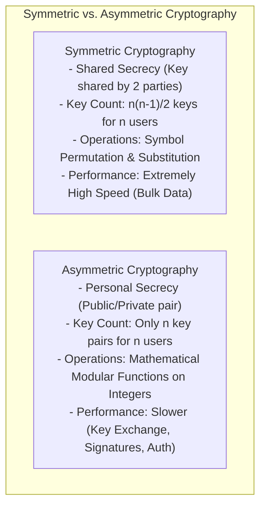

# Number Theory Foundations: Euclidean Algorithm, Modular Arithmetic, Fermat & Euler Theorems

[← Back to Course README](../README.md)

- [1. Symmetric vs. Asymmetric Cryptography Foundations](#1-symmetric-vs-asymmetric-cryptography-foundations)
- [2. One-Way & Trapdoor One-Way Functions](#2-one-way--trapdoor-one-way-functions)
  - [One-Way Function (OWF) Definition](#one-way-function-owf-definition)
  - [Prime Factorization Problem](#prime-factorization-problem)
  - [Discrete Logarithm Problem](#discrete-logarithm-problem)
- [3. Core Mathematical Theorems & Formulas](#3-core-mathematical-theorems--formulas)
  - [1. Extended Euclidean Algorithm](#1-extended-euclidean-algorithm)
  - [2. Fermat's Little Theorem](#2-fermats-little-theorem)
  - [3. Euler's Totient Function & Euler's Theorem](#3-eulers-totient-function--eulers-theorem)
  - [4. Chinese Remainder Theorem (CRT)](#4-chinese-remainder-theorem-crt)
- [4. Python Implementation: Extended GCD, Modular Inverse & CRT Engine](#4-python-implementation-extended-gcd-modular-inverse--crt-engine)
- [5. 8 Solved Practice Questions & Exam Problems](#5-8-solved-practice-questions--exam-problems)

---

## 1. Symmetric vs. Asymmetric Cryptography Foundations

Asymmetric-key cryptography (public-key cryptography) represents a fundamental paradigm shift from symmetric-key cryptography. The key conceptual differences stem from how secrets are managed and how data is mathematically processed:



### Key Differences & Complementary Roles:

| Attribute | Symmetric-Key Cryptography | Asymmetric-Key Cryptography |
| :--- | :--- | :--- |
| **Secret Management** | **Shared Secrecy**: Secret key must be shared confidentially between two parties. | **Personal Secrecy**: Private key is kept unshared; public key is announced freely. |
| **Key Scaling ($n$ users)** | Requires $\mathbf{\frac{n(n-1)}{2}}$ shared secret keys. | Requires only $\mathbf{n}$ personal key pairs. |
| **Data Representation** | Plaintext/ciphertext treated as bit/symbol sequences. | Plaintext/ciphertext treated as large integer numbers. |
| **Underlying Mechanics** | Substitutions (confusion) and Permutations (diffusion). | Mathematical modular functions (e.g., modular exponentiation). |
| **Computational Speed** | **Extremely Fast** (High throughput). | **Slower** due to complex modular arithmetic. |
| **Primary Use Cases** | Bulk file and network traffic encryption (AES). | Key exchange (Diffie-Hellman), Digital Signatures, Authentication. |

---

## 2. One-Way & Trapdoor One-Way Functions

### One-Way Function (OWF) Definition

A **One-Way Function (OWF)** $f: A \rightarrow B$ satisfies two properties:
1. **Easy to Compute**: Given input $x$, computing $y = f(x)$ is computationally easy (polynomial time $O(n^k)$).
2. **Hard to Invert**: Given output $y$, computing $x = f^{-1}(y)$ is computationally infeasible (no known polynomial-time algorithm).

```mermaid
flowchart LR
    X["Input x"] -->|f(x) Easy (Polynomial Time)| Y["Output y"]
    Y -.->|f^-1(y) Infeasible without Trapdoor| X
    Y -->|f^-1(y) Easy with Trapdoor k'| X
```

---

### Prime Factorization Problem

Given two large prime numbers $p$ and $q$, calculating their product:
$$n = p \times q$$
is computationally trivial (multiplication in $O(1)$ steps). However, given a large 1024+ bit integer $n$, finding its constituent prime factors $(p, q)$ is the **Integer Factorization Problem**, for which no polynomial-time classical algorithm is known. This forms the security basis of **RSA** and **Rabin** cryptosystems.

---

### Discrete Logarithm Problem

Given integers $x$, $g$, and prime $p$, computing:
$$y = g^x \pmod p$$
is easy using the **Fast Exponentiation Algorithm** ($O(\log x)$ multiplications). However, given $y$, $g$, and $p$, finding the exponent $x = \log_g y \pmod p$ is the **Discrete Logarithm Problem (DLP)**, which is computationally intractable for large primes (2048+ bits).

#### Trapdoor Concept:
If a secret "trapdoor" $k'$ is known such that $k \cdot k' \equiv 1 \pmod{\phi(n)}$, the one-way function can be inverted easily:
$$x = y^{k'} \pmod n$$

---

## 3. Core Mathematical Theorems & Formulas

### 1. Extended Euclidean Algorithm
Given integers $a$ and $b$, there exist integers $x$ and $y$ such that:
$$\gcd(a, b) = a \cdot x + b \cdot y$$

If $\gcd(a, m) = 1$, then $x$ is the multiplicative inverse of $a$ modulo $m$:
$$a \cdot x \equiv 1 \pmod m$$

---

### 2. Fermat's Little Theorem
If $p$ is prime and $\gcd(a, p) = 1$:
$$a^{p-1} \equiv 1 \pmod p \implies a^p \equiv a \pmod p$$

---

### 3. Euler's Totient Function & Euler's Theorem
Euler's totient function $\phi(n)$ counts the number of positive integers less than $n$ that are coprime to $n$. For $n = p \cdot q$ (product of two distinct primes):
$$\phi(n) = (p - 1)(q - 1)$$

#### Euler's Theorem:
If $\gcd(a, n) = 1$, then:
$$a^{\phi(n)} \equiv 1 \pmod n$$

---

### 4. Chinese Remainder Theorem (CRT)
Given a system of congruences $x \equiv a_i \pmod{m_i}$ for pairwise coprime moduli $m_1, m_2, \dots, m_k$ with $M = \prod m_i$:
$$x \equiv \sum_{i=1}^k a_i M_i M_i^{-1} \pmod M \quad \text{where } M_i = \frac{M}{m_i} \text{ and } M_i M_i^{-1} \equiv 1 \pmod{m_i}$$

---

## 4. Python Implementation: Extended GCD, Modular Inverse & CRT Engine

```python
def extended_gcd(a, b):
    if a == 0:
        return b, 0, 1
    gcd, x1, y1 = extended_gcd(b % a, a)
    x = y1 - (b // a) * x1
    y = x1
    return gcd, x, y

def mod_inverse(a, m):
    gcd, x, y = extended_gcd(a, m)
    if gcd != 1:
        raise ValueError(f"Modular inverse does not exist for {a} mod {m}")
    return (x % m + m) % m

def chinese_remainder_theorem(a_list, m_list):
    M = 1
    for m in m_list:
        M *= m
        
    x = 0
    for a_i, m_i in zip(a_list, m_list):
        M_i = M // m_i
        y_i = mod_inverse(M_i, m_i)
        x = (x + a_i * M_i * y_i) % M
        
    return x

# Test CRT: x ≡ 2 (mod 3), x ≡ 3 (mod 5), x ≡ 2 (mod 7) -> M = 105
x_sol = chinese_remainder_theorem([2, 3, 2], [3, 5, 7])
print(f"CRT Solution x = {x_sol} (mod 105)")
assert x_sol % 3 == 2 and x_sol % 5 == 3 and x_sol % 7 == 2
```

---

## 5. 8 Solved Practice Questions & Exam Problems

### Question 1: Key Count Comparison
**Problem**: Compare the number of keys required for a network of 500 users using symmetric-key cryptography versus asymmetric-key cryptography.

**Solution**:
- Symmetric-key: $N = \frac{500 \times 499}{2} = \mathbf{124,750} \text{ shared keys}$.
- Asymmetric-key: $N = 500 \text{ key pairs} = \mathbf{500} \text{ private keys}$ (and 500 public keys).

---

### Question 2: Extended Euclidean Algorithm Calculation
**Problem**: Find the multiplicative inverse of $a = 17$ modulo $m = 3120$ using the Extended Euclidean Algorithm.

**Solution**:
1. $3120 = 183 \times 17 + 9$
2. $17 = 1 \times 9 + 8$
3. $9 = 1 \times 8 + 1$
4. Back-substituting: $1 = 9 - 1 \times 8 = 9 - (17 - 9) = 2 \times 9 - 17 = 2(3120 - 183 \times 17) - 17 = 2(3120) - 367(17)$.
5. So $-367 \equiv 3120 - 367 = \mathbf{2753} \pmod{3120}$.
6. Verification: $17 \times 2753 = 46801 = 15 \times 3120 + 1 \equiv 1 \pmod{3120}$.

---

### Question 3: Euler's Totient Calculation for RSA Modulus
**Problem**: Calculate $\phi(3599)$ given that $3599 = 59 \times 61$.

**Solution**:
1. $p = 59$, $q = 61$.
2. $\phi(3599) = (p - 1)(q - 1) = (59 - 1)(61 - 1) = 58 \times 60 = \mathbf{3480}$.

---

### Question 4: Chinese Remainder Theorem (CRT) Calculation
**Problem**: Solve the system of congruences:
$x \equiv 1 \pmod 3$, $x \equiv 4 \pmod 5$, $x \equiv 6 \pmod 7$.

**Solution**:
1. $M = 3 \times 5 \times 7 = 105$.
2. $M_1 = 35$, $M_2 = 21$, $M_3 = 15$.
3. Modular inverses:
   - $35 \equiv 2 \pmod 3 \implies 35^{-1} \equiv 2 \pmod 3$.
   - $21 \equiv 1 \pmod 5 \implies 21^{-1} \equiv 1 \pmod 5$.
   - $15 \equiv 1 \pmod 7 \implies 15^{-1} \equiv 1 \pmod 7$.
4. $x = (1 \cdot 35 \cdot 2 + 4 \cdot 21 \cdot 1 + 6 \cdot 15 \cdot 1) \bmod 105 = (70 + 84 + 90) \bmod 105 = 244 \bmod 105 = \mathbf{34}$.

---

### Question 5: One-Way Function vs. Trapdoor OWF
**Problem**: Contrast a One-Way Function (OWF) with a Trapdoor One-Way Function. Give an example of how a trapdoor is used in RSA.

**Solution**:
A One-Way Function is easy to compute in the forward direction but computationally infeasible to invert for anyone. A Trapdoor OWF is also hard to invert for anyone, **unless** a secret piece of auxiliary information (the "trapdoor") is known, which allows inversion in polynomial time. In RSA, $C = P^e \bmod n$ is a trapdoor OWF; the private exponent $d = e^{-1} \bmod \phi(n)$ is the trapdoor that allows Bob to compute $P = C^d \bmod n$.

---

### Question 6: Fermat's Little Theorem Application
**Problem**: Compute $3^{100} \pmod{101}$ using Fermat's Little Theorem.

**Solution**:
Since $p = 101$ is prime and $\gcd(3, 101) = 1$, by Fermat's Little Theorem:
$$3^{101-1} = 3^{100} \equiv \mathbf{1} \pmod{101}$$

---

### Question 7: Discrete Logarithm Hardness
**Problem**: Why is solving $g^x \equiv y \pmod p$ computationally hard for large prime $p$ (2048+ bits)?

**Solution**:
While modular exponentiation $g^x \bmod p$ can be computed efficiently in $O(\log x)$ multiplications via repeated squaring, finding the exponent $x = \log_g y \bmod p$ requires sub-exponential algorithms (such as the Index Calculus or Number Field Sieve method) taking $O(\exp(c \sqrt[3]{\ln p (\ln \ln p)^2}))$, making brute-force search intractable.

---

### Question 8: Complementary Use of Symmetric and Asymmetric Ciphers
**Problem**: Why do hybrid cryptosystems use asymmetric ciphers for key exchange and symmetric ciphers for payload encryption?

**Solution**:
Asymmetric ciphers use complex modular arithmetic operations (modular exponentiation) which are computationally heavy and thousands of times slower than symmetric block ciphers. Therefore, asymmetric ciphers are used to establish or exchange a short symmetric session key ($128/256$ bits), while the high-speed symmetric cipher (AES) is used to encrypt the bulk payload data.
