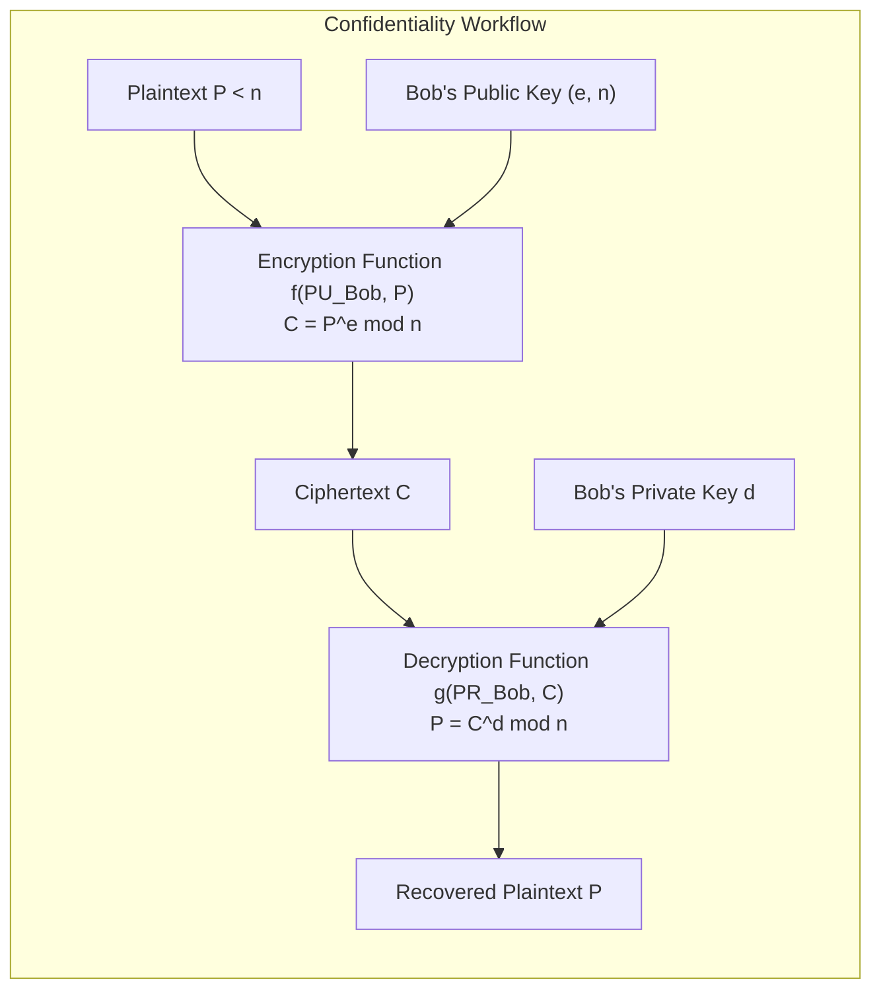
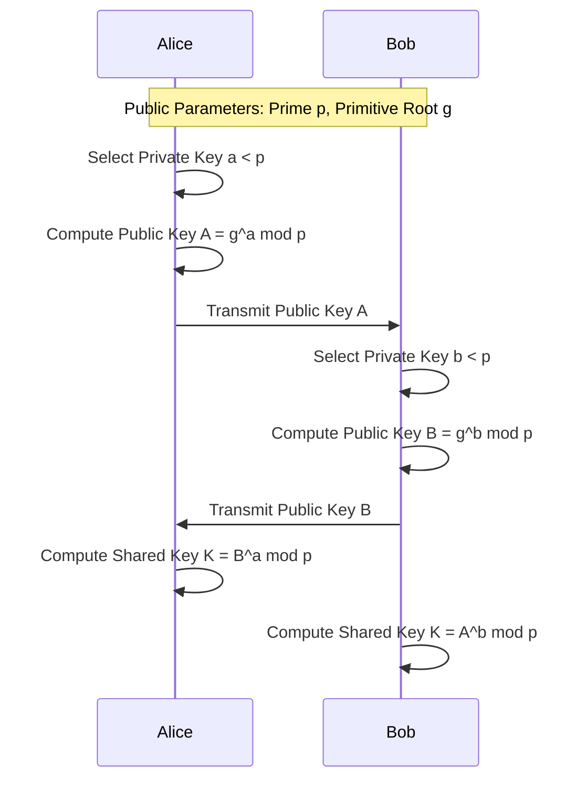

# Chapter 7: RSA, Rabin, Diffie-Hellman & ElGamal Cryptosystems

[← Back to Course README](../README.md)

- [1. Principles of Asymmetric Cryptosystems](#1-principles-of-asymmetric-cryptosystems)
- [2. The RSA Cryptosystem](#2-the-rsa-cryptosystem)
  - [Key Generation Procedure](#key-generation-procedure)
  - [Encryption & Decryption Formulas](#encryption--decryption-formulas)
  - [Mathematical Proof of RSA Correctness](#mathematical-proof-of-rsa-correctness)
  - [Worked RSA Examples (Examples 10.5, 10.6, 10.7)](#worked-rsa-examples-examples-105-106-107)
- [3. The Rabin Cryptosystem](#3-the-rabin-cryptosystem)
  - [Key Generation & Encryption](#key-generation--encryption)
  - [Decryption via Chinese Remainder Theorem (CRT)](#decryption-via-chinese-remainder-theorem-crt)
  - [Disambiguation of Four Candidate Plaintexts](#disambiguation-of-four-candidate-plaintexts)
  - [Worked Rabin Trace Example](#worked-rabin-trace-example)
  - [Security Equivalence Proof](#security-equivalence-proof)
- [4. Diffie-Hellman Key Exchange Protocol](#4-diffie-hellman-key-exchange-protocol)
  - [Protocol Exchange & Equivalence Proof](#protocol-exchange--equivalence-proof)
  - [Man-in-the-Middle (MitM) Attack & Countermeasures](#man-in-the-middle-mitm-attack--countermeasures)
- [5. The ElGamal Cryptosystem](#5-the-elgamal-cryptosystem)
  - [Key Generation & Encryption](#key-generation--encryption-1)
  - [Decryption Proof & Probabilistic Property](#decryption-proof--probabilistic-property)
- [6. 8 Solved Practice & Exam Problems](#6-8-solved-practice--exam-problems)

---

## 1. Principles of Asymmetric Cryptosystems

Asymmetric-key (public-key) cryptography uses a pair of asymmetric keys created by an entity:
- **Public Key ($PU = \{e, n\}$)**: Announced publicly; used by anyone in the community to encrypt messages intended for the owner or verify signatures.
- **Private Key ($PR = \{d, n\}$)**: Kept strictly secret by the owner; used only by the owner to decrypt incoming ciphertexts or generate digital signatures.

---

## 2. The RSA Cryptosystem

Invented by Ron Rivest, Adi Shamir, and Leonard Adleman in 1977, **RSA** is the most widely deployed public-key algorithm. RSA is built upon the computational difficulty of factoring large composite modulus integers $n = p \times q$.

### Key Generation Procedure

1. **Select Primes**: Select two distinct large prime numbers $p$ and $q$ (recommended size: 512+ bits each, resulting in 1024+ bit modulus $n$).
2. **Compute Modulus**: Calculate $n = p \times q$.
3. **Compute Totient**: Calculate Euler's totient function $\phi(n) = (p - 1)(q - 1)$.
4. **Select Public Exponent**: Select an integer $e$ such that $1 < e < \phi(n)$ and $\gcd(e, \phi(n)) = 1$ ($e$ and $\phi(n)$ are coprime).
5. **Compute Private Exponent**: Calculate $d$ using the Extended Euclidean Algorithm such that:
   $$e \cdot d \equiv 1 \pmod{\phi(n)} \implies d = e^{-1} \pmod{\phi(n)}$$
6. **Publish Keys**:
   - **Public Key**: $PU = (e, n)$
   - **Private Key**: $PR = d$ (or $(d, n)$)
   - Discard $p, q$, and $\phi(n)$.

---

### Encryption & Decryption Formulas

For a plaintext integer message $P < n$:

$$\text{Encryption: } C = P^e \pmod n$$
$$\text{Decryption: } P = C^d \pmod n$$

- **Computational Complexity**: Encryption and decryption use **Fast Modular Exponentiation** ($O(\log e)$ multiplications). An adversary without secret trapdoor $d$ must compute the $e$-th root modulo $n$, which is as hard as factoring $n$.

---

### Mathematical Proof of RSA Correctness

Since $e \cdot d \equiv 1 \pmod{\phi(n)}$, there exists an integer $k$ such that $e \cdot d = 1 + k \cdot \phi(n)$.
Using Euler's Theorem ($P^{\phi(n)} \equiv 1 \pmod n$ for $\gcd(P, n) = 1$):

$$C^d \equiv (P^e)^d = P^{e \cdot d} = P^{1 + k \cdot \phi(n)} = P^1 \cdot \left(P^{\phi(n)}\right)^k \equiv P \cdot (1)^k \equiv P \pmod n$$

---

### Worked RSA Examples (Examples 10.5, 10.6, 10.7)

#### Example 10.5: Trivial RSA System
- Primes: $p = 7, q = 11 \implies n = 7 \times 11 = \mathbf{77}$.
- Totient: $\phi(n) = (7 - 1)(11 - 1) = 6 \times 10 = \mathbf{60}$.
- Select $e = 13$ ($\gcd(13, 60) = 1$).
- Calculate $d = 13^{-1} \pmod{60} = \mathbf{37}$ (since $13 \times 37 = 481 = 8 \times 60 + 1 \equiv 1 \pmod{60}$).
- **Public Key**: $(e=13, n=77)$ | **Private Key**: $d=37$.
- **Encryption of $P = 5$**:
  $$C = 5^{13} \pmod{77} = 1220703125 \pmod{77} = \mathbf{26}$$
- **Decryption of $C = 26$**:
  $$P = 26^{37} \pmod{77} = \mathbf{5} \quad (\text{Recovered!}) \checkmark$$

#### Example 10.6: Second User Encryption
- User John sends $P = 63$ to Bob using Bob's public key $(e=13, n=77)$:
  $$C = 63^{13} \pmod{77} = \mathbf{28}$$
- Bob decrypts $C = 28$ using private key $d = 37$:
  $$P = 28^{37} \pmod{77} = \mathbf{63} \quad (\text{Recovered!}) \checkmark$$

#### Example 10.7: Larger RSA Prime Parameters & Text Encoding
- Primes: $p = 397, q = 401 \implies n = 397 \times 401 = \mathbf{159197}$.
- Totient: $\phi(n) = (397 - 1)(401 - 1) = 396 \times 400 = \mathbf{158400}$.
- Exponents: $e = 343$, $d = 12007$ (since $343 \times 12007 = 4118401 = 26 \times 158400 + 1 \equiv 1 \pmod{158400}$).
- **Text Encoding**: Plaintext `"NO"` $\rightarrow \text{'N'} = 13, \text{'O'} = 14 \implies P = 1314$.
- **Encryption**:
  $$C = 1314^{343} \pmod{159197} = \mathbf{33677}$$
- **Decryption**:
  $$P = 33677^{12007} \pmod{159197} = \mathbf{1314} \rightarrow \text{"NO"} \checkmark$$

---

## 3. The Rabin Cryptosystem

The **Rabin Cryptosystem** (invented by Michael Rabin in 1979) is an asymmetric cryptosystem based on the difficulty of computing modular square roots.

### Key Generation & Encryption
1. **Key Generation**:
   - Choose two large distinct prime numbers $p$ and $q$ congruent to $3 \pmod 4$ ($p \equiv 3 \pmod 4$ and $q \equiv 3 \pmod 4$, known as Blum primes).
   - Compute $n = p \times q$.
   - **Public Key**: $n$ | **Private Key**: $(p, q)$.
2. **Encryption**: For plaintext $P < n$:
   $$C = P^2 \pmod n$$

---

### Decryption via Chinese Remainder Theorem (CRT)

Decryption requires finding the modular square root of $C$ modulo $n$. Since $n = p \cdot q$, Bob computes square roots modulo $p$ and modulo $q$ independently, then combines them using CRT:

1. Compute square roots modulo $p$:
   $$a_1 = +\left( C^{(p+1)/4} \right) \pmod p, \quad a_2 = -a_1 \pmod p$$
2. Compute square roots modulo $q$:
   $$b_1 = +\left( C^{(q+1)/4} \right) \pmod q, \quad b_2 = -b_1 \pmod q$$
3. Combine the 4 root pairs $(a_1, b_1), (a_1, b_2), (a_2, b_1), (a_2, b_2)$ using CRT to yield **4 candidate plaintexts**: $P_1, P_2, P_3, P_4$.

---

### Disambiguation of Four Candidate Plaintexts

Because Rabin decryption produces 4 valid mathematical square roots, the receiver must select the true intended plaintext using redundancy mechanisms:
- **Redundancy / Checksum**: Appending a hash or fixed bit pattern to the plaintext before encryption.
- **File Format Headers**: Validating MIME headers or magic bytes.
- **Contextual & Semantic Analysis**: Selecting the candidate that makes linguistic or structured sense.

---

### Worked Rabin Trace Example

1. **Primes**: $p = 23, q = 7$ (Both $23 \equiv 3 \pmod 4$ and $7 \equiv 3 \pmod 4$).
2. **Modulus**: $n = 23 \times 7 = \mathbf{161}$. Public Key: $n=161$, Private Key: $(p=23, q=7)$.
3. **Encryption**: Plaintext $P = 24$.
   $$C = 24^2 \bmod 161 = 576 \bmod 161 = \mathbf{93}$$
4. **Decryption Step 1 (Roots mod $p=23$)**:
   $$a_1 = 93^{(23+1)/4} \bmod 23 = 93^6 \bmod 23 = 1^6 = \mathbf{1}$$
   $$a_2 = -1 \equiv \mathbf{22} \pmod{23}$$
5. **Decryption Step 2 (Roots mod $q=7$)**:
   $$b_1 = 93^{(7+1)/4} \bmod 7 = 93^2 \bmod 7 = 2^2 = \mathbf{4}$$
   $$b_2 = -4 \equiv \mathbf{3} \pmod 7$$
6. **Decryption Step 3 (CRT Combinations)**:
   Applying CRT to $(1, 4), (1, 3), (22, 4), (22, 3)$ yields 4 plaintexts:
   $$P_1 = 116, \quad P_2 = \mathbf{24}, \quad P_3 = 137, \quad P_4 = 45$$
   Verification: $24^2 \equiv 116^2 \equiv 137^2 \equiv 45^2 \equiv 93 \pmod{161}$. Bob picks $P = 24$ based on context.

---

### Security Equivalence Proof

The Rabin Cryptosystem is unique because it has been mathematically proven that **recovering plaintext $P$ from ciphertext $C$ is provably equivalent to factoring the modulus $n$**. If an adversary can break Rabin, they can factor large composite numbers in polynomial time.

---

## 4. Diffie-Hellman Key Exchange Protocol

Diffie-Hellman enables two parties to establish a shared secret key over an insecure channel without transmitting the secret itself.

### Protocol Exchange & Equivalence Proof
$$K_{\text{Alice}} = B^a \bmod p = (g^b)^a \bmod p = g^{ba} \bmod p$$
$$K_{\text{Bob}} = A^b \bmod p = (g^a)^b \bmod p = g^{ab} \bmod p$$
Both parties compute the exact same secret key $K = g^{ab} \bmod p$.

---

### Man-in-the-Middle (MitM) Attack & Countermeasures
Because basic Diffie-Hellman lacks authentication, an active adversary (Darth) can intercept public keys $A$ and $B$, substituting their own public key $D$, creating two separate keys $K_1$ with Alice and $K_2$ with Bob.
- **Countermeasure**: Authenticate public key exchanges using **Digital Signatures** or **X.509 PKI Certificates** (e.g., Ephemeral ECDHE in TLS 1.3).

---

## 5. The ElGamal Cryptosystem

### Key Generation & Encryption
1. **Key Generation**: Select prime $p$, primitive root $g$, and private key $x$. Compute public key $y = g^x \bmod p$. Public Key: $(p, g, y)$, Private Key: $x$.
2. **Encryption**: For plaintext $M < p$, select random ephemeral nonce $k$:
   $$c_1 = g^k \bmod p, \quad c_2 = (M \cdot y^k) \bmod p$$
   Ciphertext pair: $(c_1, c_2)$.

---

### Decryption Proof & Probabilistic Property
Decryption computes:
$$M = \left( c_2 \cdot (c_1^x)^{-1} \right) \bmod p$$

#### Decryption Proof:
$$c_2 \cdot (c_1^x)^{-1} \equiv (M \cdot y^k) \cdot (g^{kx})^{-1} \equiv M \cdot g^{xk} \cdot g^{-xk} \equiv M \pmod p \checkmark$$

- **Probabilistic Property**: Selecting a fresh random $k$ for every encryption means encrypting the same plaintext $M$ yields completely different ciphertexts $(c_1, c_2)$, hiding plaintext patterns.

---

## 6. 8 Solved Practice & Exam Problems

### Question 1: RSA Key Generation & Encryption
**Problem**: Given $p = 11, q = 13, e = 11$, generate the public and private keys and encrypt plaintext $P = 7$.

**Solution**:
1. $n = 11 \times 13 = \mathbf{143}$.
2. $\phi(n) = (11 - 1)(13 - 1) = 10 \times 12 = \mathbf{120}$.
3. Private exponent $d = 11^{-1} \pmod{120}$. Since $11 \times 11 = 121 \equiv 1 \pmod{120}$, $d = \mathbf{11}$.
4. Public Key: $(e=11, n=143)$ | Private Key: $d=11$.
5. Ciphertext $C = 7^{11} \bmod 143 = \mathbf{106}$.

---

### Question 2: Rabin Decryption Root Count
**Problem**: Why does Rabin encryption produce 4 candidate plaintexts upon decryption?

**Solution**:
Rabin encryption evaluates $C = P^2 \bmod n$. Quadratic equations modulo composite $n = p \cdot q$ yield two square roots modulo prime $p$ ($+a, -a$) and two square roots modulo prime $q$ ($+b, -b$). Combining these 2 choices mod $p$ and 2 choices mod $q$ via CRT produces $2 \times 2 = \mathbf{4}$ valid square roots modulo $n$.

---

### Question 3: RSA Small Exponent Attack
**Problem**: Why is choosing public exponent $e = 3$ insecure if the same message $P$ is sent to 3 users with different moduli $n_1, n_2, n_3$?

**Solution**:
If $e=3$, the adversary observes $C_1 = P^3 \bmod n_1$, $C_2 = P^3 \bmod n_2$, $C_3 = P^3 \bmod n_3$. Using CRT, the adversary computes $X = P^3 \bmod (n_1 n_2 n_3)$. Since $P < n_i$, $P^3 < n_1 n_2 n_3$, so $X = P^3$ holds over the integers without modular reduction. Taking the ordinary cube root $\sqrt[3]{X}$ recovers plaintext $P$ without factoring any modulus.

---

### Question 4: Diffie-Hellman Calculation
**Problem**: Given $p = 23, g = 5$, Alice's private key $a = 6$, Bob's private key $b = 15$. Find the shared secret key $K$.

**Solution**:
1. Alice's Public Key $A = 5^6 \bmod 23 = 15625 \bmod 23 = \mathbf{8}$.
2. Bob's Public Key $B = 5^{15} \bmod 23 = \mathbf{19}$.
3. Alice's Shared Key $K = B^a \bmod 23 = 19^6 \bmod 23 = \mathbf{2}$.
4. Bob's Shared Key $K = A^b \bmod 23 = 8^{15} \bmod 23 = \mathbf{2}$.
   Shared Secret Key $K = \mathbf{2}$.

---

### Question 5: Rabin Blum Prime Condition
**Problem**: Why must primes $p$ and $q$ be congruent to $3 \pmod 4$ in the Rabin cryptosystem?

**Solution**:
When prime $p \equiv 3 \pmod 4$, $p + 1$ is divisible by 4. This allows computing square roots modulo $p$ explicitly in a single modular exponentiation: $a = C^{(p+1)/4} \bmod p$, since $(C^{(p+1)/4})^2 = C^{(p+1)/2} = C^{(p-1)/2} \cdot C \equiv 1 \cdot C \equiv C \pmod p$ by Euler's criterion.

---

### Question 6: RSA Modulus Factoring Hardness
**Problem**: Explain why knowing $\phi(n)$ allows an attacker to easily factor $n = p \cdot q$.

**Solution**:
We know $n = p \cdot q$ and $\phi(n) = (p-1)(q-1) = n - (p + q) + 1$.
Thus, $p + q = n - \phi(n) + 1$.
The primes $p$ and $q$ are roots of the quadratic equation:
$$x^2 - (p + q)x + n = 0 \implies x^2 - (n - \phi(n) + 1)x + n = 0$$
Using the quadratic formula yields $p$ and $q$ instantly in $O(1)$ steps.

---

### Question 7: ElGamal Ciphertext Expansion
**Problem**: Why does ElGamal encryption expand the ciphertext size to twice the size of the plaintext?

**Solution**:
ElGamal encryption outputs a ciphertext pair $(c_1, c_2)$ for every plaintext $M$, where $c_1 = g^k \bmod p$ transmits the ephemeral key component and $c_2 = (M \cdot y^k) \bmod p$ transmits the encrypted payload. Since both $c_1$ and $c_2$ are integers modulo $p$, the total ciphertext size is $2 \times$ the size of plaintext $M$.

---

### Question 8: RSA Decryption Acceleration via CRT
**Problem**: How does the Chinese Remainder Theorem speed up RSA decryption for private key holder Bob?

**Solution**:
Instead of computing $P = C^d \bmod n$ with a 1024-bit modulus $n$, Bob computes two smaller modular exponentiations:
$$M_p = C^{d \bmod (p-1)} \pmod p \quad \text{and} \quad M_q = C^{d \bmod (q-1)} \pmod q$$
Because $p$ and $q$ are half the bit length of $n$ (512 bits), exponentiations modulo $p$ and $q$ run nearly 4 times faster each. Combining $M_p$ and $M_q$ via CRT yields $P = C^d \bmod n$ with an overall **4x speedup** in decryption performance.
