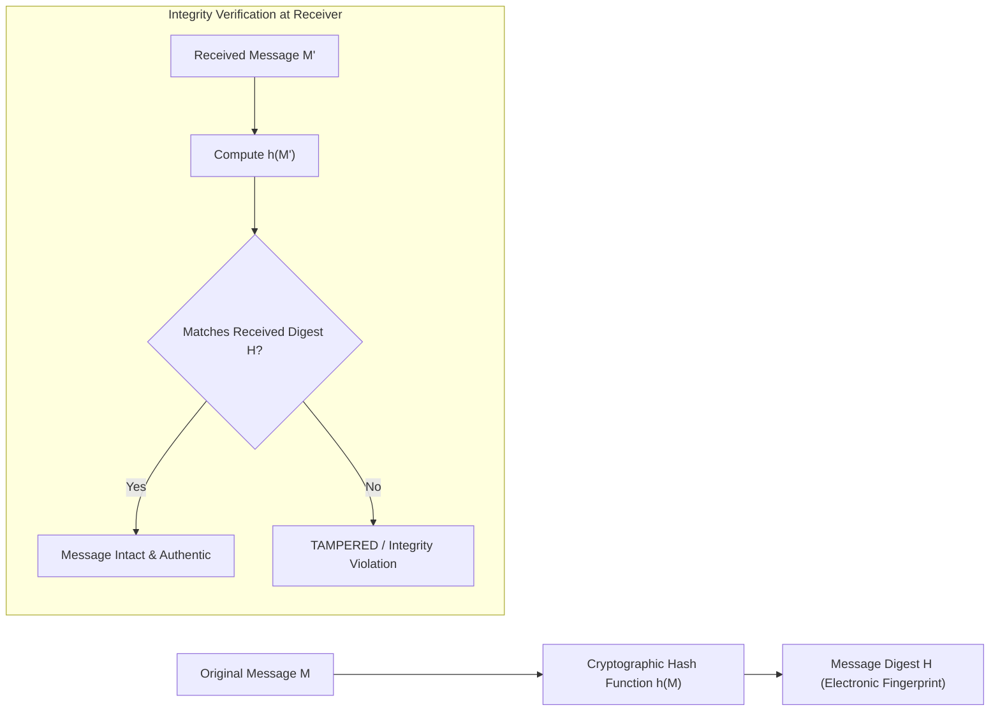
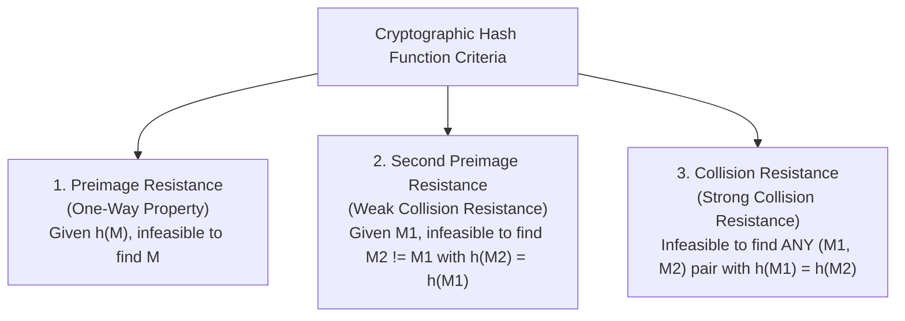
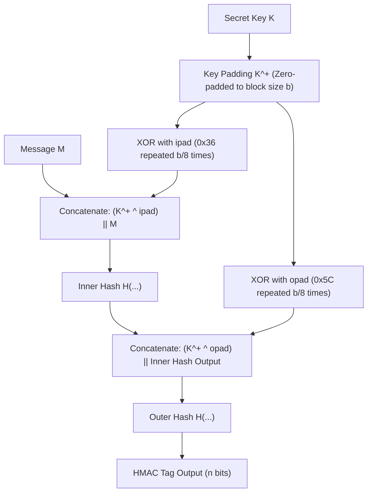
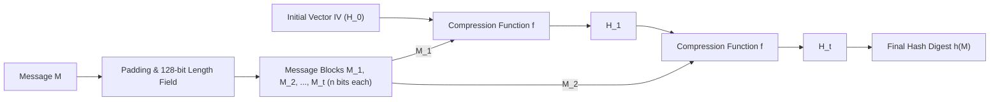
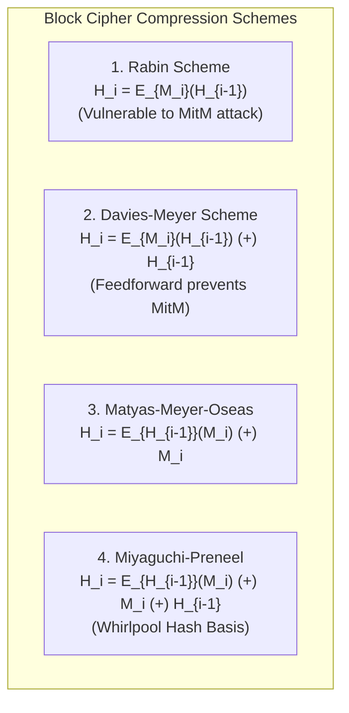
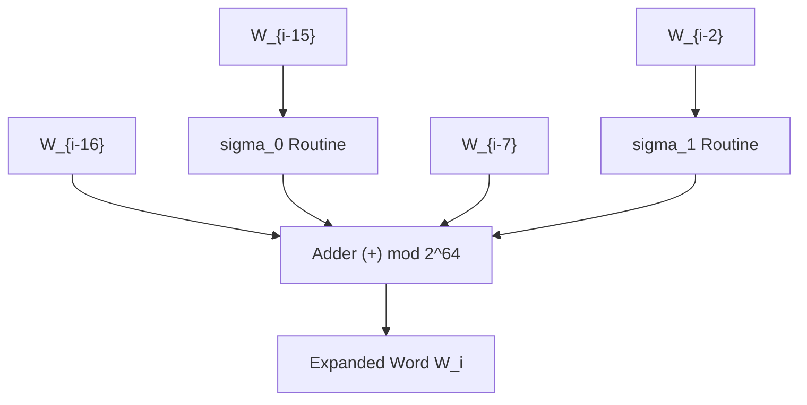

# Chapter 8: Cryptographic Hash Functions, MACs, HMAC & SHA-512

[← Back to Course README](../README.md)

- [1. Message Integrity & Cryptographic Hash Criteria](#1-message-integrity--cryptographic-hash-criteria)
  - [Document/Fingerprint Analogy & Verification](#documentfingerprint-analogy--verification)
  - [Three Core Security Criteria](#three-core-security-criteria)
- [2. Random Oracle Model](#2-random-oracle-model)
- [3. Message Authentication: MDC vs. MAC](#3-message-authentication-mdc-vs-mac)
  - [Modification Detection Code (MDC)](#modification-detection-code-mdc)
  - [Message Authentication Code (MAC)](#message-authentication-code-mac)
  - [Prefix, Postfix & Nested MAC Architecture](#prefix-postfix--nested-mac-architecture)
  - [HMAC Construction Algorithm (FIPS 198)](#hmac-construction-algorithm-fips-198)
- [4. Iterated Hash Functions & Merkle-Damgård Construction](#4-iterated-hash-functions--merkle-damg%C3%A5rd-construction)
  - [The Merkle-Damgård Scheme](#the-merkle-damg%C3%A5rd-scheme)
  - [Taxonomy of Compression Functions](#taxonomy-of-compression-functions)
- [5. Block Cipher-Based Compression Functions](#5-block-cipher-based-compression-functions)
  - [Rabin Scheme & MitM Vulnerability](#rabin-scheme--mitm-vulnerability)
  - [Davies-Meyer Scheme](#davies-meyer-scheme)
  - [Matyas-Meyer-Oseas Scheme](#matyas-meyer-oseas-scheme)
  - [Miyaguchi-Preneel Scheme (Whirlpool Basis)](#miyaguchi-preneel-scheme-whirlpool-basis)
- [6. The SHA-512 Algorithm Deep Dive](#6-the-sha-512-algorithm-deep-dive)
  - [SHA-512 Specifications & Structure](#sha-512-specifications--structure)
  - [Padding & Length Field Calculations](#padding--length-field-calculations)
  - [Worked Padding Calculation Examples](#worked-padding-calculation-examples)
  - [Word Expansion Engine (16 Words to 80 Words)](#word-expansion-engine-16-words-to-80-words)
- [7. 8 Solved Practice & Exam Problems](#7-8-solved-practice--exam-problems)

---

## 1. Message Integrity & Cryptographic Hash Criteria

### Document/Fingerprint Analogy & Verification

While encryption provides **confidentiality** (secrecy), many real-world applications (e.g., a legal will, software downloads, public policy documents) require **integrity**—ensuring the message content has not been altered—without needing secrecy.



- **Physical Analogy**: A physical document is authenticated by attaching a human fingerprint.
- **Electronic Equivalent**: A digital message is passed through a **Cryptographic Hash Function** $h$ to produce a fixed-length **Message Digest** (electronic fingerprint).

---

### Three Core Security Criteria

A cryptographic hash function $h$ mapping an arbitrary-length message $M$ to a fixed $m$-bit digest must satisfy three security properties:



| Security Property | Formal Definition | Vulnerability if Missing | Attack Complexity |
| :--- | :--- | :--- | :---: |
| **Preimage Resistance** | Given digest $y$, it is computationally infeasible to find any $M$ such that $h(M) = y$. | Attacker reverses stored password hashes in databases. | $O(2^m)$ |
| **Second Preimage Resistance** | Given message $M_1$, it is computationally infeasible to find $M_2 \neq M_1$ such that $h(M_1) = h(M_2)$. | Attacker modifies a contract while preserving the valid hash digest. | $O(2^m)$ |
| **Collision Resistance** | It is computationally infeasible to find *any* pair $(M_1, M_2)$ with $M_1 \neq M_2$ such that $h(M_1) = h(M_2)$. | Attacker creates two different contracts, gets one signed, and substitutes the other. | $O(2^{m/2})$ *(Birthday Attack)* |

---

## 2. Random Oracle Model

Introduced by Mihir Bellare and Phillip Rogaway in 1993, the **Random Oracle Model** is an ideal mathematical abstraction of a cryptographic hash function:

1. **New Input**: When presented with a new message $M$, the Oracle generates a fixed-length digest consisting of a completely random bit string (e.g., flipping a fair coin for every bit).
2. **Repeated Input**: If presented with a previously queried message, the Oracle returns the exact digest recorded in its database.
3. **Independence**: Digests are chosen independently without using any algebraic formula or deterministic algorithm (preventing mathematical attacks such as $h(M_1 + M_2) = (h(M_1) + h(M_2)) \bmod n$).

---

## 3. Message Authentication: MDC vs. MAC

### Modification Detection Code (MDC)
An **MDC** is an unkeyed message digest $H = h(M)$ that proves message integrity.
- **Channel Requirement**: Because an MDC is unkeyed, an attacker (Eve) intercepting both $M$ and $H$ over an insecure channel can alter $M$ to $M'$, compute $H' = h(M')$, and transmit $(M', H')$. Therefore, the MDC must be delivered via a **secure/safe channel** (e.g., deposited with an attorney or verified out-of-band).

---

### Message Authentication Code (MAC)
A **MAC** (keyed hash) provides both **Data Integrity** and **Data Origin Authentication** by combining a shared secret key $K$ with message $M$.

$$\text{MAC} = h(K \mathbin{\Vert} M)$$

- **Single Channel**: Both message $M$ and tag $\text{MAC}$ can be transmitted safely across an **insecure channel**. Eve cannot forge a valid MAC for modified message $M'$ without knowing secret key $K$.

---

### Prefix, Postfix & Nested MAC Architecture

1. **Prefix MAC**: $h(K \mathbin{\Vert} M)$ $\rightarrow$ Vulnerable to **Length Extension Attacks** under Merkle-Damgård hash structures.
2. **Postfix MAC**: $h(M \mathbin{\Vert} K)$.
3. **Nested MAC**: Uses two-stage hashing to completely eliminate length extension vulnerabilities:
   $$\text{NestedMAC}_K(M) = h\Big( K \mathbin{\Vert} h(K \mathbin{\Vert} M) \Big)$$

---

### HMAC Construction Algorithm (FIPS 198)

**HMAC** (Hash-based Message Authentication Code) is the standardized nested MAC framework defined by NIST:

$$\text{HMAC}_K(M) = H\Big( (K^+ \oplus \text{opad}) \mathbin{\Vert} H\big( (K^+ \oplus \text{ipad}) \mathbin{\Vert} M \big) \Big)$$



#### HMAC Operational Parameters ($b = 1024\text{ bits}$ for SHA-512):
- **Input Pad (`ipad`)**: Byte `0x36` ($00110110_2$) repeated $b/8$ times.
- **Output Pad (`opad`)**: Byte `0x5C` ($01011100_2$) repeated $b/8$ times.

---

## 4. Iterated Hash Functions & Merkle-Damgård Construction

### The Merkle-Damgård Scheme

Because messages vary in length, cryptographic hash functions use an **iterated construction** where a fixed-size compression function $f$ is evaluated repeatedly over message blocks.



#### Theorem (Merkle-Damgård Security):
If the internal compression function $f$ is collision resistant, the resulting iterated hash function $h$ is **provably collision resistant**.

---

### Taxonomy of Compression Functions

Cryptographic hash functions are categorized into two structural families:
1. **Designed from Scratch**: MD5 (128-bit digest), SHA-1 (160-bit), SHA-2 (SHA-256/512), SHA-3 (Keccak Sponge), RIPEMD-160, HAVAL.
2. **Based on Symmetric Block Ciphers**: Utilizing standard block ciphers (AES, DES) as compression functions.

---

## 5. Block Cipher-Based Compression Functions

Symmetric block ciphers can be converted into hash compression functions by treating message blocks $M_i$ and intermediate digests $H_{i-1}$ as keys and plaintexts.



| Scheme | Mathematical Compression Formula | Key Input | Plaintext Input | Feedforward Defense |
| :--- | :--- | :---: | :---: | :---: |
| **Rabin** | $H_i = E_{M_i}(H_{i-1})$ | $M_i$ | $H_{i-1}$ | None (Vulnerable to MitM) |
| **Davies-Meyer** | $H_i = E_{M_i}(H_{i-1}) \oplus H_{i-1}$ | $M_i$ | $H_{i-1}$ | $\oplus H_{i-1}$ |
| **Matyas-Meyer-Oseas** | $H_i = E_{H_{i-1}}(M_i) \oplus M_i$ | $H_{i-1}$ | $M_i$ | $\oplus M_i$ |
| **Miyaguchi-Preneel** | $H_i = E_{H_{i-1}}(M_i) \oplus M_i \oplus H_{i-1}$ | $H_{i-1}$ | $M_i$ | $\oplus M_i \oplus H_{i-1}$ *(Whirlpool)* |

---

## 6. The SHA-512 Algorithm Deep Dive

### SHA-512 Specifications & Structure

SHA-512 (part of the SHA-2 family) processes message blocks of **1024 bits** to create a **512-bit message digest** ($8 \times 64$-bit words $A, B, C, D, E, F, G, H$).

- **Maximum Allowed Message Length**: $< 2^{128}$ bits.
- **Word Size**: 64 bits ($8\text{ bytes}$).
- **Block Size**: 1024 bits ($16 \times 64$-bit words).
- **Rounds**: 80 rounds of non-linear transformations.

---

### Padding & Length Field Calculations

Before hashing, SHA-512 pads the original message $M$ so that its total bit length becomes an exact multiple of 1024 bits ($N \times 1024$):

```
+--------------------------+---...---+-------------------+
| Original Message M       | Pad     | 128-bit Length    |
| (|M| bits)               | 10...0  | Field (|M| value) |
+--------------------------+---...---+-------------------+
<------------------- Multiple of 1024 bits ------------------->
```

#### Padding Rule:
1. Append a single `'1'` bit to the message.
2. Append $P$ `'0'` bits such that:
   $$(|M| + 1 + P + 128) \equiv 0 \pmod{1024} \implies (|M| + 1 + P) \equiv 896 \pmod{1024}$$
3. Append the 128-bit unsigned integer representing the original message length $|M|$.

---

### Worked Padding Calculation Examples

#### Example 1: $|M| = 2590\text{ bits}$
1. Compute $|M| \bmod 1024 = 2590 \bmod 1024 = 542\text{ bits}$.
2. Solve $(542 + 1 + P) \equiv 896 \pmod{1024} \implies P = 896 - 543 = \mathbf{353\text{ bits of } 0s}$.
3. Padding: Single `'1'` bit followed by 353 `'0'` bits.
4. Total bits: $2590 + 1 + 353 + 128 = 3072 = \mathbf{3 \times 1024\text{ blocks}}$.

#### Example 2: $|M| = 2348\text{ bits}$
1. $2348 \bmod 1024 = 300\text{ bits}$.
2. $P = 896 - (300 + 1) = \mathbf{595\text{ bits of } 0s}$.
3. Padding: Single `'1'` bit followed by 595 `'0'` bits.
4. Total padded length: $2348 + 596 + 128 = 3072 = \mathbf{3 \times 1024\text{ blocks}}$.

#### Example 3: Minimum & Maximum Padding Limits
- **Minimum Padding (0 zero bits)**: Occurs when $|M| \equiv 896 \pmod{1024}$. Only 1 bit `'1'` + 0 bits of 0s + 128-bit length field are added ($1 + 127 = 128\text{ bits}$ added).
- **Maximum Padding (1023 bits)**: Occurs when $|M| \equiv 897 \pmod{1024}$. The message length exceeds $896$ bits by 1 bit, forcing an entire additional 1024-bit block to be created ($897\text{ padding bits}$ added).

---

### Word Expansion Engine (16 Words to 80 Words)

Each 1024-bit message block provides the first 16 words ($W_0 \dots W_{15}$). SHA-512 expands these into **80 words** ($W_0 \dots W_{79}$) for the 80 processing rounds:

$$W_i = \sigma_1(W_{i-2}) + W_{i-7} + \sigma_0(W_{i-15}) + W_{i-16} \pmod{2^{64}}$$



#### Rotational Shift Routines ($\mathbb{Z}_{2^{64}}$):
$$\sigma_0(x) = \text{ROTR}^1(x) \oplus \text{ROTR}^8(x) \oplus \text{SHR}^7(x)$$
$$\sigma_1(x) = \text{ROTR}^{19}(x) \oplus \text{ROTR}^{61}(x) \oplus \text{SHR}^6(x)$$

---

## 7. 8 Solved Practice & Exam Problems

### Question 1: Birthday Attack Bound on SHA-512
**Problem**: Calculate the number of hash operations required for an adversary to find a collision in SHA-512 using a Birthday Attack versus finding a preimage.

**Solution**:
- **Preimage Attack**: $O(2^{512}) \approx \mathbf{1.34 \times 10^{154}}$ operations.
- **Birthday Collision Attack**: $O(2^{512/2}) = O(2^{256}) \approx \mathbf{1.15 \times 10^{77}}$ operations.

---

### Question 2: MDC vs. MAC Security Channel Requirements
**Problem**: Why can a MAC be safely transmitted over an insecure channel alongside a message, whereas an MDC requires a secure channel?

**Solution**:
An MDC is unkeyed ($H = h(M)$). An attacker intercepting an MDC over an insecure channel can modify $M$ to $M'$, recompute $H' = h(M')$, and replace both. A MAC uses a shared secret key $K$ ($T = \text{MAC}_K(M)$). Since the attacker does not know $K$, they cannot generate a valid tag $T'$ for a modified message $M'$.

---

### Question 3: Davies-Meyer Feedforward Rationale
**Problem**: Why does the Davies-Meyer compression function add a feedforward term ($H_i = E_{M_i}(H_{i-1}) \oplus H_{i-1}$)?

**Solution**:
Without the feedforward term ($\oplus H_{i-1}$), the scheme reduces to the Rabin scheme ($H_i = E_{M_i}(H_{i-1})$), which is vulnerable to a Meet-in-the-Middle attack using the decryption algorithm $D_{M_i}$. The feedforward term ensures the compression function is non-invertible even if the underlying block cipher decryption key is known.

---

### Question 4: SHA-512 Padding for $|M| = 1000\text{ bits}$
**Problem**: Compute the number of padding bits required for a message of length $|M| = 1000\text{ bits}$ in SHA-512.

**Solution**:
1. $(1000 + 1 + P) \equiv 896 \pmod{1024}$.
2. $(1001 + P) \equiv 896 \pmod{1024} \implies P = (896 - 1001 + 1024) \bmod 1024 = \mathbf{919\text{ bits of } 0s}$.
3. Padding: 1 bit `'1'` followed by 919 `'0'` bits.

---

### Question 5: HMAC Length Extension Resistance
**Problem**: Explain how HMAC prevents length extension attacks that affect simple prefixed keyed hashes $h(K \Vert M)$.

**Solution**:
In $h(K \Vert M)$, an attacker leveraging Merkle-Damgård state continuation can append extra data $M_{\text{extra}}$ to $M$ and calculate $h(K \Vert M \Vert M_{\text{extra}})$ directly from digest $h(K \Vert M)$ without knowing $K$. HMAC prevents this by using a nested outer hash $H((K^+ \oplus \text{opad}) \Vert H(\dots))$, which hashes the inner digest output, hiding the internal Merkle-Damgård state.

---

### Question 6: Miyaguchi-Preneel Scheme in Whirlpool
**Problem**: Write the mathematical compression formula for the Miyaguchi-Preneel scheme used in the Whirlpool hash function.

**Solution**:
$$H_i = E_{H_{i-1}}(M_i) \oplus M_i \oplus H_{i-1}$$
where $H_{i-1}$ acts as the cipher key, $M_i$ acts as plaintext, and feedforward XORs both $M_i$ and $H_{i-1}$ into the ciphertext output.

---

### Question 7: Random Oracle Model Non-Algebraic Property
**Problem**: Why does a Random Oracle model prohibit using algebraic formulas like $h(M) = M \bmod n$?

**Solution**:
If an oracle used $h(M) = M \bmod n$, then for $M_3 = M_1 + M_2$, $h(M_3) = (h(M_1) + h(M_2)) \bmod n$. An adversary could predict $h(M_3)$ without querying the oracle, violating the fundamental requirement that digests for new inputs must be independently and uniformly random.

---

### Question 8: SHA-512 Word Expansion Step
**Problem**: Given the 16 words $W_0 \dots W_{15}$ of a SHA-512 block, write the general formula to compute expanded word $W_{16}$.

**Solution**:
Setting $i = 16$:
$$W_{16} = \sigma_1(W_{14}) + W_{9} + \sigma_0(W_{1}) + W_{0} \pmod{2^{64}}$$
where $\sigma_0(x) = \text{ROTR}^1(x) \oplus \text{ROTR}^8(x) \oplus \text{SHR}^7(x)$ and $\sigma_1(x) = \text{ROTR}^{19}(x) \oplus \text{ROTR}^{61}(x) \oplus \text{SHR}^6(x)$.
