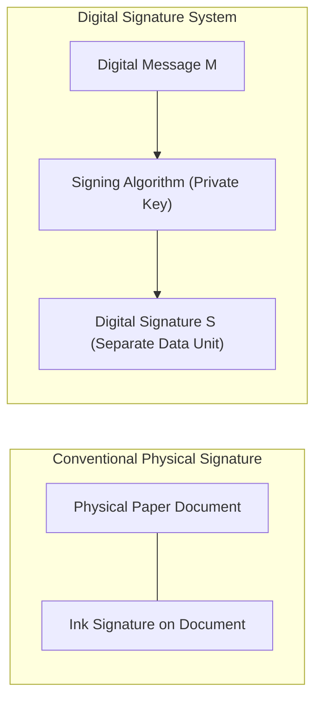
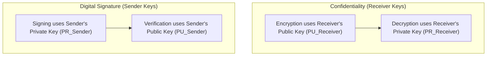
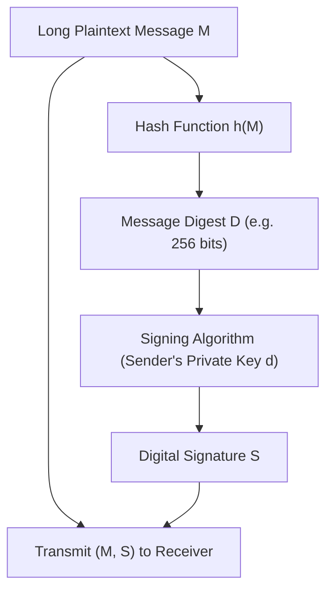
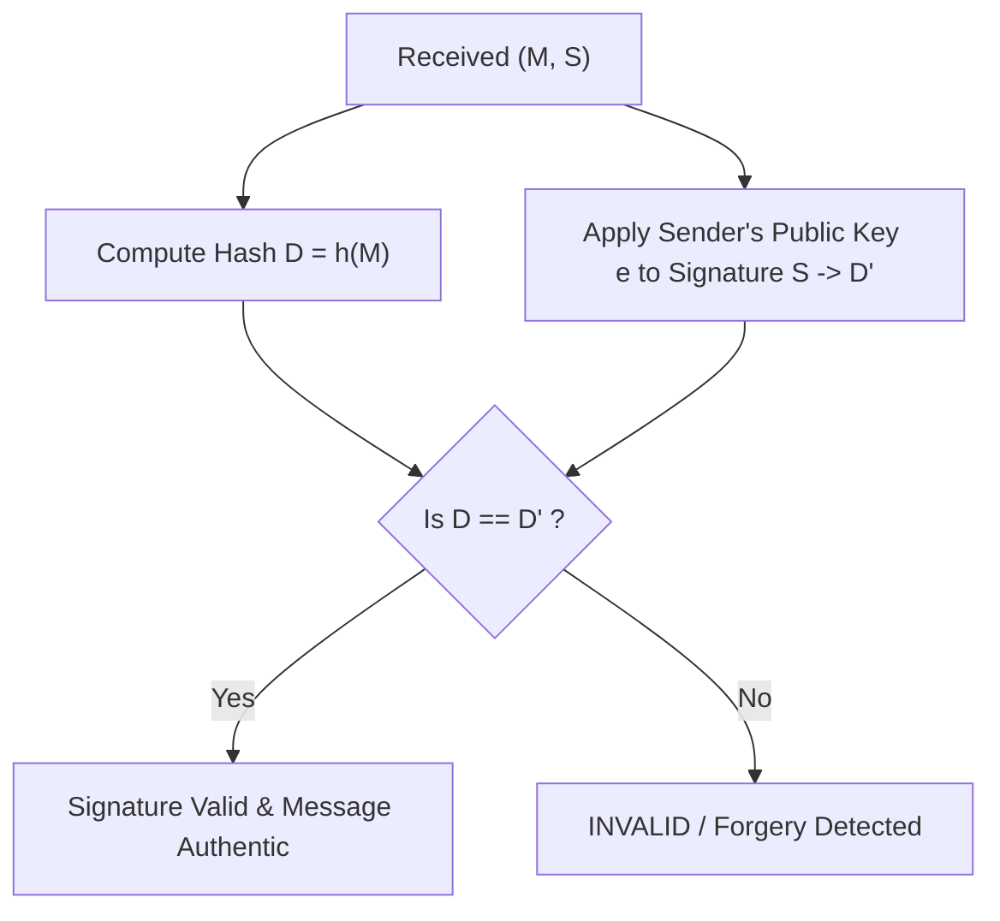
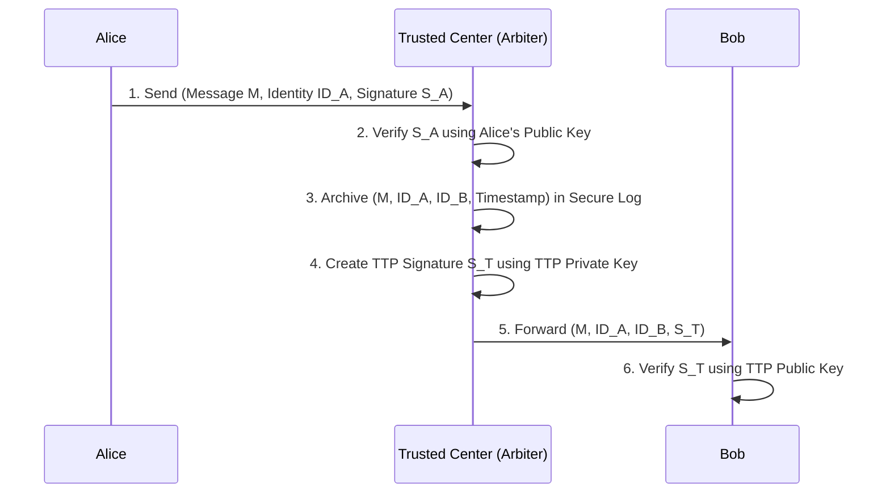
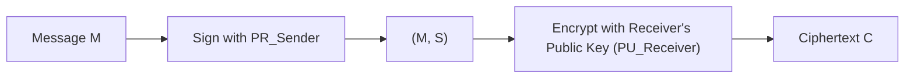
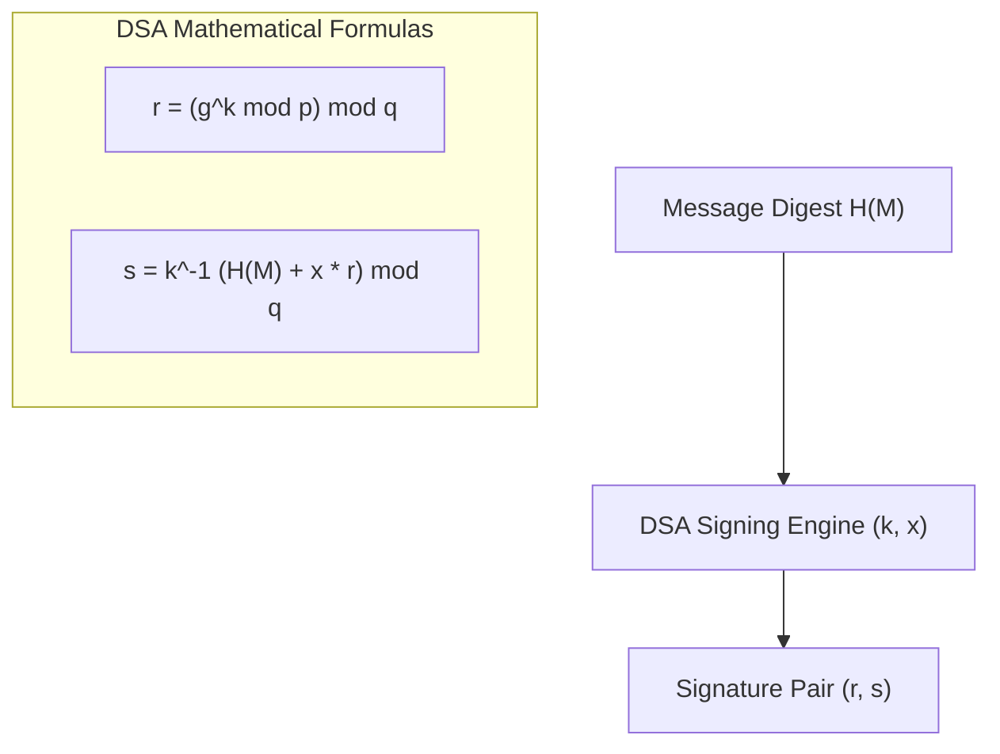
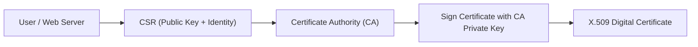

# Chapter 9: Digital Signatures & Public Key Infrastructure (PKI)

[← Back to Course README](../README.md)

- [1. Conventional Signatures vs. Digital Signatures](#1-conventional-signatures-vs-digital-signatures)
- [2. Digital Signature Process & Key Architecture](#2-digital-signature-process--key-architecture)
  - [Sender Key Role vs. Receiver Key Role](#sender-key-role-vs-receiver-key-role)
  - [Why Symmetric Keys Cannot Provide Digital Signatures](#why-symmetric-keys-cannot-provide-digital-signatures)
  - [Signing the Message Digest](#signing-the-message-digest)
- [3. Security Services Provided by Digital Signatures](#3-security-services-provided-by-digital-signatures)
  - [Message Authentication & Message Integrity](#message-authentication--message-integrity)
  - [Non-Repudiation via Trusted Centers (TTP)](#non-repudiation-via-trusted-centers-ttp)
  - [Adding Confidentiality to Digital Signatures](#adding-confidentiality-to-digital-signatures)
- [4. Attacks & Forgery Classifications](#4-attacks--forgery-classifications)
  - [Attack Models (Key-Only, Known-Message, Chosen-Message)](#attack-models-key-only-known-message-chosen-message)
  - [Forgery Classifications (Existential vs. Selective Forgery)](#forgery-classifications-existential-vs-selective-forgery)
- [5. Digital Signature Schemes](#5-digital-signature-schemes)
  - [1. RSA Digital Signature Scheme](#1-rsa-digital-signature-scheme)
  - [Attacks on RSA Signatures & Digest Mitigation](#attacks-on-rsa-signatures--digest-mitigation)
  - [Detailed Vulnerability Analysis of RSA Signed Digests](#detailed-vulnerability-analysis-of-rsa-signed-digests)
  - [2. ElGamal Digital Signature Scheme](#2-elgamal-digital-signature-scheme)
  - [ElGamal Verification Proof](#elgamal-verification-proof)
  - [3. Schnorr Digital Signature Scheme](#3-schnorr-digital-signature-scheme)
  - [4. Digital Signature Standard (DSS / DSA)](#4-digital-signature-standard-dss--dsa)
- [6. Public Key Infrastructure (PKI) & X.509 Certificates](#6-public-key-infrastructure-pki--x509-certificates)
- [7. 8 Solved Practice & Exam Problems](#7-8-solved-practice--exam-problems)

---

## 1. Conventional Signatures vs. Digital Signatures

A **Digital Signature** is an electronic mechanism that binds an identity to a digital document, serving as legal proof of origin, consent, and data integrity.

### Four Structural Differences:

| Dimension | Conventional Physical Signature | Digital Signature |
| :--- | :--- | :--- |
| **1. Inclusion** | Included inside/on the document itself (part of physical paper). | Transmitted as a separate electronic data unit alongside the message. |
| **2. Verification** | Recipient compares signature on document with a stored copy on file. | Recipient applies a verification algorithm to $(M, S)$ using signer's public key (no copy stored on file). |
| **3. Relationship** | **1-to-Many**: Same physical signature is used across many documents. | **1-to-1**: Unique signature for every message. A signature on $M_1$ cannot be reused on $M_2$. |
| **4. Duplicity / Replay** | Copies of signed paper can be visually distinguished from the original. | Bit-identical digital copies cannot be distinguished unless timestamped or using nonces. |

---

## 2. Digital Signature Process & Key Architecture

### Sender Key Role vs. Receiver Key Role

- **Encryption for Confidentiality**: Uses the **Receiver's Public Key** to encrypt and **Receiver's Private Key** to decrypt.
- **Digital Signatures**: Uses the **Sender's Private Key** to sign and **Sender's Public Key** to verify.

---

### Why Symmetric Keys Cannot Provide Digital Signatures

Symmetric (secret) keys cannot be used to generate digital signatures for three critical reasons:
1. **Pairwise Isolation**: A secret key is shared by only two entities ($A$ and $B$). If Alice needs to sign a document for Ted, she needs a different secret key.
2. **Circular Dependency**: Establishing a symmetric session key requires prior authentication, which relies on digital signatures.
3. **Repudiation & Forgery**: Since both Alice and Bob possess the shared secret key, Bob could generate a signature, send it to a third party, and claim that Alice signed it.

---

### Signing the Message Digest

Because asymmetric key algorithms (RSA, ElGamal) are computationally expensive on long messages, modern digital signature schemes sign a fixed-size **Message Digest** $D = h(M)$ produced by a cryptographic hash function.

---

## 3. Security Services Provided by Digital Signatures

### Message Authentication & Message Integrity
- **Message Authentication (Data Origin Authentication)**: Confirms that the message was created by the holder of the corresponding private key (Alice), verified using Alice's public key.
- **Message Integrity**: The cryptographic hash $h(M)$ ensures that if any bit of message $M$ is modified during transit, the recomputed digest $D'$ will not match $D''$ obtained from the signature.

---

### Non-Repudiation via Trusted Centers (TTP)

If Alice signs a message and later denies sending it (claims her private key was stolen or the signature file was forged), simple direct verification may be contested. A **Trusted Center / Trusted Third Party (TTP)** guarantees non-repudiation:

---

### Adding Confidentiality to Digital Signatures

A digital signature alone provides authenticity and integrity, but **does not provide confidentiality**. To achieve both confidentiality and digital signatures, the signed message $(M, S)$ is encrypted:

$$\text{Ciphertext } C = E_{PU_{\text{receiver}}}\Big( M \mathbin{\Vert} \text{Sign}_{PR_{\text{sender}}}(h(M)) \Big)$$

---

## 4. Attacks & Forgery Classifications

### Attack Models (Key-Only, Known-Message, Chosen-Message)

1. **Key-Only Attack**: The adversary (Eve) possesses only the signer's public verification key.
2. **Known-Message Attack**: Eve possesses one or more previously valid message-signature pairs $(M_i, S_i)$ created by the target signer.
3. **Chosen-Message Attack**: Eve obtains valid signatures from the target signer on arbitrary messages $M_{\text{chosen}}$ of Eve's choice before attempting forgery.

---

### Forgery Classifications (Existential vs. Selective Forgery)

- **Existential Forgery**: Eve succeeds in forging a valid $(M, S)$ pair, but message $M$ is syntactically or semantically meaningless garbage.
- **Selective Forgery**: Eve succeeds in forging a valid signature $S$ on a specific, chosen message $M$ of financial, legal, or tactical value to Eve.

---

## 5. Digital Signature Schemes

### 1. RSA Digital Signature Scheme

RSA changes the key roles: the **Sender's Private Key $d$** is used for signing, and the **Sender's Public Key $(e, n)$** is used for verification.

#### Algorithm Steps:
1. **Key Generation**: Same as RSA cryptosystem ($n = p \cdot q, \phi(n) = (p-1)(q-1), e \cdot d \equiv 1 \pmod{\phi(n)}$).
2. **Signing Digest $D = h(M)$**:
   $$S = D^d \pmod n$$
3. **Verification**:
   $$D' = S^e \pmod n$$
   Check if $D' \equiv h(M) \pmod n$.

---

### Attacks on RSA Signatures & Digest Mitigation

#### Multiplicative Attack on Raw RSA Signature (Without Hash):
If Alice signs raw messages $M_1$ and $M_2$ without hashing:
$$S_1 = M_1^d \pmod n, \quad S_2 = M_2^d \pmod n$$
An attacker can compute $M_{\text{forged}} = (M_1 \cdot M_2) \bmod n$ and forge signature:
$$S_{\text{forged}} = (S_1 \cdot S_2) \bmod n \implies S_{\text{forged}}^e = (S_1 S_2)^e = M_1^{de} M_2^{de} = M_1 M_2 = M_{\text{forged}} \pmod n$$

#### Mitigation via Hashing:
Signing digest $D = h(M)$ completely defeats multiplicative attacks because $h(M_1 \cdot M_2) \neq h(M_1) \cdot h(M_2)$.

---

### Detailed Vulnerability Analysis of RSA Signed Digests

When the message digest $D = h(M)$ is signed instead of raw plaintext $M$, the security of the RSA signature depends directly on the cryptographic strength of hash function $h$:

1. **Key-Only Attack Analysis**:
   - *Case A*: Eve intercepts $(S, M)$ and tries to find $M'$ such that $h(M') = h(M)$. Infeasible if $h$ is **Second Preimage Resistant**.
   - *Case B*: Eve finds two messages $M, M'$ such that $h(M) = h(M')$, lures Alice to sign $h(M)$, yielding valid signature $S$ for $M'$. Infeasible if $h$ is **Collision Resistant**.
   - *Case C*: Eve selects a random signature $S$, computes $D = S^e \bmod n$, and attempts to find $M$ such that $h(M) = D$. Infeasible if $h$ is **Preimage Resistant**.
2. **Known-Message Attack Analysis**:
   - Eve intercepts $(M_1, S_1)$ and $(M_2, S_2)$ and computes $S_{\text{forged}} = (S_1 \cdot S_2) \bmod n$. To forge a message, Eve must find $M$ such that $h(M) \equiv h(M_1) \cdot h(M_2) \pmod n$. Finding $M$ given target digest $h(M)$ is infeasible if $h$ is **Preimage Resistant**.
3. **Chosen-Message Attack Analysis**:
   - Eve asks Alice to sign $M_1$ and $M_2$, obtains $S_1$ and $S_2$, and computes $S = S_1 \cdot S_2 \bmod n$. For selective forgery, Eve needs to find $M$ such that $h(M) = h(M_1) \cdot h(M_2) \bmod n$. Infeasible if $h$ is **Preimage Resistant**.

---

### 2. ElGamal Digital Signature Scheme

ElGamal digital signature scheme uses a public key $(e_1, e_2, p)$ where $e_2 = e_1^d \bmod p$, and private key $d$.

#### Signing Algorithm ($M = h(M)$):
1. Select random secret ephemeral nonce $r$ such that $\gcd(r, p-1) = 1$.
2. Compute first signature component:
   $$S_1 = e_1^r \pmod p$$
3. Compute second signature component:
   $$S_2 = (M - d \cdot S_1) \cdot r^{-1} \pmod{p-1}$$
4. Transmit $(M, S_1, S_2)$.

#### Verification Algorithm:
1. Check $0 < S_1 < p$ and $0 < S_2 < p-1$.
2. Compute $V_1 = e_1^M \bmod p$.
3. Compute $V_2 = (e_2^{S_1} \cdot S_1^{S_2}) \bmod p$.
4. Accept if $V_1 \equiv V_2 \pmod p$.

---

### ElGamal Verification Proof

$$V_2 \equiv e_2^{S_1} \cdot S_1^{S_2} \equiv (e_1^d)^{S_1} \cdot (e_1^r)^{S_2} \equiv e_1^{d S_1 + r S_2} \pmod p$$

Since $S_2 \equiv (M - d S_1) r^{-1} \pmod{p-1} \implies d S_1 + r S_2 \equiv M \pmod{p-1}$.
By Euler's criterion over primitive root $e_1$:
$$V_2 \equiv e_1^M \equiv V_1 \pmod p \checkmark$$

---

### 3. Schnorr Digital Signature Scheme

The **Schnorr Scheme** reduces signature size by introducing a second prime modulus $q$ ($160\text{ bits}$) that divides $p-1$ ($p = 1024\text{ bits}$).
- Drastically reduces signature size from $2048\text{ bits}$ (ElGamal) down to **$320\text{ bits}$**.

---

### 4. Digital Signature Standard (DSS / DSA)

Adopted by NIST in 1994 (FIPS 186), **DSA** is based on ElGamal with Schnorr's two-moduli reduction ($p$ and $q$ where $q \mid (p-1)$).

#### DSA Verification Formulas:
1. $w = s^{-1} \bmod q$
2. $u_1 = (H(M) \cdot w) \bmod q$
3. $u_2 = (r \cdot w) \bmod q$
4. $v = \left( (g^{u_1} \cdot y^{u_2}) \bmod p \right) \bmod q$
5. Verify if **$v = r$**.

---

## 6. Public Key Infrastructure (PKI) & X.509 Certificates

Public Key Infrastructure (PKI) resolves the public key trust assignment problem by binding identities to public keys using **X.509 Digital Certificates** issued by trusted **Certificate Authorities (CAs)**.

---

## 7. 8 Solved Practice & Exam Problems

### Question 1: RSA Signature Calculation
**Problem**: Given RSA parameters $p=7, q=11, e=13, d=37$. Calculate the RSA signature on message digest $D = 5$, and verify it.

**Solution**:
1. Modulus $n = 77$.
2. Signing: $S = D^d \bmod n = 5^{37} \bmod 77 = \mathbf{26}$.
3. Verification: $D' = S^e \bmod n = 26^{13} \bmod 77 = \mathbf{5}$.
4. Since $D' = D = 5$, signature is valid.

---

### Question 2: Multiplicative Attack on RSA Signature
**Problem**: Show how an attacker can forge an RSA signature on $M = 35$ given valid signatures $S_1 = 10$ on $M_1 = 5$ and $S_2 = 14$ on $M_2 = 7$ modulo $n = 119$.

**Solution**:
1. $M = M_1 \times M_2 = 5 \times 7 = 35$.
2. Forged signature $S = (S_1 \times S_2) \bmod 119 = (10 \times 14) \bmod 119 = 140 \bmod 119 = \mathbf{21}$.
3. Verification test: $S^e = 21^e = (10 \times 14)^e = 10^e \times 14^e = 5 \times 7 = 35 \pmod{119}$.

---

### Question 3: Conventional vs. Digital Signature Relationships
**Problem**: Contrast conventional vs. digital signatures in terms of relationship multiplicity and inclusion.

**Solution**:
- **Inclusion**: Conventional signature is physically on the paper document. Digital signature is sent as a separate electronic file.
- **Multiplicity**: Conventional signature is 1-to-many (same signature used for all documents). Digital signature is 1-to-1 (each message produces a unique signature tied to its bit contents).

---

### Question 4: Symmetric Key Signature Impossibility
**Problem**: Why can symmetric secret keys not be used to produce non-repudiable digital signatures?

**Solution**:
Because a symmetric key is known by both communicating parties ($A$ and $B$). If a dispute arises, receiver $B$ cannot prove to a judge that sender $A$ generated the signature, because $B$ possesses the identical key and could have created the signature themselves.

---

### Question 5: Non-Repudiation via Trusted Center
**Problem**: Describe the role of a Trusted Third Party (TTP) in providing non-repudiation for digital signatures.

**Solution**:
Sender Alice transmits $(M, S_A)$ to the TTP. The TTP verifies Alice's signature, logs a copy with a timestamp in a secure archive, signs the package with the TTP's private key ($S_T$), and forwards it to Bob. If Alice later denies sending $M$, the TTP presents the archived log and TTP signature as legal proof.

---

### Question 6: ElGamal Signature Nonce Requirement
**Problem**: Why must a new random nonce $r$ be selected for every message signed in the ElGamal signature scheme?

**Solution**:
If the same nonce $r$ is reused to sign two different messages $M_1$ and $M_2$, an attacker observing $(S_{1,1}, S_{1,2})$ and $(S_{2,1}, S_{2,2})$ can subtract the signature equations to solve for secret nonce $r$, and subsequently recover Alice's private key $d$.

---

### Question 7: Schnorr Scheme Signature Efficiency
**Problem**: How does the Schnorr digital signature scheme achieve smaller signature sizes compared to standard ElGamal?

**Solution**:
Schnorr uses a subgroup of prime order $q$ ($160\text{ bits}$) dividing $p-1$ ($p = 1024\text{ bits}$). The second signature component $S_2$ is computed modulo $q$ instead of modulo $p-1$, reducing signature size from 2048 bits to 320 bits.

---

### Question 8: DSA Verification Formula
**Problem**: Write the verification condition for the Digital Signature Algorithm (DSA).

**Solution**:
Compute $w = s^{-1} \bmod q$, $u_1 = (H(M) \cdot w) \bmod q$, $u_2 = (r \cdot w) \bmod q$, and $v = \left( (g^{u_1} \cdot y^{u_2}) \bmod p \right) \bmod q$. The signature is valid if and only if **$v = r$**.
