# System Security: Malware Defense, Firewalls, IDS & IPS, and Audit Tools

[← Back to Course README](../README.md)

- [1. System Security Overview & Defense-in-Depth](#1-system-security-overview--defense-in-depth)
- [2. Firewall Architecture & Fundamentals](#2-firewall-architecture--fundamentals)
  - [Firewall Definition & Need](#firewall-definition--need)
  - [Four Core Access Control Techniques](#four-core-access-control-techniques)
  - [Firewall Scope Capabilities & Limitations](#firewall-scope-capabilities--limitations)
- [3. Types of Firewalls](#3-types-of-firewalls)
  - [Packet Filtering Firewalls (Stateless vs. Stateful SPI)](#packet-filtering-firewalls-stateless-vs-stateful-spi)
  - [Attacks on Packet Filters & Countermeasures](#attacks-on-packet-filters--countermeasures)
  - [Application-Level Gateways (Application Proxies)](#application-level-gateways-application-proxies)
  - [Circuit-Level Gateways & SOCKS Protocol](#circuit-level-gateways--socks-protocol)
  - [Comparative Analysis of Firewall Types](#comparative-analysis-of-firewall-types)
- [4. Firewall Misconceptions & Enterprise Vendors](#4-firewall-misconceptions--enterprise-vendors)
- [5. Intrusion Detection Systems (IDS) & Intrusion Prevention Systems (IPS)](#5-intrusion-detection-systems-ids--intrusion-prevention-systems-ips)
  - [Intruders Classification (Masquerader, Misfeasor, Clandestine)](#intruders-classification-masquerader-misfeasor-clandestine)
  - [IDS Architectures: NIDS vs. HIDS](#ids-architectures-nids-vs-hids)
  - [Detection Methodologies: Signature-Based vs. Anomaly-Based](#detection-methodologies-signature-based-vs-anomaly-based)
  - [IDS vs. IPS Comprehensive Comparison](#ids-vs-ips-comprehensive-comparison)
- [6. System Vulnerability Audit Tools & Exploitation Protections](#6-system-vulnerability-audit-tools--exploitation-protections)
  - [Rootkit Hunter (rkhunter) Architecture](#rootkit-hunter-rkhunter-architecture)
  - [N-Stalker Web Application Vulnerability Scanner](#n-stalker-web-application-vulnerability-scanner)
  - [Memory Protections: ASLR, DEP/NX & Stack Canaries](#memory-protections-aslr-depnx--stack-canaries)
- [7. Python Simulation: System Integrity File Hash Auditor](#7-python-simulation-system-integrity-file-hash-auditor)
- [8. 8 Solved Practice Questions & Exam Problems](#8-8-solved-practice-questions--exam-problems)

---

## 1. System Security Overview & Defense-in-Depth

**System Security** encompasses hardware, operating system, network perimeter, and application-level controls designed to protect host systems against unauthorized access, network intrusions, memory exploitation, and malware infections.

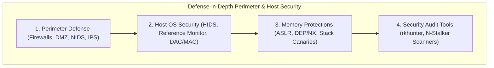

---

## 2. Firewall Architecture & Fundamentals

### Firewall Definition & Need

A **firewall** is a security device or software suite installed between the internal trusted network of an organization and an untrusted external network (such as the Internet). It acts as a dedicated gateway server that enforces traffic control by evaluating inbound and outbound packets against defined security criteria—forwarding legitimate traffic while blocking unauthorized packets.

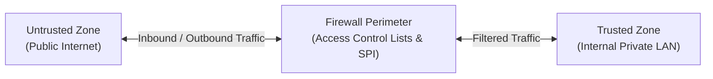

#### Why Firewalls Are Essential:
1. **Unsecured Internal Hosts**: Internal network workstations and servers are rarely perfectly hardened or patch-compliant against every known vulnerability.
2. **Hostile External Environment**: The Internet contains malicious actors, automated botnets, industrial spies, and disgruntled former employees seeking unauthorized access.
3. **Denial of Service (DoS) Mitigation**: Firewalls drop volume-based or protocol-based flood attacks before they overwhelm internal servers.
4. **Data Integrity & Confidentiality**: Prevents external attackers from reading, tampering with, or exfiltrating corporate data.

---

### Four Core Access Control Techniques

Modern firewalls enforce organization-wide security policies through four fundamental access control mechanisms:

| Control Mechanism | Description & Operational Scope | Technical Implementation Example |
| :--- | :--- | :--- |
| **Service Control** | Controls which Internet services and protocols can be accessed inbound or outbound. | Filtering traffic by IP address, IP protocol number (TCP/UDP/ICMP), or TCP/UDP port number; providing dedicated proxy services. |
| **Direction Control** | Determines the direction in which specific service requests may be initiated and allowed to flow through the boundary. | Permitting outbound HTTP requests (port 80) initiated from internal workstations, but blocking inbound HTTP connection attempts to internal workstations. |
| **User Control** | Regulates access to a network service based on the identity of the user attempting access. | Applying RADIUS/802.1X authentication or IPsec VPN credentials for incoming remote mobile users or internal local network users. |
| **Behavior Control** | Controls how specific allowable services are used and scrutinizes application data stream behavior. | Filtering incoming e-mail to eliminate spam and phishing attachments, or restricting external HTTP access to public subdirectories on a local web server. |

---

### Firewall Scope Capabilities & Limitations

#### Firewall Capabilities:
1. **Single Choke Point**: Defines a central control point that keeps unauthorized users out while prohibiting vulnerable network services from entering or leaving.
2. **Security Event Monitoring & Audit**: Serves as a centralized location to log traffic, trigger real-time alarms, and record audit trails.
3. **Integrated Network Services**: Provides non-security network functions such as Network Address Translation (NAT) to obscure private IP ranges, and bandwidth management usage logging.
4. **IPsec VPN Gateway**: Acts as the security gateway for IPsec Tunnel Mode to establish secure Virtual Private Networks (VPNs) across public WANs.

#### Firewall Limitations:
1. **Bypass Attacks**: Firewalls cannot protect against attacks or traffic flows that bypass the firewall entirely (e.g., dial-up modems, rogue cellular hotspots).
2. **Insider Threats**: Firewalls offer limited protection against internal malicious users or unwitting employees who click phishing links inside the network.
3. **Wireless LAN Exposure**: An internal firewall separating enterprise segments cannot prevent rogue wireless communications between devices on different sides of the perimeter.
4. **Infected Portable Media / Devices**: Mobile laptops, USB drives, or smartphones infected outside the corporate perimeter can introduce malware directly when connected internally.

---

## 3. Types of Firewalls

Firewalls evaluate network traffic using either **positive filters** (allowing only explicitly permitted traffic and dropping all else by default) or **negative filters** (rejecting traffic matching specific attack signatures while allowing all else).

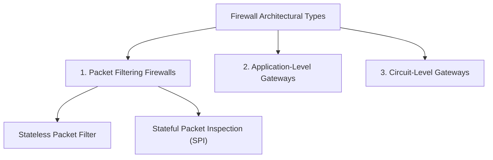

---

### Packet Filtering Firewalls (Stateless vs. Stateful SPI)

A **Packet Filtering Firewall** applies a set of rules (Access Control Lists - ACLs) to each incoming and outgoing IP packet, forwarding or dropping the packet based on header inspection.

#### ACL Inspection Parameters:
- Source and Destination IP Addresses
- Transport Layer Protocol (TCP, UDP, ICMP)
- Source and Destination Port Numbers
- IP Header Flags (SYN, ACK, FIN, RST) and ICMP Message Types

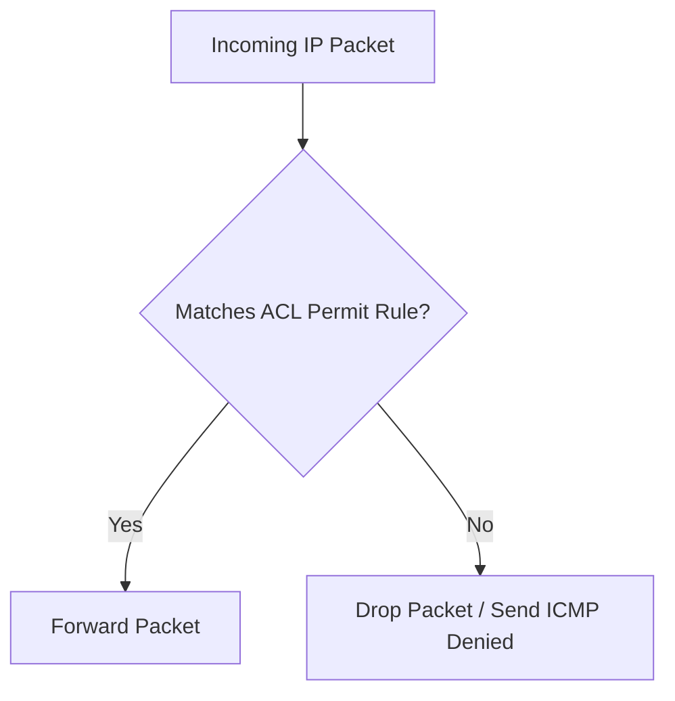

#### Stateless vs. Stateful Packet Filtering:

```
Stateless Packet Filter:
Packet 1: [Src: 192.168.1.5:49152 -> Dst: 203.0.113.10:80 | TCP SYN]  -> Evaluated statically against ACL
Packet 2: [Src: 203.0.113.10:80 -> Dst: 192.168.1.5:49152 | TCP ACK]  -> Evaluated statically against ACL

Stateful Packet Inspection (SPI):
Outbound SYN  -> Firewall records state in Session Table: [192.168.1.5:49152 <-> 203.0.113.10:80 | ESTABLISHED]
Inbound ACK   -> Matches existing Session Table entry -> Allowed automatically without full ACL re-parsing
Unsolicited Inbound SYN -> No matching Session Table entry -> DROPPED
```

---

### Attacks on Packet Filters & Countermeasures

Attacker techniques targeting packet filters and their cryptographic/network defenses:

| Attack Technique | Attack Mechanism | Firewall Countermeasure |
| :--- | :--- | :--- |
| **IP Address Spoofing** | Attacker sets the source IP address of an external packet to match an internal trusted IP address to bypass ingress rules. | Configure ingress filtering on external router interfaces: drop incoming packets with source IP addresses belonging to the internal network range. |
| **Source Routing Attacks** | Attacker specifies an explicit IP source route in the IP header options to bypass intermediate security routers. | Configure firewall router to drop all IP packets that specify source routing options. |
| **Tiny Fragment Attacks** | Attacker uses IP fragmentation to split TCP header fields across tiny fragments (e.g., first fragment contains IP header + part of TCP ports, second fragment contains TCP flags), bypassing port checks. | Discard fragments where the TCP header offset is less than the minimum required size, or reassemble all IP fragments at the firewall prior to rule inspection. |

#### Advantages & Disadvantages of Packet Filters:
- **Advantages**: High performance/speed, low processing overhead, transparent to end-users and applications.
- **Disadvantages**: ACL rule creation is complex and error-prone, lacks user authentication, cannot inspect application payload data.

---

### Application-Level Gateways (Application Proxies)

An **Application-Level Gateway (Proxy Firewall)** acts as a complete relay for application-level traffic. It terminates incoming TCP connections from clients and initiates independent TCP connections to destination servers.

```mermaid
flowchart LR
    Client["Internal Client"] <-->|TCP Conn 1 (App Data)| Proxy["Application Proxy<br/>(HTTP / FTP / Telnet)"]
    Proxy <-->|TCP Conn 2 (Filtered Payload)| Server["External Server"]
```

#### Operational Mechanics:
1. User connects to the application gateway using a specific application (e.g., HTTP, FTP, Telnet).
2. Gateway prompts user for authentication credentials.
3. Upon successful authentication, gateway evaluates the application commands (e.g., HTTP GET vs. POST, FTP RETR vs. STOR).
4. Gateway opens a separate TCP connection to the destination host and relays verified payload data.

- **Advantages**: Deep packet inspection (DPI) of application payloads, user authentication support, complete isolation between internal and external network protocols.
- **Disadvantages**: Substantial processing overhead per connection, non-transparent to users (requires client proxy configuration), limited performance scalability.

---

### Circuit-Level Gateways & SOCKS Protocol

A **Circuit-Level Gateway** operates at the transport layer (TCP) by relaying two TCP connections (one internal client-to-gateway, one gateway-to-external server) without inspecting the high-level application payload once the circuit is established.

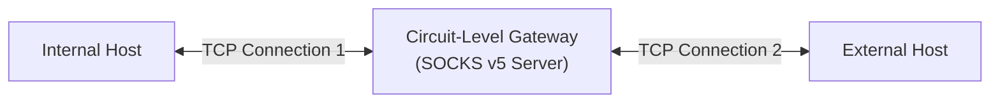

#### Key Characteristics & SOCKS Protocol:
- **Connection Authorization**: The gateway evaluates handshake packets to decide whether to permit the circuit. Once approved, TCP segments are blindly copied between connections without inspecting payload content.
- **Trusted Internal Environment**: Commonly deployed when internal users are trusted for outbound traffic—avoiding the heavy processing overhead of application proxies on outgoing data.
- **SOCKS Protocol (RFC 1928)**: Version 5 of SOCKS defines a standard framework for circuit-level proxying, providing support for authentication, IPv6, and UDP association.

---

### Comparative Analysis of Firewall Types

| Feature / Metric | Packet Filtering Firewall | Stateful Inspection (SPI) | Application-Level Gateway | Circuit-Level Gateway |
| :--- | :--- | :--- | :--- | :--- |
| **OSI Layer Operation** | Network / Transport (Layers 3–4) | Network / Transport (Layers 3–4) | Application (Layer 7) | Transport (Layer 4) |
| **Performance / Speed** | Extremely High | Very High | Low (High Overhead) | High |
| **Transparency** | Completely Transparent | Completely Transparent | Requires Proxy Config | Requires SOCKS Client |
| **State Tracking** | Stateless | Tracks Connection States | Tracks Application State | Tracks TCP Circuit State |
| **Payload Inspection** | None | Limited (Header Flags) | Deep Packet Inspection | None (Post-Handshake) |
| **User Authentication** | None | Optional | Strong Built-in | Supported (SOCKS5) |

---

## 4. Firewall Misconceptions & Enterprise Vendors

### Common Misconceptions:
1. *"Firewalls are always dedicated hardware appliances."* $\rightarrow$ **Reality**: Firewalls exist as software applications, operating system modules (e.g., Linux `iptables`/`nftables`), and cloud virtual appliances.
2. *"A firewall protects against all possible security threats."* $\rightarrow$ **Reality**: Firewalls cannot stop attacks bypassing the perimeter, social engineering, insider threats, or malicious encrypted payloads.
3. *"A firewall protects all organization data automatically."* $\rightarrow$ **Reality**: Firewalls only protect data traversing the perimeter boundary where the firewall is physically or logically inline.
4. *"A firewall can protect against zero-day attacks."* $\rightarrow$ **Reality**: Static ACL rules cannot identify novel zero-day exploits without behavioral anomaly detection or threat intelligence integration.

### Popular Enterprise Firewall Vendors:
- **Palo Alto Networks** (Next-Generation Firewalls - NGFW)
- **Cisco Systems** (Cisco Secure Firewall / ASA / Firepower)
- **Fortinet** (FortiGate NGFW)
- **Check Point Software Technologies** (Quantum Security Gateway)

---

## 5. Intrusion Detection Systems (IDS) & Intrusion Prevention Systems (IPS)

An **Intrusion Detection System (IDS)** continuously monitors network or system events to detect signs of malicious activity or policy violations and alerts administrators. An **Intrusion Prevention System (IPS)** extends IDS by actively blocking or dropping detected intrusive traffic in real time.

---

### Intruders Classification (Masquerader, Misfeasor, Clandestine)

Cryptographer and system security pioneer Richard Heberlein classified system intruders into three distinct categories:

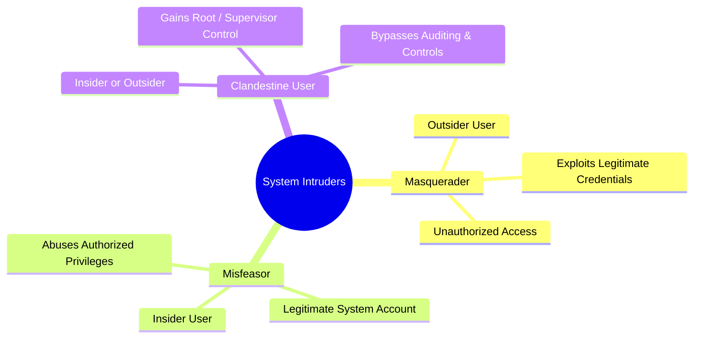

1. **Masquerader**: An unauthorized individual (external attacker) who gains access to a system by exploiting a legitimate user's account credentials.
2. **Misfeasor**: An authorized insider (employee/user) who misuses their legitimate privileges to access unauthorized data or execute forbidden actions.
3. **Clandestine User**: An insider or outsider who seizes supervisor/root control of the system to suppress security auditing, bypass access controls, or disable system security services.

---

### IDS Architectures: NIDS vs. HIDS

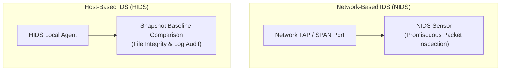

| Feature | Network-Based IDS (NIDS) | Host-Based IDS (HIDS) |
| :--- | :--- | :--- |
| **Deployment Location** | Installed at key network choke points (switches, routers, DMZ). | Installed directly on critical individual target hosts/servers. |
| **Data Analyzed** | Captures and inspects live network traffic packets across subnets. | Analyzes host OS event logs, system calls, and file system snapshots. |
| **Detection Scope** | Detects network attacks (port scans, DoS floods, IP spoofing). | Detects local privilege escalation, binary tampering, and file modifications. |
| **Encrypted Traffic** | Cannot inspect encrypted payloads (TLS/HTTPS) without SSL interception. | Can inspect decrypted data at the host application/OS level. |
| **High-Speed Performance** | May drop packets on high-speed gigabit networks under heavy traffic. | Incurs local CPU/memory processing overhead on host system. |

---

### Detection Methodologies: Signature-Based vs. Anomaly-Based

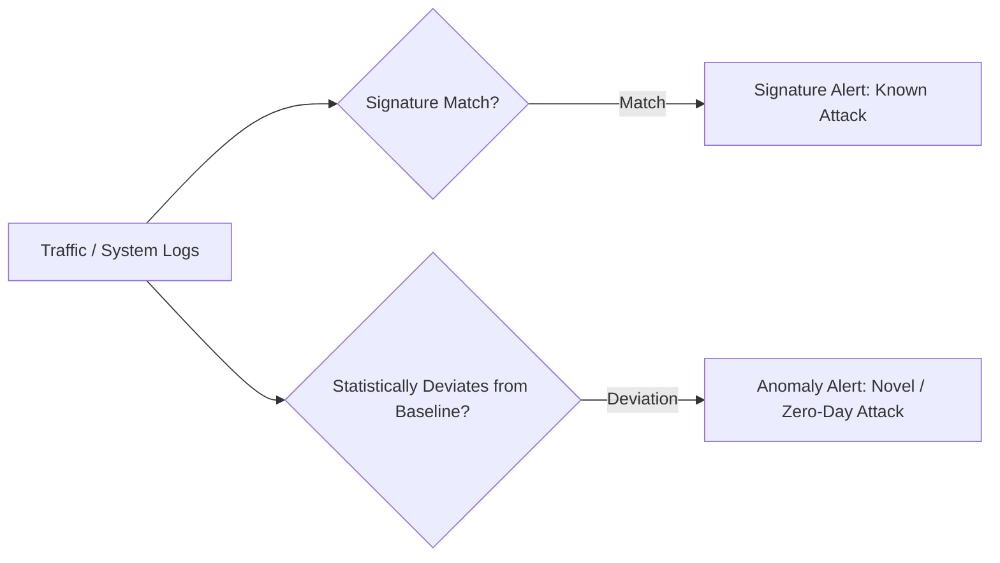

#### 1. Signature-Based Detection:
- **Mechanism**: Compares captured network traffic or system logs against a predefined database of known attack signatures (patterns).
- **Strengths**: High accuracy, extremely low false positive rate for known attacks.
- **Weaknesses**: Completely incapable of detecting new, novel, or zero-day attacks; signatures require continuous database updates.

#### 2. Anomaly-Based Detection:
- **Mechanism**: Establishes a baseline statistical model of normal system/network behavior. Detects intrusive activity when current behavior statistically deviates from the baseline.
- **Strengths**: Capable of identifying unknown, zero-day attacks and novel evasive techniques.
- **Weaknesses**: High false-positive rate due to normal non-malicious operational variance; baseline training requires extensive clean data.

---

### IDS vs. IPS Comprehensive Comparison

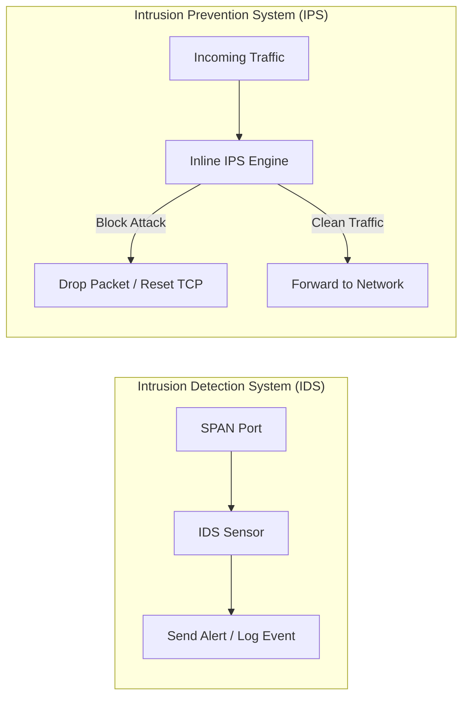

| Dimension | Intrusion Detection System (IDS) | Intrusion Prevention System (IPS) |
| :--- | :--- | :--- |
| **Primary Operational Goal** | Monitor and detect intrusions; alert administrators. | Detect and actively prevent/stop intrusive attacks in real time. |
| **Network Placement** | Out-of-band (connected via SPAN/mirror port or network TAP). | Inline (connected directly in the physical traffic path). |
| **Action Taken on Match** | Generates security alert, logs event, triggers notifications. | Drops malicious packets, resets TCP connections (`TCP RST`), blocks IPs. |
| **Latency Impact** | Zero latency impact on live network traffic. | Adds minimal inline processing latency to all passing packets. |
| **Failure Mode** | Network traffic continues unimpeded if IDS fails. | If inline IPS fails, network traffic may be blocked (fail-close) or unmonitored (fail-open). |

---

## 6. System Vulnerability Audit Tools & Exploitation Protections

### Rootkit Hunter (`rkhunter`) Architecture

`rkhunter` is an open-source host-based vulnerability assessment tool designed to audit local POSIX systems for rootkits, backdoors, and local exploits.

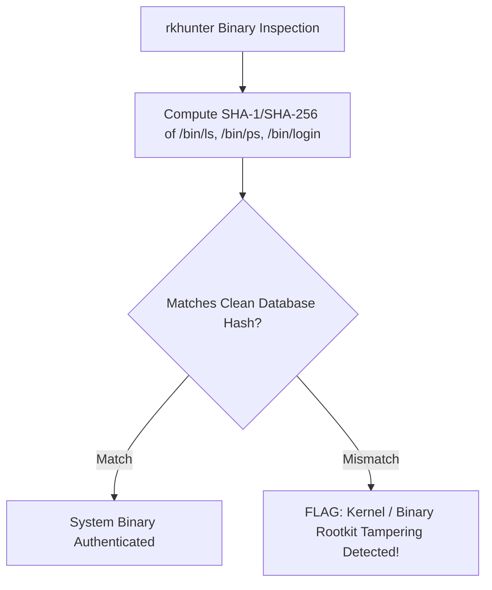

#### Core Audit Functions:
- Checks SHA-1/SHA-256 cryptographic hashes of core system binaries against a known clean baseline database.
- Detects hidden directories, abnormal file permissions, and unauthorized listening TCP/UDP ports.
- Inspects kernel modules for hidden hooks overriding system calls.

---

### N-Stalker Web Application Vulnerability Scanner

**N-Stalker** is an automated web application vulnerability scanner executing HTTP payload audits to identify security flaws in web interfaces.

#### Three-Stage Scanning Process:
1. **Spidering & Crawling**: Automatically maps web application parameters, forms, scripts, and endpoints.
2. **Automated Payload Injection**: Transmits tailored HTTP attack vectors to test for OWASP Top 10 vulnerabilities (SQL Injection, XSS, CSRF, Directory Traversal).
3. **Response Analysis**: Inspects HTTP status codes, response headers, and error messages to confirm vulnerability existence.

---

### Memory Protections: ASLR, DEP/NX & Stack Canaries

Modern operating systems deploy three complementary mitigations against buffer overflow stack exploitation:

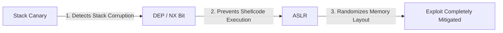

1. **Stack Canaries**: Secret integer values placed on the stack before the return address. If a buffer overflow overwrites the canary, the program terminates before executing the corrupted return address.
2. **DEP / NX (Data Execution Prevention / No-Execute)**: Marks stack and heap memory pages as non-executable. Injected shellcode cannot execute even if an attacker redirects the execution flow to the stack.
3. **ASLR (Address Space Layout Randomization)**: Randomizes the memory positions of the stack, heap, and shared libraries (`libc`) on every execution, preventing deterministic Return-to-Libc attacks.

---

## 7. Python Simulation: System Integrity File Hash Auditor

Below is an executable Python 3 script simulating host-based file integrity auditing (similar to `rkhunter`'s baseline verification engine):

```python
import hashlib
import os
import json

class SystemIntegrityAuditor:
    def __init__(self, baseline_db_path="baseline_hashes.json"):
        self.baseline_db_path = baseline_db_path
        self.baseline_db = {}
        self.load_baseline()

    def compute_sha256(self, filepath):
        # Computes SHA-256 hash of a target system binary or file.
        if not os.path.exists(filepath):
            return None
        hasher = hashlib.sha256()
        with open(filepath, 'rb') as f:
            while chunk := f.read(65536):
                hasher.update(chunk)
        return hasher.hexdigest()

    def generate_baseline(self, file_list):
        # Generates clean baseline hash database for specified files.
        for filepath in file_list:
            if os.path.exists(filepath):
                file_hash = self.compute_sha256(filepath)
                self.baseline_db[filepath] = file_hash
        print(f"[+] Baseline generated for {len(self.baseline_db)} files.")

    def audit_system(self):
        # Audits current system file hashes against stored clean baseline.
        audit_results = {"CLEAN": [], "TAMPERED": [], "MISSING": []}
        for filepath, expected_hash in self.baseline_db.items():
            current_hash = self.compute_sha256(filepath)
            if current_hash is None:
                audit_results["MISSING"].append(filepath)
            elif current_hash == expected_hash:
                audit_results["CLEAN"].append(filepath)
            else:
                audit_results["TAMPERED"].append({
                    "file": filepath,
                    "expected": expected_hash[:16],
                    "actual": current_hash[:16]
                })
        return audit_results

# Demonstration Run
if __name__ == "__main__":
    # Create dummy system file
    test_file = "system_login.bin"
    with open(test_file, "w") as f:
        f.write("AUTHENTIC_LOGIN_BINARY_V1.0")

    auditor = SystemIntegrityAuditor()
    auditor.generate_baseline([test_file])

    # Perform initial audit
    print("\n[Audit 1 - Clean System]:", auditor.audit_system())

    # Simulate rootkit binary tampering
    with open(test_file, "a") as f:
        f.write("\nMALICIOUS_BACKDOOR_HOOK")

    # Perform second audit after tampering
    print("\n[Audit 2 - Post Rootkit Tampering]:", auditor.audit_system())

    # Cleanup
    if os.path.exists(test_file):
        os.remove(test_file)
```

---

## 8. 8 Solved Practice Questions & Exam Problems

### Question 1: Firewall Control Mechanisms
**Problem**: Explain the four general access control techniques used by firewalls to enforce security policies. Provide an example of each.

**Solution**:
1. **Service Control**: Filters by protocol or port (e.g., blocking inbound SMB port 445).
2. **Direction Control**: Controls request flow direction (e.g., permitting outbound HTTP while blocking inbound HTTP).
3. **User Control**: Restricts access by user identity (e.g., requiring IPsec VPN credentials for remote access).
4. **Behavior Control**: Restricts service usage content (e.g., stripping executable attachments from incoming email).

---

### Question 2: Stateful vs. Stateless Packet Inspection
**Problem**: Contrast Stateless Packet Filtering with Stateful Packet Inspection (SPI). Why does SPI provide superior protection against unsolicited inbound attacks?

**Solution**:
Stateless filters evaluate each packet independently against static ACLs without tracking connection context. SPI maintains a dynamic **session table** recording active outbound connections (`SYN -> SYN/ACK -> ACK`). When an external inbound packet arrives, SPI checks if it matches an active outbound session; if no matching entry exists, the unsolicited packet is dropped immediately.

---

### Question 3: Attacks on Packet Filters & Defenses
**Problem**: Describe the IP Address Spoofing, Source Routing, and Tiny Fragment attacks on packet filtering firewalls. Detail the specific countermeasure for each.

**Solution**:
1. **IP Address Spoofing**: External packet uses internal source IP $\rightarrow$ *Countermeasure*: Ingress interface filtering dropping external packets claiming internal IPs.
2. **Source Routing**: Packet specifies explicit custom route to bypass firewalls $\rightarrow$ *Countermeasure*: Drop all packets with IP source routing options set.
3. **Tiny Fragment Attack**: Header split across tiny fragments to hide TCP ports $\rightarrow$ *Countermeasure*: Discard fragments smaller than minimum header size or reassemble prior to rule checks.

---

### Question 4: Application-Level vs. Circuit-Level Gateways
**Problem**: Compare Application-Level Gateways with Circuit-Level Gateways in terms of OSI layer, payload inspection, and performance overhead.

**Solution**:
- **Application Gateway**: Operates at Layer 7, performs deep packet inspection on application payloads, but incurs heavy CPU processing overhead per connection.
- **Circuit Gateway**: Operates at Layer 4, sets up two TCP connections (SOCKS5) and relays TCP segments without examining payload data, resulting in significantly lower processing overhead.

---

### Question 5: Classification of System Intruders
**Problem**: Define and compare the three classes of intruders: Masquerader, Misfeasor, and Clandestine User.

**Solution**:
1. **Masquerader**: External outsider exploiting legitimate user credentials.
2. **Misfeasor**: Authorized insider misusing their legitimate access privileges.
3. **Clandestine User**: Insider or outsider who seizes root/supervisor control to disable auditing and security controls.

---

### Question 6: NIDS vs. HIDS Architecture & Encrypted Traffic
**Problem**: Explain why a Network-Based IDS (NIDS) struggles to analyze encrypted TLS traffic, whereas a Host-Based IDS (HIDS) can inspect it successfully.

**Solution**:
NIDS intercepts network traffic out-of-band on network links; if payload data is encrypted via TLS/HTTPS, NIDS sees only ciphertext. HIDS resides directly on the destination host operating system, allowing it to inspect application data after decryption or audit OS system calls directly.

---

### Question 7: Signature-Based vs. Anomaly-Based IDS
**Problem**: Why is signature-based detection ineffective against zero-day attacks? How does anomaly-based detection overcome this, and what is its main drawback?

**Solution**:
Signature detection matches traffic against a database of known attack patterns; since zero-day attacks have no existing signature, they pass undetected. Anomaly detection flags statistical deviations from normal baseline behavior, enabling zero-day detection. Its main drawback is a high false-positive rate due to legitimate non-standard user activities.

---

### Question 8: Complementary Role of Firewalls and IPS
**Problem**: Explain why an organization needs both a Firewall and an Intrusion Prevention System (IPS) in its perimeter defense architecture.

**Solution**:
A **Firewall** acts as a coarse access control boundary, allowing or blocking traffic based on IP addresses, ports, and connection states. An **IPS** performs deep inline inspection of allowed traffic streams, detecting and blocking application-level exploits (e.g., SQL injection, buffer overflow payloads) that pass through open firewall ports (such as port 80/443).
