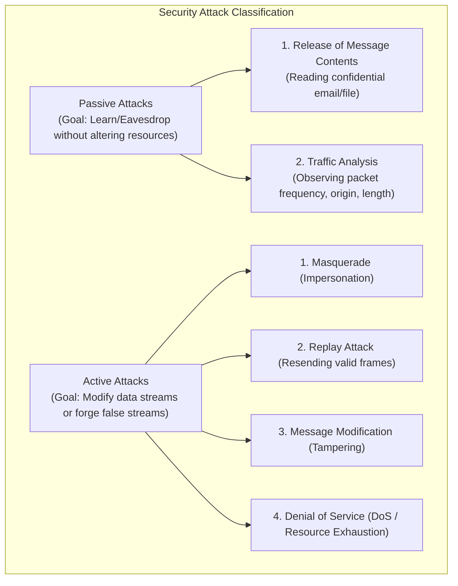
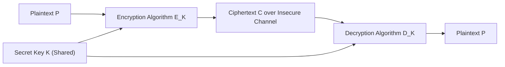
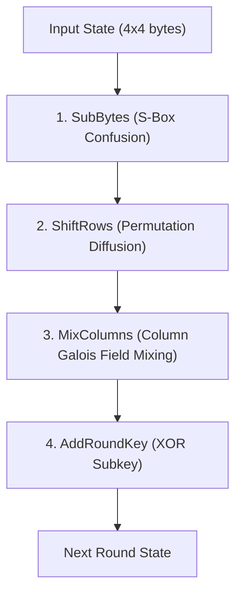
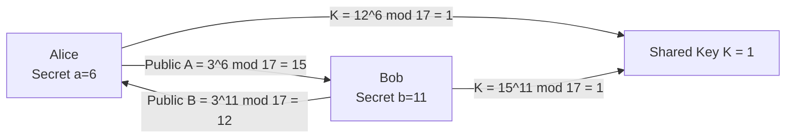
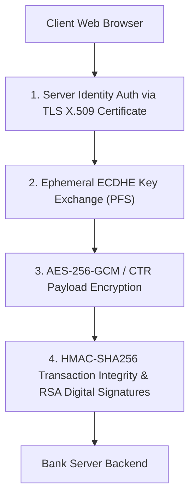

# 2nd Sessional Examination: Fully Solved Comprehensive Solutions & Syllabus Coverage

[← Back to Course README](../README.md)

- [1. Foundational Concepts & Security Models](#1-foundational-concepts--security-models)
  - [1.1 Security Attacks: Passive vs. Active Attacks](#11-security-attacks-passive-vs-active-attacks)
  - [1.2 Security Services (ITU-T X.800 Classification)](#12-security-services-itu-t-x800-classification)
  - [1.3 Cryptanalysis Classifications (4 Models)](#13-cryptanalysis-classifications-4-models)
  - [1.4 Symmetric Cipher Model & Components](#14-symmetric-cipher-model--components)
  - [1.5 Confusion vs. Diffusion (Claude Shannon)](#15-confusion-vs-diffusion-claude-shannon)
- [2. Classical Cryptography (Substitution & Transposition)](#2-classical-cryptography-substitution--transposition)
  - [2.1 Vigenère Cipher (Tableau, Encryption, Decryption & Numerical Example)](#21-vigenere-cipher-tableau-encryption-decryption--numerical-example)
  - [2.2 Rail Fence Cipher (Multi-Rail Encryption)](#22-rail-fence-cipher-multi-rail-encryption)
  - [2.3 Row-Column Transposition Cipher & Product Cipher Security](#23-row-column-transposition-cipher--product-cipher-security)
- [3. Mathematical Foundations of Cryptography](#3-mathematical-foundations-of-cryptography)
  - [3.1 Extended Euclidean Algorithm (GCD, Linear Combinations & Modular Inverses)](#31-extended-euclidean-algorithm-gcd-linear-combinations--modular-inverses)
  - [3.2 Euler's Totient Function \phi(n) & Proof for \phi(p \cdot q) = (p-1)(q-1)](#32-eulers-totient-function-phin--proof-for-phip-cdot-q--p-1q-1)
  - [3.3 Euler's Theorem & Exponent Reduction](#33-eulers-theorem--exponent-reduction)
  - [3.4 Fermat's Little Theorem (FLT) & Modular Exponentiation](#34-fermats-little-theorem-flt--modular-exponentiation)
  - [3.5 Chinese Remainder Theorem (CRT) System Solver](#35-chinese-remainder-theorem-crt-system-solver)
  - [3.6 Discrete Logarithm Problem (DLP)](#36-discrete-logarithm-problem-dlp)
- [4. Symmetric Key Cryptography (DES, 3DES, AES, RC4 & Modes of Operation)](#4-symmetric-key-cryptography-des-3des-aes-rc4--modes-of-operation)
  - [4.1 Data Encryption Standard (DES) Architecture & S-Box Non-Linearity](#41-data-encryption-standard-des-architecture--s-box-non-linearity)
  - [4.2 Triple DES (3DES) & Meet-in-the-Middle (MitM) Attack on 2DES](#42-triple-des-3des--meet-in-the-middle-mitm-attack-on-2des)
  - [4.3 Advanced Encryption Standard (AES Transformations & Key Schedule)](#43-advanced-encryption-standard-aes-transformations--key-schedule)
  - [4.4 RC4 Stream Cipher (KSA & PRGA Algorithms)](#44-rc4-stream-cipher-ksa--prga-algorithms)
  - [4.5 Block Cipher Modes of Operation (CTR, OFB, CBC & AES-XTS)](#45-block-cipher-modes-of-operation-ctr-ofb-cbc--aes-xts)
- [5. Asymmetric Key Cryptography (RSA, Diffie-Hellman & ElGamal)](#5-asymmetric-key-cryptography-rsa-diffie-hellman--elgamal)
  - [5.1 RSA Algorithm (Key Generation, Encryption, Decryption & Numerical Tracing)](#51-rsa-algorithm-key-generation-encryption-decryption--numerical-tracing)
  - [5.2 Diffie-Hellman Key Exchange, MitM Attack & Countermeasures](#52-diffie-hellman-key-exchange-mitm-attack--countermeasures)
  - [5.3 ElGamal Cryptosystem vs. RSA Comparison](#53-elgamal-cryptosystem-vs-rsa-comparison)
- [6. Data Integrity & Authentication](#6-data-integrity--authentication)
  - [6.1 Cryptographic Hash Functions & Compression Designs (Davies-Meyer / Miyaguchi-Preneel)](#61-cryptographic-hash-functions--compression-designs-davies-meyer--miyaguchi-preneel)
  - [6.2 SHA-512 Architecture, Parsing & Avalanche Effect](#62-sha-512-architecture-parsing--avalanche-effect)
  - [6.3 HMAC Construction & MAC vs. MDC Comparison](#63-hmac-construction--mac-vs-mdc-comparison)
  - [6.4 Digital Signatures & One-Way Hash Necessity](#64-digital-signatures--one-way-hash-necessity)
- [7. Security System Design & Applications](#7-security-system-design--applications)
  - [7.1 End-to-End Online Banking Security Architecture](#71-end-to-end-online-banking-security-architecture)
  - [7.2 Cloud & Disk Storage Security via AES-XTS](#72-cloud--disk-storage-security-via-aes-xts)
  - [7.3 Pseudorandom Number Generation (PRNG) via CTR Mode](#73-pseudorandom-number-generation-prng-via-ctr-mode)

> **Course**: ICS 250 - Cryptography and Network Security  
> **Assessment**: 2nd Sessional Examination (Exhaustive Solved Curriculum & Practice Questions)

---

## 1. Foundational Concepts & Security Models

### 1.1 Security Attacks: Passive vs. Active Attacks



- **Detection vs. Prevention**:
  - *Passive Attacks*: Extremely difficult to detect because they leave no system audit logs. Focus is strictly on **prevention** via end-to-end encryption (TLS, IPsec).
  - *Active Attacks*: Difficult to prevent completely across complex physical networks. Focus is on **detection** and recovery via MACs, Digital Signatures, Firewalls, and Intrusion Detection Systems (IDS).

---

### 1.2 Security Services (ITU-T X.800 Classification)

1. **Authentication**: Guarantees entity identity (Peer Entity Authentication & Data Origin Authentication).
2. **Access Control**: Prevents unauthorized utilization of network or system resources.
3. **Data Confidentiality**: Protects transmitted data from unauthorized passive eavesdropping.
4. **Data Integrity**: Ensures received data is unmodified and free from insertion, deletion, or replay.
5. **Non-Repudiation**: Prevents sender or receiver from denying message transmission/reception.

---

### 1.3 Cryptanalysis Classifications (4 Models)

| Cryptanalysis Model | Attacker's Available Information | Primary Cryptanalytic Objective |
| :--- | :--- | :--- |
| **Ciphertext-Only** | Ciphertexts $C_1, C_2, \dots, C_k$ | Recover secret key $K$ or plaintexts using frequency analysis. |
| **Known-Plaintext** | Pairs of $(P_1, C_1), (P_2, C_2), \dots$ | Determine key $K$ by exploiting known structural patterns. |
| **Chosen-Plaintext** | Attacker chooses arbitrary $P_i$ and obtains $C_i = E_K(P_i)$ | Break cipher using targeted plaintext structures (Differential Cryptanalysis). |
| **Chosen-Ciphertext** | Attacker chooses arbitrary $C_i$ and obtains $P_i = D_K(C_i)$ | Extract key $K$ by submitting crafted ciphertexts to decryption oracle. |

---

### 1.4 Symmetric Cipher Model & Components



- **5 Key Components**: Plaintext $P$, Encryption Algorithm $E$, Secret Key $K$, Ciphertext $C = E_K(P)$, Decryption Algorithm $P = D_K(C)$.
- **2 Fundamental Security Requirements**:
  1. Encryption algorithm must be strong enough that ciphertext alone cannot be decrypted without key $K$.
  2. Sender and receiver must obtain copies of the secret key $K$ over a secure channel and keep $K$ strictly confidential.

---

### 1.5 Confusion vs. Diffusion (Claude Shannon)

- **Confusion**: Obscures the complex relationship between the secret key $K$ and ciphertext $C$.
  - *Mechanism*: Implemented using non-linear **Substitution** operations (e.g. S-Boxes in DES/AES).
- **Diffusion**: Spreads the statistical structure of plaintext $P$ over long durations of ciphertext $C$.
  - *Mechanism*: Implemented using **Permutation** and transposition operations (e.g. P-Boxes, ShiftRows, MixColumns).

---

## 2. Classical Cryptography (Substitution & Transposition)

### 2.1 Vigenère Cipher (Tableau, Encryption, Decryption & Numerical Example)

- **Mathematical Formula**:
  $$C_i = (P_i + K_{i \bmod m}) \pmod{26}$$
  $$P_i = (C_i - K_{i \bmod m} + 26) \pmod{26}$$

- **Numerical Example**: Encrypt $P = \text{"CRYPTOGRAPHY"}$ using $K = \text{"KEY"}$.

| Index | 0 | 1 | 2 | 3 | 4 | 5 | 6 | 7 | 8 | 9 | 10 | 11 |
| :--- | :--- | :--- | :--- | :--- | :--- | :--- | :--- | :--- | :--- | :--- | :--- | :--- |
| **Plaintext $P$** | C (2) | R (17) | Y (24) | P (15) | T (19) | O (14) | G (6) | R (17) | A (0) | P (15) | H (7) | Y (24) |
| **Key $K$** | K (10) | E (4) | Y (24) | K (10) | E (4) | Y (24) | K (10) | E (4) | Y (24) | K (10) | E (4) | Y (24) |
| **$(P+K) \bmod 26$** | 12 | 21 | 22 | 25 | 23 | 12 | 16 | 21 | 24 | 25 | 11 | 22 |
| **Ciphertext $C$** | **M** | **V** | **W** | **Z** | **X** | **M** | **Q** | **V** | **Y** | **Z** | **L** | **W** |

---

### 2.2 Rail Fence Cipher (Multi-Rail Encryption)

Write plaintext diagonally along $N$ rails and read out row-by-row.

*Example ($N=3$ rails for $P = \text{"SECRET ATTACK"}$)*:
```
S . . . E . . . T . . . C . .
. E . R . T . A . T . A . K .
. . C . . . T . . . H . . . .
```
Reading row-by-row yields Ciphertext: `SETC ERTATAK CTH`.

---

### 2.3 Row-Column Transposition Cipher & Product Cipher Security

Plaintext is written in rows under a key permutation (e.g. $K = [3, 1, 4, 2]$) and read column-by-column in sorted key order.
- **Product Cipher Security**: Combining a substitution cipher (Vigenère/Rail Fence) with a transposition cipher (Row-Column) creates a product cipher that satisfies both Confusion and Diffusion, rendering simple frequency analysis ineffective.

---

## 3. Mathematical Foundations of Cryptography

### 3.1 Extended Euclidean Algorithm (GCD, Linear Combinations & Modular Inverses)

- **Algorithm Objective**: Finds $\gcd(a, b)$ and integers $x, y$ satisfying $a \cdot x + b \cdot y = \gcd(a, b)$.
- **Problem**: Calculate multiplicative inverse of $23 \pmod{51}$.

$$\begin{aligned}
51 &= 2 \times 23 + 5 \implies 5 = 51 - 2(23) \\
23 &= 4 \times 5 + 3 \implies 3 = 23 - 4(5) \\
5 &= 1 \times 3 + 2 \implies 2 = 5 - 1(3) \\
3 &= 1 \times 2 + 1 \implies 1 = 3 - 1(2)
\end{aligned}$$

Back-substituting to solve for $1$:
$$\begin{aligned}
1 &= 3 - 1(5 - 3) = 2(3) - 5 \\
&= 2(23 - 4(5)) - 5 = 2(23) - 9(5) \\
&= 2(23) - 9(51 - 2(23)) = 20(23) - 9(51)
\end{aligned}$$
Taking modulo 51 yields: $20 \times 23 \equiv 1 \pmod{51}$.  
Therefore, $23^{-1} \pmod{51} = \mathbf{20}$.

---

### 3.2 Euler's Totient Function $\phi(n)$ & Proof for $\phi(p \cdot q) = (p-1)(q-1)$

- **Definition**: $\phi(n)$ counts the number of positive integers less than $n$ that are coprime to $n$.
- **Proof**: Let $n = p \cdot q$ where $p, q$ are distinct primes.
  1. The integers in $\{1, 2, \dots, n\}$ that share a factor with $p$ are the $q$ multiples: $\{p, 2p, 3p, \dots, qp\}$.
  2. The integers that share a factor with $q$ are the $p$ multiples: $\{q, 2q, 3q, \dots, pq\}$.
  3. Only $n = p \cdot q$ is counted in both sets.
  4. Total non-coprime numbers = $p + q - 1$.
  5. Therefore:
     $$\phi(p \cdot q) = n - (p + q - 1) = pq - p - q + 1 = (p - 1)(q - 1)$$

---

### 3.3 Euler's Theorem & Exponent Reduction

If $\gcd(a, n) = 1$, then:
$$a^{\phi(n)} \equiv 1 \pmod n$$
*Application*: Computes large powers modulo $n$ by reducing exponent $k \pmod{\phi(n)}$: $a^k \equiv a^{k \bmod \phi(n)} \pmod n$.

---

### 3.4 Fermat's Little Theorem (FLT) & Modular Exponentiation

If $p$ is prime and $p \nmid a$, then:
$$a^{p-1} \equiv 1 \pmod p \implies a^p \equiv a \pmod p$$
*Example*: Calculate $3^{102} \pmod{11}$.
Since $p=11$ is prime and $11 \nmid 3$, by FLT $3^{10} \equiv 1 \pmod{11}$.
$$3^{102} = (3^{10})^{10} \times 3^2 \equiv 1^{10} \times 9 \equiv \mathbf{9} \pmod{11}$$

---

### 3.5 Chinese Remainder Theorem (CRT) System Solver

Solve system of congruences:
$$x \equiv 2 \pmod 3, \quad x \equiv 3 \pmod 5, \quad x \equiv 2 \pmod 7$$
1. $M = 3 \times 5 \times 7 = 105$.
2. $M_1 = 35$, $M_2 = 21$, $M_3 = 15$.
3. Inverses:
   - $35 y_1 \equiv 2 y_1 \equiv 1 \pmod 3 \implies y_1 = 2$.
   - $21 y_2 \equiv 1 y_2 \equiv 1 \pmod 5 \implies y_2 = 1$.
   - $15 y_3 \equiv 1 y_3 \equiv 1 \pmod 7 \implies y_3 = 1$.
4. $x = (2 \times 35 \times 2 + 3 \times 21 \times 1 + 2 \times 15 \times 1) \bmod 105 = (140 + 63 + 30) \bmod 105 = 233 \bmod 105 = \mathbf{23}$.

---

### 3.6 Discrete Logarithm Problem (DLP)

Given $y = g^x \bmod p$ with prime $p$ and generator $g$, finding $x = \log_g(y) \bmod p$ is computationally hard. DLP provides the underlying mathematical security for Diffie-Hellman and ElGamal.

---

## 4. Symmetric Key Cryptography (DES, 3DES, AES, RC4 & Modes of Operation)

### 4.1 Data Encryption Standard (DES) Architecture & S-Box Non-Linearity

- **Architecture**: 16-round Feistel Network operating on 64-bit blocks with a 56-bit key.
- **Round Function**:
  $$L_i = R_{i-1}, \quad R_i = L_{i-1} \oplus F(R_{i-1}, K_i)$$
- **S-Box Significance**: The 8 S-Boxes map 6-bit inputs to 4-bit outputs. They represent the **only non-linear operation** in DES, providing critical **Confusion**.
- **Weaknesses**: 56-bit key space ($2^{56}$) is vulnerable to brute-force key search in hours.

---

### 4.2 Triple DES (3DES) & Meet-in-the-Middle (MitM) Attack on 2DES

- **Why Double DES (2DES) Fails**:
  For $C = E_{K2}(E_{K1}(P))$, an attacker re-arranges to $D_{K2}(C) = E_{K1}(P)$.
  - Attacker encrypts $P$ under all $2^{56}$ candidate keys $K_1$ and stores $(E_{K1}(P), K_1)$ in a hash table.
  - Attacker decrypts $C$ under all $2^{56}$ keys $K_2$ and checks for matches $D_{K2}(C) = E_{K1}(P)$.
  - Reduces 2DES break complexity from $2^{112}$ down to **$2^{57}$ operations**, making 2DES no safer than single DES!
- **3DES (EDE3 / EDE2)**:
  $$C = E_{K3}\big(D_{K2}(E_{K1}(P))\big)$$
  Raises MitM attack complexity to $2^{112}$ operations.

---

### 4.3 Advanced Encryption Standard (AES Transformations & Key Schedule)

- **Structure**: Non-Feistel substitution-permutation network operating on a $4 \times 4$ byte State matrix.
- **4 Transformations per Round**:
  1. `SubBytes`: Non-linear byte substitution using S-Box based on multiplicative inverse over $GF(2^8)$.
  2. `ShiftRows`: Cyclic left-shifting of State matrix rows (Row 0: 0, Row 1: 1, Row 2: 2, Row 3: 3 bytes).
  3. `MixColumns`: Matrix multiplication over $GF(2^8)$ multiplying state columns by a fixed polynomial.
  4. `AddRoundKey`: Bitwise XOR of State matrix with round subkey.



- **AES Complexity Variants**:
  - AES-128: 10 rounds, 128-bit key.
  - AES-192: 12 rounds, 192-bit key.
  - AES-256: 14 rounds, 256-bit key.

---

### 4.4 RC4 Stream Cipher (KSA & PRGA Algorithms)

RC4 uses a 256-byte S-array permutation state.

1. **Key Scheduling Algorithm (KSA)**:
   ```python
   S = list(range(256))
   j = 0
   for i in range(256):
       j = (j + S[i] + key[i % keylen]) % 256
       S[i], S[j] = S[j], S[i]
   ```
2. **Pseudo-Random Generation Algorithm (PRGA)**:
   ```python
   i = j = 0
   while generating:
       i = (i + 1) % 256
       j = (j + S[i]) % 256
       S[i], S[j] = S[j], S[i]
       K_byte = S[(S[i] + S[j]) % 256]
       output(P_byte ^ K_byte)
   ```

---

### 4.5 Block Cipher Modes of Operation (CTR, OFB, CBC & AES-XTS)

| Mode | Encryption Formula | Parallelization | Error Propagation | Use Case |
| :--- | :--- | :--- | :--- | :--- |
| **CBC** | $C_i = E_K(P_i \oplus C_{i-1})$ | Decryption Only | Corrupts $P_i$ and 1 bit in $P_{i+1}$ | General network payloads |
| **CTR** | $C_i = P_i \oplus E_K(Counter + i)$ | Fully Parallelizable | 1 bit affects 1 bit | High-speed network / PRNG |
| **OFB** | $O_i = E_K(O_{i-1}), \; C_i = P_i \oplus O_i$ | Pre-computable | 1 bit affects 1 bit | Lossy real-time audio/video |
| **AES-XTS**| $C_i = E_{K1}(P_i \oplus T) \oplus T$ | Fully Parallelizable | Single block | Cloud & Disk storage at rest |

---

## 5. Asymmetric Key Cryptography (RSA, Diffie-Hellman & ElGamal)

### 5.1 RSA Algorithm (Key Generation, Encryption, Decryption & Numerical Tracing)

- **Key Generation**:
  1. Select primes $p = 61, q = 53$.
  2. Compute $n = p \cdot q = 3233$, $\phi(n) = (61-1)(53-1) = 3120$.
  3. Choose public exponent $e = 17$ ($\gcd(17, 3120) = 1$).
  4. Calculate private exponent $d = e^{-1} \pmod{\phi(n)} \implies 17d \equiv 1 \pmod{3120} \implies d = 2753$.
  - **Public Key**: $(e=17, n=3233)$, **Private Key**: $(d=2753, n=3233)$.
- **Encryption**: For $M = 65$:
  $$C = M^e \bmod n = 65^{17} \bmod 3233 = \mathbf{2790}$$
- **Decryption**:
  $$M = C^d \bmod n = 2790^{2753} \bmod 3233 = \mathbf{65}$$

---

### 5.2 Diffie-Hellman Key Exchange, MitM Attack & Countermeasures



- **Man-in-the-Middle (MitM) Attack**:
  Attacker (Darth) intercepts $A$ and $B$, establishing key $K_1$ with Alice and key $K_2$ with Bob. Darth decrypts, inspects, and re-encrypts all traffic.
- **Countermeasure**: Digital Certificates (X.509) / Station-to-Station (STS) protocol signing public keys with RSA/ECDSA.

---

### 5.3 ElGamal Cryptosystem vs. RSA Comparison

| Metric | RSA Cryptosystem | ElGamal Cryptosystem |
| :--- | :--- | :--- |
| **Hardness Assumption** | Integer Factorization Problem (IFP) | Discrete Logarithm Problem (DLP) |
| **Ciphertext Size** | $1 \times$ Message Length ($|C| = |M|$) | **$2 \times$ Message Length** ($(c_1, c_2)$ pair) |
| **Encryption Type** | Deterministic (requires padding) | **Probabilistic** (Random ephemeral key $k$) |

---

## 6. Data Integrity & Authentication

### 6.1 Cryptographic Hash Functions & Compression Designs

- **Iterated Compression Functions**:
  - **Davies-Meyer**: Encrypts previous hash digest $H_{i-1}$ using block $M_i$ as key:
    $$H_i = E_{M_i}(H_{i-1}) \oplus H_{i-1}$$
  - **Miyaguchi-Preneel**:
    $$H_i = E_{H_{i-1}}(M_i) \oplus H_{i-1} \oplus M_i$$

---

### 6.2 SHA-512 Architecture, Parsing & Avalanche Effect

- **Message Parsing & Padding**:
  Append bit `1` followed by $k$ zero bits such that $(N + 1 + k) \equiv 896 \pmod{1024}$, then append 128-bit original length $N$.
- **Avalanche Effect**: Flipping a single bit in the input message changes over $50\%$ of the output digest bits unpredictably.

---

### 6.3 HMAC Construction & MAC vs. MDC Comparison

$$\text{HMAC}_K(M) = H\Big( (K^+ \oplus \text{opad}) \mathbin{\Vert} H\big( (K^+ \oplus \text{ipad}) \mathbin{\Vert} M \big) \Big)$$

- **MAC vs. MDC**:
  - **MDC (Unkeyed)**: Provides data integrity against accidental transmission errors (requires separate secure channel for digest).
  - **MAC (Keyed)**: Provides data integrity AND data origin authentication against active attackers over untrusted channels.

---

### 6.4 Digital Signatures & One-Way Hash Necessity

Hashing before signing ($S = \text{Sign}_{SK}(H(M))$) is mathematically required to avoid RSA multiplicative malleability attacks ($S_1 \cdot S_2 = \text{Sign}(M_1 \cdot M_2)$) and to drastically reduce signature computation time from megabytes to fixed 256/512-bit digests.

---

## 7. Security System Design & Applications

### 7.1 End-to-End Online Banking Security Architecture



---

### 7.2 Cloud & Disk Storage Security via AES-XTS

- **AES-XTS Mode**: Specially designed for block storage devices (hard drives, cloud sector storage). Uses sector number tweaks $T = E_{K2}(\text{Sector ID}) \otimes \alpha^j$ so that identical data blocks written to different sectors produce totally different ciphertexts without data expansion.

---

### 7.3 Pseudorandom Number Generation (PRNG) via CTR Mode

$$\text{Bitstream } X_i = E_K(\text{Counter} + i)$$
Cryptographically secure PRNG generating high-entropy pseudo-random bits for key generation by encrypting sequential counter blocks under AES.
