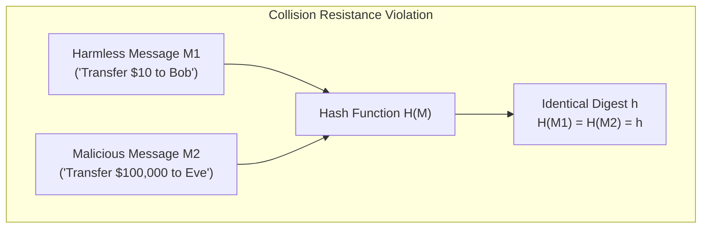
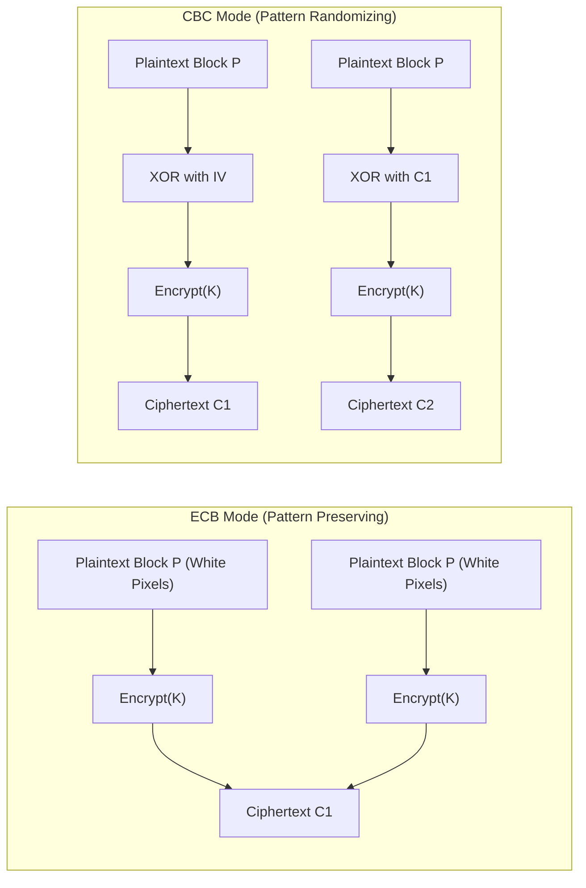
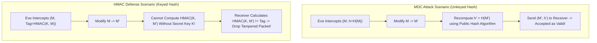
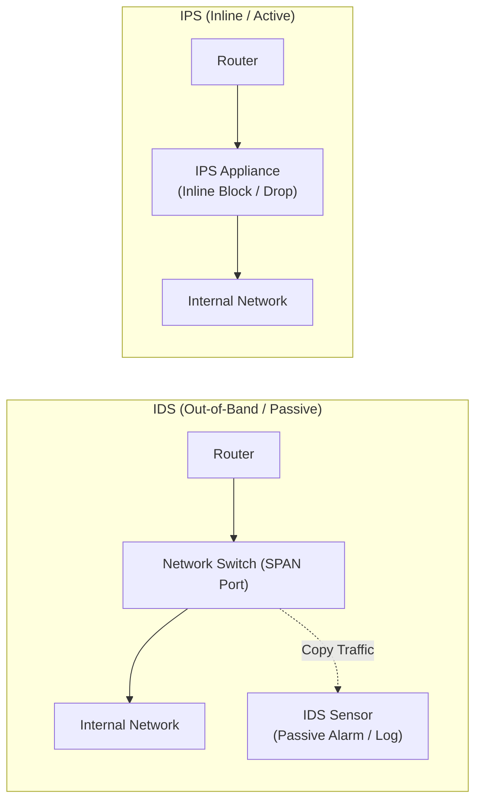
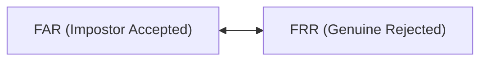

# 3rd Sessional Examination: Fully Solved Comprehensive Solutions

[← Back to Course README](../README.md)

- [Question 1](#question-1)
  - [Part A: Cryptographic Hash Function Properties & Signature Forgery [3 Marks]](#part-a-cryptographic-hash-function-properties--signature-forgery-3-marks)
  - [Part B: Public Key Misuse, Integrity, and Non-Repudiation Impact [2 Marks]](#part-b-public-key-misuse-integrity-and-non-repudiation-impact-2-marks)
- [Question 2](#question-2)
  - [Part A: ECB vs. CBC Mode Security for Bitmap Image Encryption [3 Marks]](#part-a-ecb-vs-cbc-mode-security-for-bitmap-image-encryption-3-marks)
  - [Part B: Stream Cipher Modes (CFB vs. OFB) & Transmission Error Propagation [2 Marks]](#part-b-stream-cipher-modes-cfb-vs-ofb--transmission-error-propagation-2-marks)
- [Question 3](#question-3)
  - [Part A: Inadequacy of MDC Hash vs. HMAC Keyed Authentication [3 Marks]](#part-a-inadequacy-of-mdc-hash-vs-hmac-keyed-authentication-3-marks)
  - [Part B: Pre-Image Resistance vs. Collision Resistance [2 Marks]](#part-b-pre-image-resistance-vs-collision-resistance-2-marks)
- [Question 4](#question-4)
  - [Part A: MAC vs. Digital Signatures & Non-Repudiation Failure [3 Marks]](#part-a-mac-vs-digital-signatures--non-repudiation-failure-3-marks)
  - [Part B: Public Key Infrastructure (PKI) & Missing Root CA Impact [2 Marks]](#part-b-public-key-infrastructure-pki--missing-root-ca-impact-2-marks)
- [Question 5](#question-5)
  - [Part A: Intrusion Detection System (IDS) vs. Intrusion Prevention System (IPS) [2 Marks]](#part-a-intrusion-detection-system-ids-vs-intrusion-prevention-system-ips-2-marks)
  - [Part B: Biometric Authentication (FAR vs. FRR) Security Prioritization [3 Marks]](#part-b-biometric-authentication-far-vs-frr-security-prioritization-3-marks)

> **Course**: ICS 250 - Cryptography and Network Security  
> **Assessment**: 3rd Sessional Examination (100% Solved Solutions)

---

## Question 1

### Part A: Cryptographic Hash Function Properties & Signature Forgery [3 Marks]

**Question**:
A digital signature scheme relies on a cryptographic hash function $H(M)$. Suppose an adversary finds a way to easily find two different messages, $M_1$ and $M_2$, such that $H(M_1) = H(M_2)$. Analyze which specific Hash Rule (Property) has been violated. Furthermore, explain how this violation allows an attacker to commit a 'Signature Forgery' even if they cannot crack the underlying private key of the signer.

#### Comprehensive Solution:

1. **Violated Cryptographic Property**:
   - The property violated is **Collision Resistance** (also known as Strong Collision Resistance).
   - *Definition*: Collision Resistance states that it must be computationally infeasible to find *any* pair of distinct messages $M_1 \neq M_2$ such that $H(M_1) = H(M_2)$.

2. **Signature Forgery Mechanism without Private Key Compromise**:
   - Digital signatures are computed over the hash digest of a message rather than the raw message itself:
     $$S = \text{Sign}_{SK}(H(M_1))$$
   - *Step-by-Step Attack*:
     1. **Crafting Colliding Pair**: The adversary Eve generates a benign message $M_1$ (e.g., a standard contract) and a fraudulent message $M_2$ (e.g., transferring ownership of assets to Eve) such that $H(M_1) = H(M_2)$.
     2. **Obtaining Legitimate Signature**: Eve presents the benign message $M_1$ to the victim (Alice) for signing. Alice computes $h = H(M_1)$ and applies her private key to generate signature $S = D_{SK_A}(h)$.
     3. **Substituting Payload**: Eve takes the valid signature $S$ and pairs it with the malicious message $M_2$.
     4. **Verification Bypass**: When a verifier validates $(M_2, S)$ using Alice's public key $PK_A$:
        $$E_{PK_A}(S) \stackrel{?}{=} H(M_2)$$
        Since $H(M_1) = H(M_2)$, the equality holds perfectly. The signature $S$ evaluates as 100% valid for $M_2$, committing a **successful signature forgery** without cracking or knowing Alice's private key $SK_A$.

---

### Part B: Public Key Misuse, Integrity, and Non-Repudiation Impact [2 Marks]

**Question**:
Alice wants to send a digitally signed message to Bob to ensure non-repudiation. During the process, she uses her Private Key to sign the message and Bob uses Alice's Public Key to verify it. Analyze what would happen to the security goals of Integrity and Non-Repudiation if Alice mistakenly used her Public Key to sign the message and sent it along with her private key for Bob to verify. Justify your answer.

#### Comprehensive Solution:

Both **Integrity** and **Non-Repudiation** would be completely destroyed:

1. **Complete Compromise of Integrity**:
   - *Public Key Signing Issue*: Public keys are openly distributed to the world. If Alice "signs" by encrypting with her Public Key, anyone in possession of the public key could forge or modify the message and generate a matching "signature".
   - *Private Key Exposure*: By transmitting her secret Private Key over the network to Bob, Alice exposes her private credential to any network eavesdropper. Eavesdroppers intercepting the private key can decrypt, modify payloads, and generate valid signatures on arbitrary data, destroying data integrity.

2. **Complete Destruction of Non-Repudiation**:
   - Non-repudiation guarantees that the sender cannot deny having authored a message because the digital signature could *only* have been produced by someone holding the unique, unshared Private Key.
   - Once Alice's Private Key is exposed publicly, Alice can plausibly deny sending any instruction by claiming an attacker or unauthorized party used her publicly leaked key to sign the message.

---

## Question 2

### Part A: ECB vs. CBC Mode Security for Bitmap Image Encryption [3 Marks]

**Question**:
You are tasked with encrypting a high-resolution bitmap image where large areas contain identical pixel values. Evaluate the security of Electronic Codebook (ECB) mode versus Cipher Block Chaining (CBC) mode for this task. Which mode would you recommend to prevent an adversary from discerning the image's structure?

#### Comprehensive Solution:

1. **Evaluation of Electronic Codebook (ECB) Mode**:
   - ECB encrypts each 128-bit block independently: $C_i = E_K(P_i)$.
   - In a bitmap image, uniform color areas (e.g. background pixels) consist of identical plaintext blocks $P_i = P_j$. Under ECB, identical plaintexts produce **identical ciphertext blocks** ($C_i = C_j$).
   - *Security Failure*: High-level visual structures, contours, and object outlines remain clearly visible in the ciphertext (e.g., the classic "Tux Penguin" vulnerability).

2. **Evaluation of Cipher Block Chaining (CBC) Mode**:
   - CBC XORs each plaintext block with the preceding ciphertext block before encryption:
     $$C_i = E_K(P_i \oplus C_{i-1}), \quad \text{where } C_0 = IV$$
   - Even if plaintext blocks are identical ($P_i = P_j$), the pseudo-random feedback inputs ($C_{i-1} \neq C_{j-1}$) ensure that output ciphertext blocks $C_i \neq C_j$ are completely distinct.

3. **Recommendation**:
   - **Cipher Block Chaining (CBC) mode** (or CTR mode) **must be recommended**. CBC completely hides image structures, rendering the encrypted ciphertext visually indistinguishable from random noise.

---

### Part B: Stream Cipher Modes (CFB vs. OFB) & Transmission Error Propagation [2 Marks]

**Question**:
A network protocol requires a block cipher to act as a Stream Cipher to encrypt real-time traffic byte-by-byte. Compare the suitability of Cipher Feedback (CFB) and Output Feedback (OFB) modes for this application, specifically addressing how they handle transmission bit errors.

#### Comprehensive Solution:

| Feature / Mode | Cipher Feedback (CFB) Mode | Output Feedback (OFB) Mode |
| :--- | :--- | :--- |
| **Keystream Generation** | $C_i = P_i \oplus E_K(C_{i-1})$ (Feedback depends on previous ciphertext) | $O_i = E_K(O_{i-1}), \; C_i = P_i \oplus O_i$ (Feedback is independent of ciphertext) |
| **Bit Error Behavior** | **Error Propagation**: A 1-bit error in ciphertext $C_i$ corrupts plaintext $P_i$ AND propagates to corrupt subsequent blocks until shifted out. | **No Error Propagation**: A 1-bit error in ciphertext $C_i$ corrupts **only** the single corresponding bit in $P_i$. |
| **Pre-Computation** | Cannot pre-compute keystream (ciphertext unknown). | Keystream can be pre-computed offline before data arrives. |
| **Real-Time Streaming** | Higher latency due to inline chaining. | Ideal for high-throughput, low-latency streaming (VoIP/Video). |

**Conclusion**: **OFB Mode** is superior for real-time streaming traffic because bit errors over lossy wireless/network channels do not cascade, and keystream blocks can be generated offline to minimize latency.

---

## Question 3

### Part A: Inadequacy of MDC Hash vs. HMAC Keyed Authentication [3 Marks]

**Question**:
Explain why a simple Hash function (MDC) alone is insufficient to provide Message Authentication in the presence of an active attacker (Eve). Demonstrate how the addition of a shared secret key in HMAC (Hash-based Message Authentication Code) prevents Eve from modifying a message and re-calculating a valid digest.

#### Comprehensive Solution:

1. **Inadequacy of Modification Detection Code (MDC)**:
   - An MDC $h = H(M)$ relies on an unkeyed, publicly known hash algorithm (e.g. SHA-256).
   - An active attacker (Eve) intercepting $(M, h)$ over an insecure network can modify the message to $M'$, compute $h' = H(M')$, and replace $(M, h)$ with $(M', h')$.
   - The recipient calculating $H(M')$ matches $h'$ and accepts the tampered payload. MDC provides integrity **only** if the digest itself is delivered over an out-of-band secure channel.

2. **How HMAC Prevents Tampering**:
   - HMAC incorporates a secret key $K$ shared exclusively between sender and receiver:
     $$\text{HMAC}_K(M) = H\Big( (K^+ \oplus \text{opad}) \mathbin{\Vert} H\big( (K^+ \oplus \text{ipad}) \mathbin{\Vert} M \big) \Big)$$
   - If Eve alters $M \rightarrow M'$, she cannot generate a valid $\text{HMAC}_K(M')$ because she lacks the secret key $K$. When the receiver computes $\text{HMAC}_K(M')$, it fails to match Eve's tag, catching the intrusion.

---

### Part B: Pre-Image Resistance vs. Collision Resistance [2 Marks]

**Question**:
Differentiate between Collision Resistance and Pre-image Resistance in cryptographic hash functions. Which property is most critical to prevent an attacker from finding a fake document that has the same "digital fingerprint" as a legitimate one?

#### Comprehensive Solution:

1. **Definitions & Differences**:
   - **Pre-image Resistance (One-Way Property)**: Given a hash digest $y = H(M)$, it is computationally infeasible to find the original message $M$.
   - **Second Pre-image Resistance (Weak Collision Resistance)**: Given a specific message $M_1$ and its digest $y = H(M_1)$, it is computationally infeasible to find a *different* message $M_2 \neq M_1$ such that $H(M_2) = H(M_1)$.
   - **Collision Resistance (Strong Collision Resistance)**: It is computationally infeasible to find *any two arbitrary distinct messages* $M_1 \neq M_2$ such that $H(M_1) = H(M_2)$.

2. **Critical Property**:
   - **Second Pre-image Resistance** is the most critical property. It guarantees that when presented with a specific, legitimate document $M_1$ and its fingerprint $h = H(M_1)$, an attacker cannot construct a fraudulent document $M_2$ that hashes to the exact same fingerprint $h$.

---

## Question 4

### Part A: MAC vs. Digital Signatures & Non-Repudiation Failure [3 Marks]

**Question**:
Compare the security services provided by a MAC versus a Digital Signature. Specifically, explain why a MAC cannot provide Non-Repudiation in a scenario where a sender denies having sent a specific financial instruction to a bank.

#### Comprehensive Solution:

| Security Service | Message Authentication Code (MAC) | Digital Signature |
| :--- | :--- | :--- |
| **Key Type** | Symmetric Shared Key ($K$) | Asymmetric Pair (Private $SK$, Public $PK$) |
| **Data Integrity** | Yes | Yes |
| **Data Origin Auth** | Yes (Between Key Holders) | Yes |
| **Non-Repudiation** | **No** | **Yes** |

#### Why MAC Fails to Provide Non-Repudiation:
- A MAC uses a **shared secret key $K$** known to both the sender (Alice) and the receiver (the Bank).
- If Alice sends a financial instruction $M$ with tag $T = \text{MAC}_K(M)$ and later denies sending it, the bank cannot prove Alice's authorship to an independent third-party judge.
- Because the Bank also possesses key $K$, the Bank itself had the technical capability to forge the instruction $M$ and calculate $T = \text{MAC}_K(M)$. Thus, a MAC cannot bind origin exclusively to Alice.

---

### Part B: Public Key Infrastructure (PKI) & Missing Root CA Impact [2 Marks]

**Question**:
In a Public Key Infrastructure (PKI), describe the role of a Certificate Authority (CA). What is the impact on the trust model if a user's browser does not have the CA's public key installed in its "Trusted Root" store?

#### Comprehensive Solution:

1. **Role of Certificate Authority (CA)**:
   - A CA is a trusted third party that verifies entity identities and issues X.509 digital certificates. The CA signs each certificate with its private key, binding a subject's identity (domain name/organization) to their public key.

2. **Impact of Missing Root CA Key**:
   - If a browser does not possess the CA's public key in its "Trusted Root" store, it cannot verify the CA's digital signature on presented certificates.
   - The chain of trust breaks: the browser displays untrusted warnings (`NET::ERR_CERT_AUTHORITY_INVALID`) or blocks connection, preventing users from validating server authenticity and opening vulnerability to Man-in-the-Middle attacks.

---

## Question 5

### Part A: Intrusion Detection System (IDS) vs. Intrusion Prevention System (IPS) [2 Marks]

**Question**:
Evaluate the fundamental difference between an Intrusion Detection System (IDS) and an Intrusion Prevention System (IPS) in terms of their placement in the network and their response mechanism to a detected signature match.

#### Comprehensive Solution:

1. **Network Placement**:
   - **IDS**: Deployed **Out-of-Band** (passive tap / SPAN mirror port monitoring copies of network traffic).
   - **IPS**: Deployed **Inline** (directly in the primary network traffic path so all packets traverse the device).

2. **Response Mechanism**:
   - **IDS**: **Passive**; logs malicious activity and generates security alerts/notifications to administrators without altering packet flow.
   - **IPS**: **Active**; automatically blocks, drops malicious packets, resets TCP connections (`RST`), or modifies firewall rules inline to halt attacks.

---

### Part B: Biometric Authentication (FAR vs. FRR) Security Prioritization [3 Marks]

**Question**:
In the context of System Security, analyze the "False Acceptance Rate" (FAR) vs. "False Rejection Rate" (FRR) in Biometric Authentication. Justify which rate should be prioritized (kept lower) for a system protecting a highly classified nuclear facility versus a system used for student attendance.

#### Comprehensive Solution:

1. **Definitions**:
   - **False Acceptance Rate (FAR)**: The probability that an unauthorized (impostor) user is incorrectly accepted as legitimate.
   - **False Rejection Rate (FRR)**: The probability that an authorized (genuine) user is incorrectly rejected.

2. **Nuclear Facility (High Security Domain)**:
   - *Priority*: **Prioritize Low FAR (Minimize FAR)**.
   - *Justification*: Security is paramount; an unauthorized intruder entering a nuclear facility causes catastrophic risk. The system must enforce strict biometric thresholds to ensure FAR is near zero, accepting a higher FRR (legitimate personnel may occasionally need to re-scan).

3. **Student Attendance System (High Usability Domain)**:
   - *Priority*: **Prioritize Low FRR (Minimize FRR)**.
   - *Justification*: The primary operational goal is convenience and throughput. High FRR creates long queues and administrative overhead. Falsely rejecting genuine students is frustrating, whereas a minor FAR risk carries minimal security impact in a classroom.
