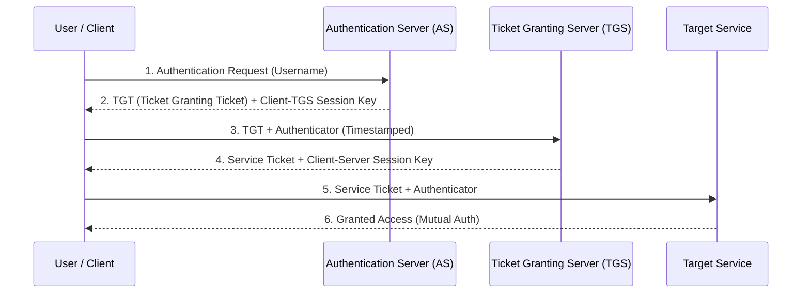

# End-Semester Question Bank Solutions: 5-Marker Comprehensive Answers (Q1 to Q14)

[← Back to Course README](../README.md)

- [Question 1: Vigenère Cipher (SECRET MESSAGE / SHIELD)](#question-1)
- [Question 2: RSA Algorithm (p=7, q=17, M=5)](#question-2)
- [Question 3: DES Architecture, Feistel Structure, Subkey Schedule & S-Boxes](#question-3)
- [Question 4: Cryptographic Hash Function Properties & Vulnerabilities](#question-4)
- [Question 5: End-to-End Corporate Messaging System Design](#question-5)
- [Question 6: Double Transposition Cipher (Rail Fence + Row-Column)](#question-6)
- [Question 7: Extended Euclidean Algorithm (GCD & Modular Inverse)](#question-7)
- [Question 8: Diffie-Hellman Key Exchange, MitM Attack & Countermeasures](#question-8)
- [Question 9: Davies-Meyer vs. Miyaguchi-Preneel Compression Functions](#question-9)
- [Question 10: AES 128-bit Key Expansion & Non-Linearity Rationale](#question-10)
- [Question 11: Elliptic Curve Cryptography (ECC) vs. RSA](#question-11)
- [Question 12: Whirlpool Hash Function Structure & Transformations](#question-12)
- [Question 13: Kerberos Authentication Service Architecture & Single Sign-On](#question-13)
- [Question 14: ElGamal Cryptosystem Mechanics & Probabilistic Expansion](#question-14)

---

## Question 1
**Question**: Encrypt the plaintext 'SECRET MESSAGE' using the Vigenere Cipher with the keyword 'SHIELD'. Show the construction of the Vigenere tableau, trace the encryption step-by-step, and demonstrate the corresponding decryption process.

### Comprehensive Solution:
The Vigenère cipher is a polyalphabetic stream cipher where the key stream is a repetition of an initial secret keyword (`SHIELD`). Encryption and decryption are mathematically defined as:
$$C_i = (P_i + K_{i \bmod m}) \pmod{26}$$
$$P_i = (C_i - K_{i \bmod m} + 26) \pmod{26}$$

The Vigenère tableau is a $26 \times 26$ matrix where the first row shows the plaintext characters, the first column contains the key characters, and the intersection indicates the ciphertext.

#### Vigenère Tableau (Relevant Rows for Keyword `SHIELD`):
```
Key \ PT   A B C D E F G H I J K L M N O P Q R S T U V W X Y Z
S          S T U V W X Y Z A B C D E F G H I J K L M N O P Q R
H          H I J K L M N O P Q R S T U V W X Y Z A B C D E F G
I          I J K L M N O P Q R S T U V W X Y Z A B C D E F G H
E          E F G H I J K L M N O P Q R S T U V W X Y Z A B C D
L          L M N O P Q R S T U V W X Y Z A B C D E F G H I J K
D          D E F G H I J K L M N O P Q R S T U V W X Y Z A B C
```

To encrypt, locate the row matching the key letter and the column matching the plaintext letter — their intersection is the ciphertext letter.

- **Plaintext**: `S E C R E T M E S S A G E`
- **Key Stream**: `S H I E L D S H I E L D S`

#### Encryption Trace ($A=0, B=1, \dots, Z=25$):

| Plaintext $P$ | Key $K$ | Calculation $(P + K) \bmod 26$ | Ciphertext $C$ |
| :--- | :--- | :--- | :--- |
| **S** (18) | **S** (18) | $(18 + 18) \bmod 26 = 36 \bmod 26 = 10$ | **K** |
| **E** (4) | **H** (7) | $(4 + 7) \bmod 26 = 11$ | **L** |
| **C** (2) | **I** (8) | $(2 + 8) \bmod 26 = 10$ | **K** |
| **R** (17) | **E** (4) | $(17 + 4) \bmod 26 = 21$ | **V** |
| **E** (4) | **L** (11) | $(4 + 11) \bmod 26 = 15$ | **P** |
| **T** (19) | **D** (3) | $(19 + 3) \bmod 26 = 22$ | **W** |
| **M** (12) | **S** (18) | $(12 + 18) \bmod 26 = 30 \bmod 26 = 4$ | **E** |
| **E** (4) | **H** (7) | $(4 + 7) \bmod 26 = 11$ | **L** |
| **S** (18) | **I** (8) | $(18 + 8) \bmod 26 = 26 \bmod 26 = 0$ | **A** |
| **S** (18) | **E** (4) | $(18 + 4) \bmod 26 = 22$ | **W** |
| **A** (0) | **L** (11) | $(0 + 11) \bmod 26 = 11$ | **L** |
| **G** (6) | **D** (3) | $(6 + 3) \bmod 26 = 9$ | **J** |
| **E** (4) | **S** (18) | $(4 + 18) \bmod 26 = 22$ | **W** |

**Final Ciphertext**: `KLKVPW ELAWLJW`

#### Decryption Trace:
To decrypt, the receiver subtracts the key value from the ciphertext value modulo 26 (adding 26 if negative):

| Ciphertext $C$ | Key $K$ | Calculation $(C - K + 26) \bmod 26$ | Plaintext $P$ |
| :--- | :--- | :--- | :--- |
| **K** (10) | **S** (18) | $10 - 18 = -8 + 26 = 18$ | **S** |
| **L** (11) | **H** (7) | $11 - 7 = 4$ | **E** |
| **K** (10) | **I** (8) | $10 - 8 = 2$ | **C** |
| **V** (21) | **E** (4) | $21 - 4 = 17$ | **R** |
| **P** (15) | **L** (11) | $15 - 11 = 4$ | **E** |
| **W** (22) | **D** (3) | $22 - 3 = 19$ | **T** |
| **E** (4) | **S** (18) | $4 - 18 = -14 + 26 = 12$ | **M** |
| **L** (11) | **H** (7) | $11 - 7 = 4$ | **E** |
| **A** (0) | **I** (8) | $0 - 8 = -8 + 26 = 18$ | **S** |
| **W** (22) | **E** (4) | $22 - 4 = 18$ | **S** |
| **L** (11) | **L** (11) | $11 - 11 = 0$ | **A** |
| **J** (9) | **D** (3) | $9 - 3 = 6$ | **G** |
| **W** (22) | **S** (18) | $22 - 18 = 4$ | **E** |

**Recovered Plaintext**: `SECRET MESSAGE` ✓

---

## Question 2
**Question**: Using the RSA algorithm, select $p = 7$ and $q = 17$. Compute $n$ and $\phi(n)$, then choose a valid public key $e$. Encrypt the message $M = 5$ and decrypt the resulting ciphertext using the private key $d$ computed via the Extended Euclidean Algorithm.

### Comprehensive Solution:

1. **Modulus and Totient Computation**:
   $$n = p \times q = 7 \times 17 = \mathbf{119}$$
   $$\phi(n) = (p - 1)(q - 1) = 6 \times 16 = \mathbf{96}$$

2. **Public Key Selection**:
   The public exponent $e$ must be coprime to $\phi(n) = 96$. Select $e = 5$ ($\gcd(5, 96) = 1$).  
   **Public Key**: $\{e=5, n=119\}$.

3. **Private Key $d$ Computation via Extended Euclidean Algorithm**:
   Calculate $d \equiv e^{-1} \pmod{\phi(n)} \implies 5d \equiv 1 \pmod{96}$:
   $$96 = 19 \times 5 + 1 \implies 1 = 96 - 19(5)$$
   $$-19 \times 5 \equiv 1 \pmod{96} \implies d \equiv -19 \equiv 96 - 19 = \mathbf{77}$$
   **Private Key**: $\{d=77, n=119\}$.

4. **Encryption of $M = 5$**:
   $$C = M^e \pmod n = 5^5 \pmod{119} = 3125 \pmod{119} = \mathbf{31}$$
   **Ciphertext**: $C = 31$.

5. **Decryption of $C = 31$**:
   $$P = C^d \pmod n = 31^{77} \pmod{119} = \mathbf{5}$$
   **Recovered Message**: $M = 5$ ✓

---

## Question 3
**Question**: Explain the Data Encryption Standard (DES) algorithm in detail. Include the Feistel network structure, the 16-round subkey generation schedule, the role of S-boxes in providing confusion, and a discussion on its modern cryptographic weaknesses.

### Comprehensive Solution:

DES is a symmetric-key block cipher published by NIST that encrypts 64-bit plaintext blocks into 64-bit ciphertext blocks using a 56-bit cipher key.

#### 1. Feistel Network Structure:
DES uses a 16-round Feistel network sandwiched between keyless Initial Permutation (IP) and Final Permutation (IP$^{-1}$). Each round splits data into $L_{i-1}$ and $R_{i-1}$ halves:
$$L_i = R_{i-1}$$
$$R_i = L_{i-1} \oplus F(R_{i-1}, K_i)$$

```
64-bit Plaintext 
       │ 
┌──────▼──────┐ 
│   Initial   │ 
│ Permutation │ 
└──────┬──────┘ 
       │ 
┌──────┴──────┐ 
│             │ 
L₀ (32-bit)   R₀ (32-bit) 
│             │ ◄── K₁ (48-bit subkey) 
│       ┌─────▼─────┐ 
│       │  f(R, K)  │ 
│       └─────┬─────┘ 
│             │ 
└──────►⊕◄────┘ 
        │ 
        R₁ = L₀ ⊕ f(R₀, K₁) 
        L₁ = R₀ 
        │ 
 ... × 16 rounds ... 
        │ 
┌───────▼─────┐ 
│    Final    │ 
│ Permutation │ 
└───────┬─────┘ 
        │ 
64-bit Ciphertext 
```

#### 2. Subkey Generation Schedule:
The 64-bit original key drops 8 parity bits to become 56 bits via Permuted Choice 1 (PC-1). This 56-bit key is divided into two 28-bit halves ($C_0, D_0$), which undergo cyclic left shifts (by 1 or 2 bits depending on the round) and are compressed via PC-2 to produce sixteen 48-bit round subkeys $K_1 \dots K_{16}$.

#### 3. Role of S-Boxes:
The 32-bit right half is expanded to 48 bits and XORed with the 48-bit subkey before entering 8 non-linear substitution boxes (S-Boxes). S-Boxes map 6-bit inputs to 4-bit outputs. They provide the **only non-linear transformation** in DES, generating critical **Confusion** to obscure the relationship between key and ciphertext.

#### 4. Modern Cryptographic Weaknesses:
The 56-bit key size yields only $2^{56} \approx 7.2 \times 10^{16}$ keys, making DES vulnerable to exhaustive brute-force key search in hours using parallel custom hardware (e.g. EFF Deep Crack, Filecoin clusters). DES is also susceptible to Linear Cryptanalysis ($2^{43}$ known plaintexts) and Differential Cryptanalysis ($2^{47}$ chosen plaintexts).

---

## Question 4
**Question**: Describe the essential properties of a Cryptographic Hash Function (Pre-image resistance, Second pre-image resistance, and Collision resistance). For each, provide a formal definition and explain the specific security vulnerability that arises if the property is missing.

### Comprehensive Solution:

1. **Preimage Resistance (One-Way Property)**:
   - *Formal Definition*: Given a hash function $H$ and a digest $y$, it must be computationally infeasible to find any message $M'$ such that $H(M') = y$.
   - *Vulnerability if Missing*: An attacker intercepting a public hash digest (e.g. stored password hashes in a database) could easily reverse-engineer it to reveal confidential plaintexts.

2. **Second Preimage Resistance (Weak Collision Resistance)**:
   - *Formal Definition*: Given a specific message $M$ and its digest $H(M)$, it must be computationally infeasible to find a different message $M' \neq M$ such that $H(M') = H(M)$.
   - *Vulnerability if Missing*: An attacker could forge communications by replacing a legitimate signed document $M$ with a malicious document $M'$ that yields the identical hash digest and valid signature.

3. **Collision Resistance (Strong Collision Resistance)**:
   - *Formal Definition*: It must be computationally infeasible to find *any* pair of arbitrary distinct messages $M \neq M'$ such that $H(M) = H(M')$.
   - *Vulnerability if Missing*: An attacker could generate two documents from scratch (one harmless $M$, one malicious $M'$) with matching hash values, trick a victim into signing $M$, and then attach the valid signature to $M'$ (Signature Forgery).

---

## Question 5
**Question**: Design a secure end-to-end communication system for a Corporate Messaging App. Address confidentiality (algorithm/mode), authentication (MAC/digital signatures), key exchange protocols, and data integrity. Provide a block diagram and justify each component.

### Comprehensive Solution:

#### 1. Component Design & Justifications:
- **Confidentiality**: **AES-256 in Counter (CTR) Mode**. AES-256 provides military-grade symmetric confidentiality. CTR mode turns the block cipher into a stream cipher with zero feedback latency, full parallelizability, and direct random access for fast mobile execution.
- **Authentication & Data Integrity**: **HMAC-SHA-512**. HMAC provides data origin authentication and tamper protection using a shared secret key. SHA-512 outputs a 512-bit digest, heavily mitigating collision attacks.
- **Key Exchange & Non-Repudiation**: **Diffie-Hellman (ECDHE)** paired with **RSA/Ed25519 Digital Signatures**. ECDHE enables users to establish ephemeral shared session keys with Perfect Forward Secrecy (PFS). Signing DH parameters with RSA/Ed25519 private keys prevents Man-in-the-Middle (MitM) impersonation attacks.

#### 2. System Block Diagram:

```
SENDER                                                     RECEIVER 
──────                                                     ──────── 
[Message]                                                 [Message] 
   │                                                         ▲ 
   ▼                                                         │ 
[HMAC-SHA-512] ◄── Session Key       Session Key ──► [HMAC Verify] 
   │                    ▲                 ▲                  │ 
   ▼                    │                 │                  │ 
[AES-CTR Encrypt] ──────┼─── Encrypted ───┼──► [AES-CTR Decrypt] 
   │                    │    (Msg+HMAC)   │                  │ 
   └── RSA-signed DH Key Exchange ────────┘                  │ 
            (over network channel) ──────────────────────────┘ 
```

---

## Question 6
**Question**: Encrypt the message 'THE ENEMY IS NEAR' using a Rail Fence Cipher with 4 rails, followed by a Row-Column Transposition Cipher using the key 'GUARD'. Show all intermediate arrangements and explain the security benefit of this double encryption.

### Comprehensive Solution:

#### Step 1: Rail Fence Cipher (4 Rails)
Remove spaces (`THEENEMYISNEAR`, length 14) and write diagonally across 4 rails (period $= 2 \times (4-1) = 6$):
```
T . . . . . M . . . . . A . 
. H . . . E . Y . . . E . R 
. . E . N . . . I . N . . . 
. . . E . . . . . S . . . . 
```
Reading row-by-row yields Intermediate Text: `TMAHEYERENINES`

#### Step 2: Row-Column Transposition Cipher (Key `GUARD`)
Order key alphabetically: `A` (1), `D` (2), `G` (3), `R` (4), `U` (5). Write intermediate text into a 5-column grid (pad with `X`):
```
G (3)   U (5)   A (1)   R (4)   D (2)
  T       M       A       H       E
  Y       E       R       E       N
  I       N       E       S       X
```
Reading columns in key order (A, D, G, R, U):
- Col 1 (`A`): `A R E`
- Col 2 (`D`): `E N X`
- Col 3 (`G`): `T Y I`
- Col 4 (`R`): `H E S`
- Col 5 (`U`): `M E N`

**Final Ciphertext**: `ARE ENX TYI HES MEN`

#### Security Benefit of Double Encryption:
A single transposition cipher preserves original letter frequencies, vulnerable to anagramming and statistical analysis. Combining two distinct transposition algorithms (diagonal zigzag + columnar permutation) creates a product cipher that radically scrambles letter adjacency patterns, making cryptanalysis virtually impossible.

---

## Question 7
**Question**: Using the Extended Euclidean Algorithm:
(a) Find $\gcd(420, 135)$ and express it as a linear combination $420x + 135y = \gcd$.
(b) Find the multiplicative inverse of 23 modulo 51. Show all intermediate steps.

### Comprehensive Solution:

#### Part (a): Find $\gcd(420, 135)$ & Linear Combination
$$\begin{aligned}
420 &= 3(135) + 15 \\
135 &= 9(15) + 0 \implies \gcd(420, 135) = \mathbf{15}
\end{aligned}$$
Express as linear combination:
$$15 = 1(420) - 3(135) \implies x = 1, \; y = -3$$

#### Part (b): Find Multiplicative Inverse of $23 \pmod{51}$
$$\begin{aligned}
51 &= 2(23) + 5 \implies 5 = 51 - 2(23) \\
23 &= 4(5) + 3 \implies 3 = 23 - 4(5) \\
5 &= 1(3) + 2 \implies 2 = 5 - 1(3) \\
3 &= 1(2) + 1 \implies 1 = 3 - 1(2)
\end{aligned}$$
Back-substituting to express 1:
$$\begin{aligned}
1 &= 3 - 1(2) = 3 - 1(5 - 1(3)) = 2(3) - 1(5) \\
&= 2(23 - 4(5)) - 1(5) = 2(23) - 9(5) \\
&= 2(23) - 9(51 - 2(23)) = 20(23) - 9(51)
\end{aligned}$$
Modulo 51: $20 \times 23 \equiv 1 \pmod{51}$.  
**Multiplicative Inverse**: $23^{-1} \pmod{51} = \mathbf{20}$.

---

## Question 8
**Question**: Provide a detailed diagram and explanation of the Diffie-Hellman Key Exchange Protocol. Use a numerical example with $p = 13, g = 2$, Alice's private key $a = 5$, and Bob's private key $b = 4$. Illustrate a Man-in-the-Middle attack and suggest a countermeasure.

### Comprehensive Solution:

#### 1. Protocol Sequence & Numerical Tracing:

```
ALICE                      Public Channel                      BOB 
─────                      ──────────────                      ─── 
Private: a = 5             Agreed: p = 13, g = 2               Private: b = 4 

A = g^a mod p                                                  B = g^b mod p 
  = 2^5 mod 13                                                   = 2^4 mod 13 
  = 6 ─────────────────────── A = 6 ─────────────────────────►   = 3 
  ◄────────────────────────── B = 3 ────────────────────────── 

K = B^a mod p                                                  K = A^b mod p 
  = 3^5 mod 13                                                   = 6^4 mod 13 
  = 243 mod 13 = 9                                               = 1296 mod 13 = 9 

                    Shared Secret Key K = 9 ✓
```

#### 2. Man-in-the-Middle (MitM) Attack:
Attacker Darth intercepts Alice's public value $A=6$ and sends Bob his own value $Y_{D1}$. Darth also intercepts Bob's public value $B=3$ and sends Alice $Y_{D2}$. Alice computes key $K_1$ shared with Darth; Bob computes key $K_2$ shared with Darth. Darth decrypts, inspects, alters, and re-encrypts all traffic between Alice and Bob unnoticed.

#### 3. Countermeasure:
Pair Diffie-Hellman with **Digital Certificates and RSA Signatures** (Station-to-Station STS Protocol), requiring Alice and Bob to digitally sign their public DH parameters before transmission.

---

## Question 9
**Question**: Compare the Davies-Meyer and Miyaguchi-Preneel compression function schemes. Provide mathematical formulas, block diagrams, and explain the role of the feedforward mechanism in preventing fixed-point attacks.

### Comprehensive Solution:

Both Davies-Meyer and Miyaguchi-Preneel adapt a symmetric block cipher into an iterated cryptographic hash function.

#### 1. Davies-Meyer Scheme:
Uses message block $M_i$ as cipher key and previous digest $H_{i-1}$ as plaintext.  
**Formula**: $H_i = E_{M_i}(H_{i-1}) \oplus H_{i-1}$

```
H_{i-1} ──────────►┌───────────────┐ 
(plaintext)        │ Block Cipher  │──────────────►⊕──────► H_i 
                   │   E_{M_i}     │               ▲ 
M_i ──────────────►│ (key = M_i)   │               │ 
(cipher key)       └───────────────┘               │ 
  │                                                │ 
  H_{i-1} ─────────────────────────────────────────┘ 
               (feedforward XOR) 
```

#### 2. Miyaguchi-Preneel Scheme:
Uses previous digest $H_{i-1}$ as cipher key and message block $M_i$ as plaintext. Plaintext, key, and ciphertext are XORed together.  
**Formula**: $H_i = E_{H_{i-1}}(M_i) \oplus M_i \oplus H_{i-1}$

```
M_i ──────────────►┌───────────────┐ 
(plaintext)        │ Block Cipher  │──────────────►⊕──►⊕──────► H_i 
                   │  E_{H_{i-1}}  │               ▲   ▲ 
H_{i-1} ──────────►│ (key=H_{i-1}) │               │   │ 
(cipher key)       └───────────────┘               │   │ 
  │                                                │   │ 
  M_i ─────────────────────────────────────────────┘   │ 
  H_{i-1} ─────────────────────────────────────────────┘ 
```

#### 3. Feedforward Mechanism Role:
The XOR feedforward step forces the block cipher to act as a trapdoor one-way function and prevents **fixed-point attacks**, where an adversary attempts to find a stable state $E_K(X) = X$ to invert the compression function.

---

## Question 10
**Question**: Describe the AES Key Expansion process for a 128-bit key. Explain the SubWord, RotWord, and Rcon XOR operations, and discuss why the expansion is designed to be non-linear.

### Comprehensive Solution:

#### 1. Process Overview:
The AES key expansion routine creates 44 32-bit words ($W[0 \dots 43]$) from the original 128-bit (16-byte) key. $W[0 \dots 3]$ are formed directly from the key. Remaining words $W[i]$ are calculated as:
$$W[i] = W[i-1] \oplus W[i-4]$$
For indices $i$ that are multiples of 4, $W[i-1]$ undergoes three special transformations before XORing:

#### 2. Transformations:
1. `RotWord`: Performs a 1-byte cyclic left shift on the 4-byte word: $[b_0, b_1, b_2, b_3] \to [b_1, b_2, b_3, b_0]$.
2. `SubWord`: Applies AES S-Box byte substitution independently to each of the 4 bytes.
3. `Rcon XOR`: XORs the result with round constant word `Rcon[i/4]` (rightmost 3 bytes are zero).

#### 3. Non-Linearity Rationale:
The inclusion of S-Box substitution in `SubWord` ensures the key expansion is highly non-linear. This eliminates linear symmetries and prevents attackers from solving linear equations to recover the master key if a round subkey is partially leaked.

---

## Question 11
**Question**: Discuss the design of the Elliptic Curve Cryptography (ECC) key exchange. Explain the mathematical basis (Elliptic Curve Discrete Logarithm Problem) and compare its efficiency and security level with standard RSA for the same key size.

### Comprehensive Solution:

#### 1. Key Exchange Design (ECDH):
Alice and Bob publicly agree on an elliptic curve $E(F_p)$ and a base point $G$.
- Alice picks private scalar $k_A$, computes public point $P_A = k_A \times G$.
- Bob picks private scalar $k_B$, computes public point $P_B = k_B \times G$.
- Alice computes shared secret $S = k_A \times P_B = k_A \times k_B \times G$.
- Bob computes shared secret $S = k_B \times P_A = k_B \times k_A \times G$. Both arrive at identical shared point $S$.

#### 2. Mathematical Basis (ECDLP):
Given base point $G$ and public point $P = k \times G$, finding scalar integer $k$ is computationally infeasible.

#### 3. Efficiency & Security Comparison with RSA:

| Security Level | RSA Key Size | ECC Key Size | ECC Efficiency Gain |
| :--- | :--- | :--- | :--- |
| **80-bit** | 1024 bits | **160 bits** | $6 \times$ key reduction |
| **128-bit** | 3072 bits | **256 bits** | $12 \times$ key reduction, $10 \times$ faster computation |
| **256-bit** | 15360 bits | **512 bits** | $30 \times$ key reduction, massive memory/bandwidth savings |

ECC delivers equivalent cryptographic strength with drastically smaller key sizes, lower power consumption, and faster execution, ideal for mobile and IoT security.

---

## Question 12
**Question**: Explain the structure and operation of the Whirlpool Hash Function. Describe the round function transformations and how it differs from the MD-family (like SHA) in terms of its internal state and structure.

### Comprehensive Solution:

#### 1. Structure & Differences from MD-Family:
- Unlike MD5/SHA (which use custom bitwise word logic), Whirlpool is built on a modified 512-bit AES-like block cipher operating in Miyaguchi-Preneel mode.
- Internal state is structured as an $8 \times 8$ byte matrix (512 bits). It processes 512-bit message blocks over 10 rounds.

#### 2. 4 Round Transformations:
1. `SubBytes`: Non-linear byte-by-byte substitution using an 8-bit S-Box for confusion.
2. `ShiftColumns`: Cyclic downward shift of bytes in each matrix column.
3. `MixRows`: Matrix multiplication over $GF(2^8)$ using irreducible polynomial $x^8 + x^4 + x^3 + x^2 + 1$ for diffusion.
4. `AddRoundKey`: Bitwise XOR of the state matrix with 512-bit round keys generated via a key schedule using prime-derived constants.

---

## Question 13
**Question**: Describe the architecture of the Kerberos Authentication Service. Explain the roles of the Authentication Server (AS), Ticket Granting Server (TGS), and the exchange of tickets and authenticators to achieve single sign-on.

### Comprehensive Solution:



#### Roles & Ticket/Authenticator Mechanics:
- **Authentication Server (AS)**: Verifies user password hash and issues a Ticket Granting Ticket (TGT) encrypted with TGS's secret key.
- **Ticket Granting Server (TGS)**: Verifies TGT and issues specific Service Tickets for target resources without asking for user passwords again (Single Sign-On).
- **Role of Authenticator**: A short-lived structure created by the client containing client identity and a current timestamp, encrypted with the session key. Because an authenticator expires within 5 minutes and is single-use, captured TGTs cannot be replayed by attackers.

---

## Question 14
**Question**: Analyze the ElGamal Cryptosystem. Detail the key generation, encryption, and decryption steps. Explain why the system is non-deterministic (probabilistic) and how this affects the ciphertext size compared to the plaintext.

### Comprehensive Solution:

#### 1. Key Generation:
Select large prime $p$, primitive root $e_1$, and secret private key $d$. Compute:
$$e_2 = e_1^d \pmod p$$
**Public Key**: $(e_1, e_2, p)$, **Private Key**: $d$.

#### 2. Encryption:
To encrypt plaintext $P$, Bob selects a random ephemeral nonce $r$. Compute ciphertext pair $(C_1, C_2)$:
$$C_1 = e_1^r \pmod p$$
$$C_2 = (P \cdot e_2^r) \pmod p$$

#### 3. Decryption:
Alice decrypts using private key $d$:
$$P = \left[ C_2 \cdot (C_1^d)^{-1} \right] \pmod p$$

#### 4. Non-Deterministic Nature & Ciphertext Size:
Selecting a fresh random nonce $r$ for every encryption means encrypting the exact same plaintext multiple times yields completely different ciphertexts (probabilistic encryption). Because plaintext $P$ is split into a pair $(C_1, C_2)$, the resulting ciphertext is **twice the size ($2 \times$)** of the original plaintext.
