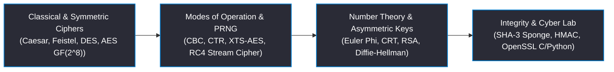

<div align="center">

# Principles of Cryptography
### Course Code: ICS 250 | ICAS, MAHE
**Classical ciphers (Substitution, Transposition, Playfair, Vigenère), symmetric key cryptography (DES, Triple-DES, AES-128/192/256), block cipher modes of operation (ECB, CBC, CFB, OFB, CTR, XTS), number theory (Modular Arithmetic, Euler's Totient, Fermat's Little Theorem), pseudo-random number generators & RC4, public-key cryptography (RSA, Diffie-Hellman Key Exchange, ElGamal, ECC), cryptographic hash functions (MD5, SHA-1, SHA-256, SHA-3), HMAC & digital signatures, and Cyber Security Lab implementations.**

[](https://manipal.edu/icas.html)
[](#academic-course-information)
[](#academic-course-information)
[](https://manipal.edu/icas.html)
[](https://www.openssl.org/)

<br/>

<table width="100%">
  <tr align="center">
    <td>
      <b>8 Modules + Lab</b><br/>
      <sub>Cryptography Curriculum</sub>
    </td>
    <td>
      <b>36h Theory + 36h Lab</b><br/>
      <sub>Course Hours</sub>
    </td>
    <td>
      <b>20 Notes & Crypto Labs</b><br/>
      <sub>Crypto Modules & Labs</sub>
    </td>
    <td>
      <b>OpenSSL / C / Python</b><br/>
      <sub>Cryptography Stack</sub>
    </td>
  </tr>
</table>

</div>

---

### Academic Course Information

| Academic Attribute | Course Details & Specs |
| :--- | :--- |
| **Course Structure (L-T-P-C)** | 3-0-6-5 (3 Lecture Credits, 0 Tutorial Credits, 6 Practical Credits, 5 Total Course Credits) |
| **Contact Hours** | 36 Lecture Hours + 36 Laboratory Hours |
| **Curriculum Distribution** | 36 Hours (2h Classical + 10h DES/AES + 4h Modes + 3h Number Theory + 4h PRNG + 5h RSA/DH + 8h Hashes + Lab) |
| **Academic Level & Semester** | 2nd Year, Semester IV (Stream III: Cyber Security) |

---

### Project Metrics

```toml
[academic.course_info]
institution       = "International Centre for Applied Sciences (ICAS)"
university        = "Manipal Academy of Higher Education (MAHE)"
course_code       = "ICS 250"
course_title      = "Principles of Cryptography"
stream            = "Stream III: Cyber Security"
credit_structure  = "3-0-6-5"
academic_level    = "2nd Year"
semester          = "Semester IV"

[repository.metadata]
lecture_modules      = 7
total_lecture_hours  = 36
notes_files_count    = 25
core_stack           = "OpenSSL / Python PyCryptodome / C / N-Stalker / Rootkit Hunter"
curriculum_status    = "100% [████████████████████████████████████████]"

[curriculum.distribution.hours]
introduction_and_classical_ciphers    = 2
symmetric_ciphers_des_and_aes         = 10
block_cipher_operation_modes          = 4
introduction_to_number_theory         = 3
random_bit_generation_and_rc4        = 4
asymmetric_ciphers_rsa_and_elgamal    = 5
hash_functions_mac_and_hmac           = 8
```

---

### Coursework Pipeline

The curriculum maps systematically from classical substitution/transposition ciphers and Feistel/AES symmetric block ciphers to modular arithmetic number theory, RSA/Diffie-Hellman public-key cryptosystems, SHA-3 Keccak sponge hashes, HMAC authentication, and practical C/Python lab implementations:



---

### Course Modules Directory

| Chapter Unit | Covered Concepts | Key Markdown Notes & Files |
| :--- | :--- | :--- |
| **01 Introduction & Classical Ciphers (2 Hours)** | Security Goals (CIA Triad), Cryptanalytic Attack Models (COA, KPA, CPA, CCA), Classical Substitution Ciphers (Caesar $C = (P+k) \bmod 26$, Playfair $5 \times 5$ matrix rules, Hill Cipher matrix multiplication $C = P \cdot K \bmod 26$, Vigenère polyalphabetic cipher), Transposition Ciphers (Rail-fence, Row & Column). | • [ch01-introduction-to-information-security.md](01-introduction-and-classical-ciphers/ch01-introduction-to-information-security.md)<br/>• [ch02-classical-encryption-techniques.md](01-introduction-and-classical-ciphers/ch02-classical-encryption-techniques.md) |
| **02 Symmetric Ciphers (10 Hours)** | Symmetric Cipher Model, Feistel Structure, Data Encryption Standard (DES 64-bit block / 56-bit key, 16 rounds, IP, Expansion Permutation, S-boxes, P-box, 3DES), Advanced Encryption Standard (AES 128/192/256-bit state, Galois Field $GF(2^8)$ arithmetic modulo $m(x) = x^8 + x^4 + x^3 + x + 1$, SubBytes, ShiftRows, MixColumns matrix multiplication over $x^4+1$, AddRoundKey, Key Expansion, Equivalent Inverse Cipher). | • [ch03-block-ciphers-and-des.md](02-symmetric-key-cryptography/ch03-block-ciphers-and-des.md)<br/>• [ch04-advanced-encryption-standard-aes.md](02-symmetric-key-cryptography/ch04-advanced-encryption-standard-aes.md)<br/>• [ch05-block-cipher-modes-of-operation.md](02-symmetric-key-cryptography/ch05-block-cipher-modes-of-operation.md) |
| **03 Asymmetric Cryptography & Number Theory (8 Hours)** | Extended Euclidean Algorithm ($\gcd(a, b) = ax + by$), Modular Inverse $a^{-1} \pmod m$, Prime Numbers, Fermat's Little Theorem ($a^{p-1} \equiv 1 \pmod p$), Euler's Totient Theorem ($\phi(n) = (p-1)(q-1)$), Miller-Rabin Primality Testing, Chinese Remainder Theorem (CRT), Discrete Logarithms, RSA Cryptosystem (Key Generation, Encryption $C = M^e \bmod n$, Decryption $M = C^d \bmod n$, OAEP Padding), Diffie-Hellman Key Exchange & Man-in-the-Middle Attack, ElGamal Encryption & Digital Signature System. | • [ch06-number-theory-foundations.md](03-asymmetric-cryptography-and-number-theory/ch06-number-theory-foundations.md)<br/>• [ch07-rsa-cryptosystem-and-diffie-hellman.md](03-asymmetric-cryptography-and-number-theory/ch07-rsa-cryptosystem-and-diffie-hellman.md) |
| **04 Hash Functions, MACs & Signatures (8 Hours)** | Cryptographic Hash Function Applications, Requirements & Security (Pre-image, Second Pre-image, Collision Resistance, Birthday Attack math $2^{n/2}$), MD5, SHA-1, SHA-2, SHA-3 Keccak Sponge Construction (Absorbing & Squeezing phases, State matrix $5 \times 5 \times w$), Cipher Block Chaining Hash, Message Authentication Codes (MACs), HMAC Construction ($HMAC(K, M) = H((K^+ \oplus opad) \parallel H((K^+ \oplus ipad) \parallel M))$), Digital Signatures (DSA, ECDSA). | • [ch08-cryptographic-hash-functions-and-mac.md](04-hash-functions-mac-and-digital-signatures/ch08-cryptographic-hash-functions-and-mac.md)<br/>• [ch09-digital-signatures-and-pki.md](04-hash-functions-mac-and-digital-signatures/ch09-digital-signatures-and-pki.md) |
| **05 System Security & Malware (4 Hours)** | System Security Architecture, Viruses, Worms, Trojans, Rootkits, Buffer Overflow Exploits, Firewalls, Intrusion Detection Systems (IDS), N-Stalker Vulnerability Assessment Tool, Rootkit Hunter. | • [ch10-system-security-malware-and-firewalls.md](05-system-security-malware-and-firewalls/ch10-system-security-malware-and-firewalls.md) |
| **06 Cyber Security Laboratory (8 Practical Labs)** | Complete C and Python executable implementations for Caesar, Playfair, Hill, Vigenère, Rail-fence, Row & Column, DES, AES, RSA, Diffie-Hellman, SHA-1, SHA-256, HMAC, Homomorphic Encryption (Paillier), Searchable Encryption, N-Stalker, and Rootkit Hunter. | • [lab01-basic-symmetric-ciphers.md](06-information-security-laboratory/lab01-basic-symmetric-ciphers.md)<br/>• [lab02-advanced-symmetric-ciphers.md](06-information-security-laboratory/lab02-advanced-symmetric-ciphers.md)<br/>• [lab03-asymmetric-ciphers-rsa-diffie-hellman.md](06-information-security-laboratory/lab03-asymmetric-ciphers-rsa-diffie-hellman.md)<br/>• [lab04-advanced-asymmetric-cryptography.md](06-information-security-laboratory/lab04-advanced-asymmetric-cryptography.md)<br/>• [lab05-cryptographic-hash-functions.md](06-information-security-laboratory/lab05-cryptographic-hash-functions.md)<br/>• [lab06-digital-signatures-and-pki.md](06-information-security-laboratory/lab06-digital-signatures-and-pki.md)<br/>• [lab07-homomorphic-encryption.md](06-information-security-laboratory/lab07-homomorphic-encryption.md)<br/>• [lab08-searchable-encryption.md](06-information-security-laboratory/lab08-searchable-encryption.md) |
| **07 Solved Assessments & Exam Prep** | 100% fully solved step-by-step solutions for 2nd Sessional, 3rd Sessional, End-Sem 2-Markers, 3-Markers, 5-Markers, Question Bank, and Lab Exam Mini Project Report. | • [2nd-sessional-exam-solutions.md](07-course-resources-and-assessments/2nd-sessional-exam-solutions.md)<br/>• [3rd-sessional-exam-solutions.md](07-course-resources-and-assessments/3rd-sessional-exam-solutions.md)<br/>• [end-sem-2markers-solutions.md](07-course-resources-and-assessments/end-sem-2markers-solutions.md)<br/>• [end-sem-3markers-solutions.md](07-course-resources-and-assessments/end-sem-3markers-solutions.md)<br/>• [end-sem-5markers-solutions.md](07-course-resources-and-assessments/end-sem-5markers-solutions.md)<br/>• [end-sem-lab-exam-project-report.md](07-course-resources-and-assessments/end-sem-lab-exam-project-report.md)<br/>• [question-bank-and-exam-solutions.md](07-course-resources-and-assessments/question-bank-and-exam-solutions.md) |

---

### Text / Reference Books

1. **William Stallings**, *Cryptography and Network Security: Principles and Practice*, 7th Edition, Prentice Hall, 2017.
2. **Behrouz A. Forouzan, Debdeep Mukhopadhyay**, *Cryptography and Network Security*, 2nd Edition, McGraw Hill, 2008.
3. **Atul Kahate**, *Cryptography and Network Security*, Tata McGraw-Hill Publishing, 2008.
4. **Bruce Schneier**, *Applied Cryptography: Protocols, Algorithms, and Source Code in C*, 2nd Edition, John Wiley & Sons, Inc., 2013.

---

### Technical Guide

<details>
<summary><b>Running Cryptographic Execution & Vulnerability Assessment Commands</b></summary>

```bash
# OpenSSL AES-256-CBC Encryption & Decryption Command
openssl enc -aes-256-cbc -salt -in secret.txt -out secret.enc -k MySecretPassphrase
openssl enc -d -aes-256-cbc -in secret.enc -out secret.dec -k MySecretPassphrase

# OpenSSL RSA 4096-bit Key Pair Generation & Private Key Inspection
openssl genpkey -algorithm RSA -out private_key.pem -pkeyopt rsa_keygen_bits:4096
openssl rsa -in private_key.pem -pubout -out public_key.pem

# Rootkit Hunter Vulnerability & Malware Scan
rkhunter --check --sk
```

</details>
